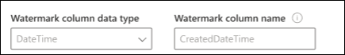
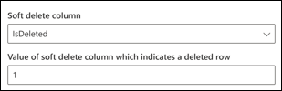

<!---Previous ms.author: vivg --->

# Conectores SQL y Microsoft SQL Server Graph Azure

El conector Microsoft SQL Server o Azure SQL Graph permite a la organización detectar e indizar datos de una base de datos de SQL Server local o una base de datos hospedada en la instancia de Azure SQL en la nube.
El Graph indexa el contenido especificado en Búsqueda de Microsoft. Para mantener el índice actualizado con los datos de origen, admite rastreos incrementales e completos periódicos. Con estos SQL, también puede restringir el acceso a los resultados de búsqueda para determinados usuarios.

> [!NOTE]
> Lea el [**artículo Configurar el conector Graph para**](configure-connector.md) comprender las instrucciones de configuración Graph conectores generales.

Este artículo está para cualquier persona que configure, ejecute y monitore un conector SQL azure y microsoft SQL servidor Graph. Complementa el proceso de configuración general y muestra instrucciones que solo se aplican al conector de SQL y microsoft SQL servidor Graph. En este artículo también se incluye [información](#limitations) sobre las limitaciones para el servidor de Microsoft SQL y los conectores SQL Azure.

## Antes de empezar

### Instale el agente Graph conector de Microsoft SQL Server local (obligatorio únicamente para el conector de Microsoft SQL Server local)

Para tener acceso a los datos de terceros locales, debe instalar y configurar el agente de conector Graph local. Consulte [Install the Graph connector agent para](on-prem-agent.md) obtener más información.

>[!NOTE]
>Si usa la autenticación Windows al configurar el conector de Microsoft SQL Server Graph, el usuario con el que está intentando iniciar sesión debe tener derechos de inicio de sesión interactivos en el equipo donde está instalado Graph agente de conector. Consulte la documentación sobre la administración [de directivas de inicio de sesión](/windows/security/threat-protection/security-policy-settings/allow-log-on-locally#policy-management) para comprobar los derechos de inicio de sesión.

## Paso 1: Agregar un conector Graph en el Centro de administración de Microsoft 365

Siga las instrucciones [generales de configuración](./configure-connector.md).
<!---If the above phrase does not apply, delete it and insert specific details for your data source that are different from general setup 
instructions.-->

## Paso 2: Nombrar la conexión

Siga las instrucciones [generales de configuración](./configure-connector.md).
<!---If the above phrase does not apply, delete it and insert specific details for your data source that are different from general setup 
instructions.-->

## Paso 3: Configurar las opciones de conexión

### Registrar una aplicación (solo para el conector SQL Azure)

Para el conector SQL azure, debe registrar una aplicación en Azure Active Directory para permitir que Búsqueda de Microsoft la aplicación obtenga acceso a los datos para la indización. Para obtener más información sobre el registro de una aplicación, consulte Microsoft Graph documentación sobre cómo [registrar una aplicación](/graph/auth-register-app-v2).

Después de completar el registro de la aplicación y tomar nota del nombre de la aplicación, el identificador de la aplicación (cliente) y el identificador de inquilino, debe generar [un nuevo secreto de cliente](/azure/healthcare-apis/register-confidential-azure-ad-client-app#application-secret). El secreto de cliente solo se mostrará una vez. Recuerde tener en cuenta & almacenar el secreto de cliente de forma segura. Use el identificador de cliente y el secreto de cliente al configurar una nueva conexión en Búsqueda de Microsoft.

Para agregar la aplicación registrada a tu Azure SQL Database, debes:

- Inicie sesión en la base de datos SQL Azure
- Abrir una nueva ventana de consulta
- Para crear un usuario nuevo, ejecute el comando 'CREATE USER [app name] FROM EXTERNAL PROVIDER'
- Agregar usuario al rol ejecutando el comando 'exec sp_addrolemember 'db_datareader', [nombre de la aplicación]' O 'ALTER ROLE db_datareader ADD MEMBER [nombre de la aplicación]'

>[!NOTE]
>Para revocar el acceso a cualquier aplicación registrada en Azure Active Directory, consulte la documentación de Azure sobre cómo [quitar una aplicación registrada.](/azure/active-directory/develop/quickstart-remove-app)

### Configuración de conexión

Para conectar el conector Microsoft SQL Server a un origen de datos, debe configurar el servidor de base de datos que desea rastrear y el agente local. A continuación, puede conectarse a la base de datos con el método de autenticación necesario.

> [!NOTE] 
> La base de datos debe SQL Server versión 2008 o posterior para que el Microsoft SQL Server para poder conectarse.

Para el conector SQL azure, solo debe especificar el nombre del servidor o la dirección IP a la que desea conectarse. Azure SQL connector solo admite Azure Active Directory de conexión de Open ID (OIDC) para conectarse a la base de datos.

Para mayor seguridad, puede configurar reglas de firewall IP para la base de datos SQL Server Azure. Para obtener más información sobre cómo configurar reglas de firewall IP, consulte la documentación sobre [las reglas de firewall IP](/azure/azure-sql/database/firewall-configure). Agregue los siguientes intervalos IP de cliente en la configuración del firewall.

| Región | Intervalo IP |
| ------------ | ------------ |
| NAM | 52.250.92.252/30, 52.224.250.216/30 |
| EUR | 20.54.41.208/30, 51.105.159.88/30 |
| APC | 52.139.188.212/30, 20.43.146.44/30 |

Para buscar en el contenido de la base de datos, debe especificar SQL al configurar el conector. Estas SQL necesitan nombrar todas las columnas de base de datos que desea indizar (es decir, las propiedades de origen), incluidas las combinaciones de SQL que deben realizarse para obtener todas las columnas. Para restringir el acceso a los resultados de búsqueda, debe especificar listas de control de acceso (ACL) dentro de SQL consultas al configurar el conector.

## Paso 3a: Rastreo completo (obligatorio)

En este paso, se configura la consulta SQL que ejecuta un rastreo completo de la base de datos. El rastreo completo selecciona todas las columnas o propiedades donde desea seleccionar las opciones **Query**, **Search** o **Retrieve**. También puede especificar columnas de ACL para restringir el acceso de los resultados de búsqueda a usuarios o grupos específicos.

> [!Tip]
> Para obtener todas las columnas que necesita, puede unir varias tablas.

### Seleccionar columnas de datos (obligatorio) y columnas acl (opcional)

En el ejemplo se muestra una selección de cinco columnas de datos que contienen los datos de la búsqueda: OrderId, OrderTitle, OrderDesc, CreatedDateTime e IsDeleted. Para establecer permisos de vista para cada fila de datos, puede seleccionar opcionalmente estas columnas de ACL: AllowedUsers, AllowedGroups, DeniedUsers y DeniedGroups. Todas estas columnas de datos también tienen las opciones **Query**, **Search** o **Retrieve**.

Seleccione columnas de datos como se muestra en esta consulta de ejemplo: `SELECT OrderId, OrderTitle, OrderDesc, AllowedUsers, AllowedGroups, DeniedUsers, DeniedGroups, CreatedDateTime, IsDeleted`

Para administrar el acceso a los resultados de búsqueda, puede especificar una o más columnas de ACL en la consulta. El SQL permite controlar el acceso por nivel de registro. Puede elegir tener el mismo control de acceso para todos los registros de una tabla. Si la información de acl se almacena en una tabla independiente, es posible que deba hacer una combinación con dichas tablas en la consulta.

A continuación se describe el uso de cada una de las columnas acl de la consulta anterior. En la siguiente lista se explican los cuatro mecanismos **de control de acceso**.

- **AllowedUsers:** esta columna especifica la lista de id. de usuario que pueden tener acceso a los resultados de la búsqueda. En el siguiente ejemplo, lista de usuarios: john@contoso.com, keith@contoso.com y lisa@contoso.com solo tendrían acceso a un registro con OrderId = 12.
- **AllowedGroups:** esta columna especifica el grupo de usuarios que podrán obtener acceso a los resultados de la búsqueda. En el ejemplo siguiente, los grupos sales-team@contoso.com solo tendrían acceso al registro con OrderId = 12.
- **DeniedUsers:** esta columna especifica la lista de usuarios que no **tienen** acceso a los resultados de búsqueda. En el siguiente ejemplo, los usuarios john@contoso.com y keith@contoso.com no tienen acceso al registro con OrderId = 13, mientras que todos los demás tienen acceso a este registro.
- **DeniedGroups:** esta columna especifica el grupo de usuarios que no tienen **acceso** a los resultados de búsqueda. En el siguiente ejemplo, los grupos engg-team@contoso.com y pm-team@contoso.com no tienen acceso al registro con OrderId = 15, mientras que todos los demás tienen acceso a este registro.  

### Tipos de datos admitidos

En la tabla siguiente se resumen los SQL de datos compatibles con los conectores MS SQL y Azure SQL datos. La tabla también resume el tipo de datos de indización para el tipo SQL datos admitido. Para obtener más información acerca de los Graph de microsoft compatibles con tipos de datos para la indización, consulte la documentación sobre tipos [de recursos de propiedad](/graph/api/resources/property?preserve-view=true&view=graph-rest-beta#properties).

| Categoría | Tipo de datos de origen | Tipo de datos de indización |
| ------------ | ------------ | ------------ |
| Fecha y hora | date   datetime   datetime2   smalldatetime | datetime |
| Numérico exacto | bigint   Entero   smallint   tinyint | int64 |
| Numérico exacto | bit | booleano |
| Numérico aproximado | float   real | double |
| Cadena de caracteres | char   varchar   text | cadena |
| Cadenas de caracteres Unicode | nchar   nvarchar   ntext | cadena |
| Otros tipos de datos | uniqueidentifier | cadena |

Para cualquier otro tipo de datos actualmente no compatible directamente, la columna debe convertirse explícitamente en un tipo de datos admitido.

### Marca de agua (obligatorio)

Para evitar sobrecargar la base de datos, el conector por lotes y reanuda las consultas de rastreo completo con una columna de marca de agua de rastreo completo. Al usar el valor de la columna de marca de agua, se captura cada lote posterior y se reanuda la consulta desde el último punto de control. Básicamente, estos mecanismos controlan la actualización de datos para rastreos completos.

Cree fragmentos de código de consulta para marcas de agua como se muestra en estos ejemplos:

- `WHERE (CreatedDateTime > @watermark)`. Cite el nombre de la columna de marca de agua con la palabra clave reservada `@watermark` . Si el criterio de ordenación de la columna de marca de agua es ascendente, use `>` ; de lo contrario, use `<` .
- `ORDER BY CreatedDateTime ASC`. Ordene en la columna de marca de agua en orden ascendente o descendente.

En la configuración que se muestra en la siguiente imagen, `CreatedDateTime` se encuentra la columna de marca de agua seleccionada. Para capturar el primer lote de filas, especifique el tipo de datos de la columna de marca de agua. En este caso, el tipo de datos es `DateTime` .

La primera consulta captura el primer **número N** de filas mediante: "CreatedDateTime > 1 de enero de 1753 00:00:00" (valor mínimo del tipo de datos DateTime). Después de capturar el primer lote, el valor más alto de devuelto en el lote se guarda como punto de control si las filas se ordenan `CreatedDateTime` en orden ascendente. Un ejemplo es el 1 de marzo de 2019 03:00:00. A continuación, se captura el siguiente lote de filas **N** mediante "CreatedDateTime > March 1, 2019 03:00:00" en la consulta.

### Omitir filas eliminadas temporalmente (opcional)

Para excluir las filas eliminadas temporalmente en la base de datos para que no se indexe, especifique el nombre y el valor de la columna de eliminación temporal que indica que la fila se ha eliminado.

### Rastreo completo: administrar permisos de búsqueda

Seleccione Administrar permisos para elegir las **distintas** columnas de control de acceso (ACL) que especifican el mecanismo de control de acceso. Seleccione el nombre de columna que especificó en la consulta completa SQL rastreo.

Se espera que cada una de las columnas acl sea una columna de varios valores. Estos valores de identificador múltiples se pueden separar mediante separadores como punto y coma (;), coma (,), y así sucesivamente. Debe especificar este separador en el campo **separador de** valores.

Se admiten los siguientes tipos de id. para usar como ACL:

- **Nombre principal de usuario (UPN):** un nombre principal de usuario (UPN) es el nombre de un usuario del sistema en un formato de dirección de correo electrónico. Un UPN (por ejemplo: john.doe@domain.com) consta del nombre de usuario (nombre de inicio de sesión), separador (símbolo @) y nombre de dominio (sufijo UPN).
- **Azure Active Directory (AAD):** en Azure AD, cada usuario o grupo tiene un identificador de objeto similar a 'e0d3ad3d-0000-1111-2222-3c5f5c52ab9b'.
- Id. de seguridad de **Active Directory (AD):** en una configuración de AD local, todos los usuarios y grupos tienen un identificador de seguridad único inmutable que tiene un aspecto similar a 'S-1-5-21-3878594291-2115959936-132693609-65242.'

## Paso 3b: Rastreo incremental (opcional)

En este paso opcional, proporcione una consulta SQL para ejecutar un rastreo incremental de la base de datos. Con esta consulta, el conector SQL determina los cambios realizados en los datos desde el último rastreo incremental. Al igual que en el rastreo completo, seleccione todas las columnas en las que desee seleccionar las opciones **Consulta,** **Búsqueda** o **Recuperar**. Especifique el mismo conjunto de columnas acl que especificó en la consulta de rastreo completa.

Los componentes de la siguiente imagen son similares a los componentes de rastreo completos con una excepción. En este caso, "ModifiedDateTime" es la columna de marca de agua seleccionada. Revise los [pasos de rastreo completos](#step-3a-full-crawl-required) para obtener información sobre cómo escribir la consulta de rastreo incremental y vea la siguiente imagen como un ejemplo.

## Paso 4: Asignar etiquetas de propiedades

Siga las instrucciones [generales de configuración](./configure-connector.md).

<!---If the above phrase does not apply, delete it and insert specific details for your data source that are different from general setup 
instructions.-->

## Paso 5: Administrar esquema

Siga las instrucciones [generales de configuración](./configure-connector.md).
<!---If the above phrase does not apply, delete it and insert specific details for your data source that are different from general setup 
instructions.-->

## Paso 6: Administrar permisos de búsqueda

Puede elegir usar las [ACL](#full-crawl-manage-search-permissions) especificadas en la pantalla de rastreo completa o puede invalidarlas para que el contenido sea visible para todos.

## Paso 7: Elegir la configuración de actualización

Siga las instrucciones [generales de configuración](./configure-connector.md).
<!---If the above phrase does not apply, delete it and insert specific details for your data source that are different from general setup 
instructions.-->

## Paso 8: Revisar la conexión

Siga las instrucciones [generales de configuración](./configure-connector.md).
<!---If the above phrase does not apply, delete it and insert specific details for your data source that are different from general setup 
instructions.-->

<!---## Next steps: Customize the search results page

Create your own verticals and result types, so end users can view search results from new connections. Without this step, data from your connection won't show up on the search results page.

To learn more about how to create your verticals and MRTs, see [Search results page customization](customize-search-page.md).-->

## Solución de problemas

A continuación se muestra un error común observado al configurar el conector y su posible motivo.

| Paso de configuración | Mensaje de error | Posibles motivos |
| ------------ | ------------ | ------------ |
| Rastreo completo | `Error from database server: A transport level error has occurred when receiving results from the server.` | Este error se produce debido a problemas de red. Se recomienda comprobar los registros de red con el monitor de red [de Microsoft](https://www.microsoft.com/download/details.aspx?id=4865) y comunicarse con el soporte técnico de Microsoft. |

## Limitaciones

Los SQL tienen estas limitaciones en la versión preliminar:

- Microsoft SQL Server: la base de datos local debe ejecutarse SQL Server versión 2008 o posterior.
- La Microsoft 365 suscripción y la suscripción de Azure (que hospeda la base de datos SQL azure) deben estar dentro del mismo Azure Active Directory.
- Las ACL solo se admiten mediante un nombre principal de usuario (UPN), Azure Active Directory (Azure AD) o seguridad de Active Directory.
- No se admite la indización de contenido enriquecido dentro de las columnas de base de datos. Ejemplos de este contenido son HTML, JSON, XML, blobs y análisis de documentos que existen como vínculos dentro de las columnas de la base de datos.
