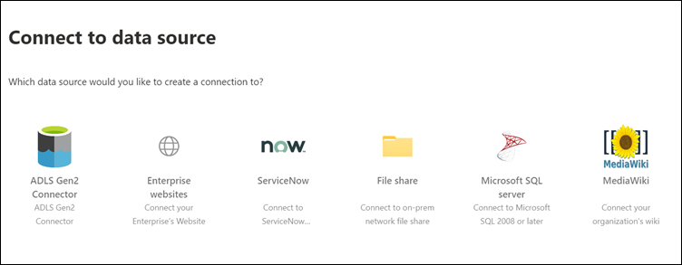

<!-- markdownlint-disable no-trailing-punctuation -->

# Configurar el conector creado por Microsoft para Microsoft SearchSet up your Microsoft-built connector for Microsoft Search

Este artículo le guiará por los pasos necesarios para configurar un conector creado por Microsoft.This article guides you through the steps of configuring a Microsoft-built connector. Se describe el flujo de configuración de una conexión en el [centro de administración](https://admin.microsoft.com)de Microsoft 365.It outlines the flow of setting up a connection in the Microsoft 365 [admin center](https://admin.microsoft.com). Para obtener más información sobre cómo configurar conectores creados por Microsoft específicos, consulte estos artículos:For more details on how to set up specific Microsoft-built connectors, see these articles:

* [Azure Data Lake Storage Gen2Azure Data Lake Storage Gen2](azure-data-lake-connector.md)
* [Azure DevOpsAzure DevOps](azure-devops-connector.md)
* [SQL de AzureAzure SQL](MSSQL-connector.md)
* [Sitios web de la empresaEnterprise websites](enterprise-web-connector.md)
* [Compartir archivosFile share](file-share-connector.md)
* [MediaWikiMediaWiki](mediawiki-connector.md)
* [Microsoft SQL ServerMicrosoft SQL server](MSSQL-connector.md)
* [ServiceNowServiceNow](servicenow-connector.md)

## ConfigurarSet up

Complete los pasos siguientes para configurar cualquiera de los conectores creados por Microsoft.Complete the following steps to configure any of the Microsoft-built connectors.

1. Vaya a la [pestaña conectores](https://admin.microsoft.com/Adminportal/Home#/MicrosoftSearch/Connectors) en el [centro de administración de Microsoft 365](https://admin.microsoft.com).Go to the [Connectors tab](https://admin.microsoft.com/Adminportal/Home#/MicrosoftSearch/Connectors) in the [Microsoft 365 admin center](https://admin.microsoft.com).
2. Inicie sesión en su cuenta con las credenciales de su inquilino de [Microsoft 365](https://www.microsoft.com/microsoft-365) .Sign in to your account with the credentials for your [Microsoft 365](https://www.microsoft.com/microsoft-365) tenant.
3. Seleccione **Agregar un conector**.Select **Add a connector**.
4. En la lista de conectores disponibles, seleccione el conector de su elección.From the list of available connectors, select the connector of your choice.

### Nombre del conectorName the connector

Para crear una conexión, primero especifique estos atributos:To create a connection, first specify these attributes:

1. Nombre de la conexiónName of the connection
2. IDENTIFICADOR de conexiónConnection ID
3. Descripción (opcional)Description (optional)

El identificador de conexión crea propiedades implícitas para el conector.The connection ID creates implicit properties for your connector. Debe contener solo caracteres alfanuméricos y tener un máximo de 32 caracteres.It must contain only alphanumeric characters and be a maximum of 32 characters.

### Conectarse a un origen de datosConnect to a data source

El proceso de conexión de datos varía en función del tipo de conector.The data connection process varies based on the type of connector. Para obtener más información sobre cómo conectarse a su origen de datos local, vea [instalar una puerta de enlace de datos local](https://aka.ms/configuregateway).To learn more about connecting to your on-premises data source, see [Install an on-premises data gateway](https://aka.ms/configuregateway).

### Seleccionar Propiedades de origenSelect source properties

Los campos de datos establecidos por el origen de datos de terceros como propiedades de origen se indizan en Microsoft Search.The data fields set by your third-party data source as source properties are indexed into Microsoft Search. Para modificar estas propiedades, seleccione **Editar propiedades** en la barra lateral situada a la derecha de la página **conectores** .To modify these properties, select **Edit properties** in the side bar on the right of the **Connectors** page. Puede seleccionar **hasta 64 propiedades de origen**.You can select **up to 64 source properties**.

### Administrar el esquema de búsquedaManage the search schema

Los administradores pueden establecer los atributos del esquema de búsqueda para controlar la funcionalidad de búsqueda de cada propiedad de origen.Admins can set the search schema attributes to control search functionality of each source property. Un esquema de búsqueda ayuda a determinar los resultados que se muestran en la página de resultados de búsqueda y la información que los usuarios finales pueden ver y a los que se accede.A search schema helps determine what results display on the search results page and what information end users can view and access.

Los atributos de esquema de búsqueda incluyen **búsquedas**, **consultas**y **recuperables**.Search schema attributes include **searchable**, **queryable**, and **retrievable**. En la siguiente tabla se enumeran todos los atributos compatibles con los conectores de Microsoft Graph y se explican sus funciones.The following table lists each of the attributes that Microsoft Graph connectors support and explains their functions.

Atributo de esquema de búsquedaSearch schema attribute | FunciónFunction | EjemploExample
--- | --- | ---
QUE permiten búsquedasSEARCHABLE | Hace que el contenido de texto de una propiedad permita la búsqueda.Makes the text content of a property searchable. El contenido de la propiedad se incluye en el índice de texto completo.Property contents are included in the full-text index. | Si la propiedad es **title**, una consulta de **Enterprise** devuelve respuestas que contienen la palabra **Enterprise** en cualquier texto o título.If the property is **title**, a query for **Enterprise** returns answers that contain the word **Enterprise** in any text or title.
CONSULTABLEQUERYABLE | Busca una coincidencia para una propiedad determinada en la consulta.Searches by query for a match for a particular property. A continuación, se puede especificar el nombre de la propiedad en la consulta, ya sea mediante programación o literalmente.The property name can then be specified in the query either programmatically or verbatim. |  Si la propiedad **title** es consultable, el título de la consulta **: Enterprise** es compatible.If the **Title** property is queryable, then the query **Title: Enterprise** is supported.
RECUPERABLERETRIEVABLE | Solo se pueden usar propiedades recuperables en el tipo de resultado y se muestran en los resultados de la búsqueda.Only retrievable properties can be used in the result type and display in the search result. |

Para todos los conectores excepto el conector de recursos compartidos de archivos, los tipos personalizados deben establecerse manualmente.For all connectors except the file share connector, custom types must be set manually. Para activar las capacidades de búsqueda para cada campo, necesita un esquema de búsqueda asignado a una lista de propiedades.To activate search capabilities for each field, you need a search schema mapped to a list of properties. El Asistente para la conexión selecciona automáticamente un esquema de búsqueda en función del conjunto de propiedades de origen que elija.The connection wizard automatically selects a search schema based on the set of source properties you choose. Puede modificar este esquema activando las casillas de verificación de cada propiedad y atributo en la página esquema de búsqueda.You can modify this schema by selecting the check boxes for each property and attribute in the search schema page.

Estas restricciones y recomendaciones se aplican a la configuración del esquema de búsqueda:These restrictions and recommendations apply to search schema settings:

* Para los conectores que indizan tipos personalizados, se recomienda **no** marcar el campo que contiene el contenido principal **recuperable**.For connectors that index custom types, we recommend that you **do not** mark the field that contains the main content **retrievable**. Se producen problemas de rendimiento significativos cuando los resultados de búsqueda se representan con ese atributo de búsqueda.Significant performance issues occur when search results render with that search attribute. Un ejemplo es el campo de contenido de **texto** de un artículo de base de conocimiento de [ServiceNow](https://www.servicenow.com) .An example is the **Text** content field for a [ServiceNow](https://www.servicenow.com) knowledge-base article.
* Solo las propiedades marcadas como representables recuperables en los resultados de búsqueda y se pueden usar para crear tipos de resultado modernos (MRTs).Only properties marked as retrievable render in the search results and can be used to create modern result types (MRTs).
* Solo las propiedades de cadena se pueden marcar como buscables.Only string properties can be marked searchable.

> [!Note]
> Después de crear una conexión, **no** puede modificar el esquema.After you create a connection, you **can't** modify the schema. Para ello, debe eliminar la conexión y crear una nueva.To do that, you need to delete your connection and create a new one.

### Administrar permisos de búsquedaManage search permissions

Las listas de control de acceso (ACL) determinan qué usuarios de la organización pueden tener acceso a cada elemento de datos.Access Control Lists (ACLs) determine which users in your organization can access each item of data. El conector de recursos compartidos de archivos solo admite ACL que se puede asignar a [Azure Active Directory (Azure ad)](https://docs.microsoft.com/azure/active-directory/).The file share connector supports only ACLs that can be mapped to [Azure Active Directory (Azure AD)](https://docs.microsoft.com/azure/active-directory/). El resto de conectores admiten permisos de búsqueda que son visibles para todos los usuarios.All the other connectors support search permissions that are visible to all users.

### Establecer la programación de actualizaciónSet the refresh schedule

La programación de la actualización determina la frecuencia con la que los datos se sincronizan con el índice en Microsoft Graph y Microsoft Search.The refresh schedule determines how often your data is synced with the index in Microsoft Graph and Microsoft Search. Puede programar la actualización de dos maneras: rastreo completo o rastreo incremental.You can schedule the refresh in two ways: full crawl or incremental crawl.

Con un **rastreo completo**, el motor de búsqueda procesa e indiza todos los elementos del origen de contenido, independientemente de los rastreos anteriores.With a **full crawl**, the search engine processes and indexes every item in the content source, regardless of previous crawls. El rastreo completo funciona mejor en estas situaciones:Full crawl works best in these situations:

* Debe detectar eliminaciones de datos.You need to detect deletions of data.
* El rastreo incremental no pudo rastrear el contenido de los errores.The incremental crawl failed to crawl content for errors.
* Se necesita una actualización de software de Microsoft Search.A software update for Microsoft Search is required. Las actualizaciones modifican el esquema de búsqueda.Updates modify the search schema.
* Las ACL se modificaron.ACLs were modified.
* Se modificaron las reglas de rastreo.Crawl rules were modified.

Con un **rastreo incremental**, el motor de búsqueda puede procesar e indizar sólo los elementos que se crearon o modificaron desde el último rastreo correcto.With an **incremental crawl**, the search engine can process and index only the items that were created or modified since the last successful crawl. Por lo tanto, no todos los datos en el origen de contenido se vuelven a indizar.Therefore, not all the data in the content source is re-indexed. Los rastreos incrementales funcionan mejor para detectar contenido, metadatos, permisos y otras actualizaciones.Incremental crawls works best to detect content, metadata, permission, and other updates.

Los rastreos incrementales son mucho más rápidos que los rastreos completos porque no se procesan los elementos que no han cambiado.Incremental crawls are much faster than full crawls because unchanged items aren’t processed. Para mantener una sincronización de datos precisa entre el origen de contenido y el índice de búsqueda, debe ejecutar ambos rastreos de forma periódica.To maintain an accurate data sync between the content source and the search index, you need to run both crawls periodically.

Cada conector tendrá un conjunto de programaciones de actualización óptimo diferente en función de la frecuencia con la que se modifican los datos y el tipo de modificaciones.Each connector will have a different optimal set of refresh schedules based on how often data is modified and the type of modifications.

### Revisión de la configuración del conectorReview connector settings

Después de configurar el conector, el [centro de administración](https://admin.microsoft.com) le lleva a una página en la que puede revisar la configuración.After you configure your connector, the [admin center](https://admin.microsoft.com) takes you to a page where you can review your settings. Puede volver a pasar por el proceso de configuración para editar cualquier configuración antes de confirmar la conexión.You can go back through the configuration process to edit any setting before you confirm the connection. Para obtener más información, consulte [administrar el conector](manage-connector.md).To learn more, see [Manage your connector](manage-connector.md).

## Pasos siguientes: personalizar la página de resultados de búsquedaNext steps: Customize the search results page

Con la interfaz de usuario (UI) de Microsoft Search, los usuarios finales pueden buscar contenido de las aplicaciones de productividad de [microsoft 365](https://www.microsoft.com/microsoft-365) y el ecosistema de Microsoft más amplio.With the Microsoft Search user interface (UI), your end users can search content from your [Microsoft 365](https://www.microsoft.com/microsoft-365) productivity apps and the broader Microsoft ecosystem. Una presentación vertical de búsqueda hace referencia a las pestañas que se muestran cuando un usuario ve los resultados de la búsqueda en [SharePoint](https://sharepoint.com/), [Microsoft Office](https://Office.com)y Microsoft Search en [Bing](https://Bing.com).A search vertical refers to the tabs that are shown when a user views their search results in [SharePoint](https://sharepoint.com/), [Microsoft Office](https://Office.com), and Microsoft Search in [Bing](https://Bing.com). Puede personalizar las presentaciones verticales de búsqueda para restringir los resultados, de modo que solo se muestre un tipo determinado de resultados de búsqueda.You can customize search verticals to narrow down results, so that only a certain type of search results is displayed. Estos verticales aparecen como una pestaña en la parte superior de la página de resultados de búsqueda.These verticals appear as a tab on the top of the search results page. Un tipo de resultado moderno (MRT) es la interfaz de usuario que designa cómo se presentan los resultados.A modern result type (MRT) is the UI that designates how results are presented.

Debe crear sus propios tipos de resultados y verticales, de modo que los usuarios finales puedan ver los resultados de la búsqueda de conexiones nuevas.You must create your own verticals and result types, so end users can view search results from new connections. Sin este paso, los datos de la conexión no se mostrarán en la página de resultados de búsqueda.Without this step, data from your connection won’t show up on the search results page.

Para obtener más información sobre cómo crear sus verticales y MRTs, vea [Personalización](customize-search-page.md)de la página de resultados de búsqueda.To learn more about how to create your verticals and MRTs, see [Search results page customization](customize-search-page.md).

## ¿Cómo saber si el proceso se ha completado correctamente?How do I know this worked?

Vaya a la lista de las conexiones publicadas en la ficha **conectores** del [centro de administración](https://admin.microsoft.com).Go to the list of your published connections under the **Connectors** tab in the [admin center](https://admin.microsoft.com). Para obtener información sobre cómo realizar actualizaciones y eliminaciones, consulte [administrar el conector](manage-connector.md).To learn how to make updates and deletions, see [Manage your connector](manage-connector.md).
