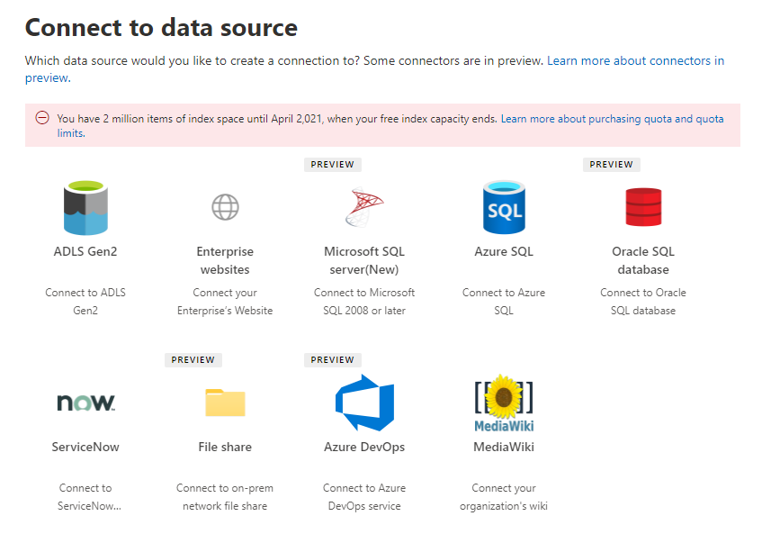

<!-- markdownlint-disable no-trailing-punctuation -->

# Introducción a la instalación de conectores de Graph por Microsoft 

En este artículo se resume el proceso básico necesario para usar el Centro de administración de [Microsoft 365](https://admin.microsoft.com) para configurar cualquiera de los conectores de Graph de Microsoft. El proceso básico incluye los siguientes pasos:  
<!---Add links to each section in the doc--->

1. Agregue un conector de Graph en el Centro de administración de Microsoft 365.
2. Asigne un nombre a la conexión.
3. Configure las opciones de conexión.
4. Administrar permisos de búsqueda.
5. Asignar etiquetas de propiedad.
6. Administrar esquema.
7. Elija la configuración de actualización.
8. Revise la conexión.

Es importante tener en cuenta que el proceso de configuración es muy similar para todos los conectores de Graph de Microsoft, pero no es exactamente el mismo. **Además de leer este artículo, asegúrese de leer la información específica del conector para su origen de datos.**  

## Paso 1: Agregar un conector de Graph en el Centro de administración de Microsoft 365

Complete los siguientes pasos para configurar cualquiera de los conectores creados por Microsoft.

1. Inicie sesión en su cuenta de administrador en el [Centro de administración de Microsoft 365](https://admin.microsoft.com)
2. En el panel de navegación, seleccione **Configuración** y, a continuación, seleccione **Buscar & de búsqueda.** Seleccione la [pestaña Conectores](https://admin.microsoft.com/Adminportal/Home#/MicrosoftSearch/Connectors).
3. Seleccione **+Agregar** y, a continuación, seleccione el origen de datos que prefiera en el menú de opciones disponibles.

>[! Nota:] Puede agregar un máximo de diez conexiones de Graph a cada inquilino.

## Paso 2: Nombrar la conexión
Deberá especificar estos atributos: 

* Nombre  
* Id. de conexión 
* Descripción (opcional) 

El identificador de conexión crea propiedades implícitas para el conector. Debe contener sólo caracteres alfanuméricos y un máximo de 32 caracteres. 

## Paso 3: Configurar las opciones de conexión

El proceso para configurar las opciones de conexión varía en función del tipo de origen de datos. Vea la información específica del conector para el tipo de origen de datos que desea agregar a su espacio empresarial para completar este paso en el proceso de configuración.  

Para obtener más información sobre cómo conectarse a un origen de datos local, vea Instalar una puerta de [enlace de datos local.](https://aka.ms/configuregateway)

## Paso 4: Administrar permisos de búsqueda

Las listas de control de acceso (ACL) determinan qué usuarios de la organización pueden tener acceso a cada elemento de datos.  

Algunos conectores como [Microsoft SQL](MSSQL-connector.md) Azure Data Lake [Storage Gen2](azure-data-lake-connector.md) admiten de forma nativa las ACL [de Azure Active Directory (Azure AD).](https://docs.microsoft.com/azure/active-directory/)

Otros conectores como [ServiceNow,](servicenow-connector.md) [Azure DevOps](azure-devops-connector.md)y [Salesforce](salesforce-connector.md) admiten la sincronización de usuarios y grupos que no son de Azure AD.  

## Paso 5: Asignar etiquetas de propiedad
Puedes asignar etiquetas semánticas a las propiedades de origen en la página "Asignar etiquetas de propiedades". Las etiquetas son etiquetas conocidas proporcionadas por Microsoft que proporcionan significado semántico. Permiten a Microsoft integrar los datos del conector en experiencias de Microsoft 365, como búsqueda mejorada, tarjetas de personas, detección inteligente y mucho más.  

En la tabla siguiente se enumeran las etiquetas admitidas actualmente y sus descripciones.  

Etiqueta | Descripción
--- | ---  
**title** | El título del elemento que desea que se muestra en la búsqueda y otras experiencias 
**url** | La dirección URL de destino del elemento en el sistema de origen 
**createdBy** | Nombre de la persona que creó el elemento 
**lastModifiedBy** | Nombre de la persona que editó el elemento más recientemente 
**authors** | Nombre de las personas que participaron o colaboraron en el elemento 
**createdDateTime** | Cuándo se creó el elemento 
**lastModifiedDateTime** | Cuándo se editó el elemento más recientemente 
**fileName** | Nombre del elemento de archivo 
**fileExtension** | Tipo de elemento de archivo como .pdf o .word 

Las propiedades de esta página están seleccionadas previamente en función del origen de datos, pero puede cambiar esta selección si hay una propiedad diferente que sea más adecuada para una etiqueta determinada.  

El título **de la** etiqueta es la etiqueta más importante. Se recomienda **encarecidamente que** tenga una propiedad asignada a esta etiqueta para que la conexión participe en la experiencia del [clúster de resultados.](result-cluster.md)

La asignación incorrecta de etiquetas provocará una experiencia de búsqueda degradada. Es correcto que algunas etiquetas no tengan una propiedad asignada.  

## Paso 6: Administrar esquema

### Content (propiedad)

Se recomienda encarecidamente seleccionar una **Propiedad de contenido" en el menú desplegable de opciones o mantener el valor predeterminado si hay uno. Esta propiedad se usa para la indización de texto completo del contenido, la generación de fragmentos de código de la página de resultados de [búsqueda,](result-cluster.md) la participación del clúster de resultados, la detección de idiomas, la compatibilidad con HTML/texto, la clasificación y relevancia, y la formulación de consultas.

Si selecciona una propiedad de contenido, tendrá la opción de usar la propiedad generada por el sistema **ResultSnippet** al [crear el tipo de resultado.](customize-results-layout.md) Esta propiedad actúa como marcador de posición para los fragmentos de código dinámicos que se generan a partir de la propiedad de contenido en el momento de la consulta. Si usa esta propiedad en el tipo de resultado, se generarán fragmentos de código en los resultados de búsqueda.

### Creación de alias para propiedades de origen

Puede agregar alias a sus propiedades en la columna "Alias" de la página "Administrar esquema". Los alias son nombres descriptivos para las propiedades. Se usan en consultas y en la creación de filtros. También se usan para normalizar las propiedades de origen de varias conexiones de modo que tengan el mismo nombre. De este modo, puede crear un filtro único para una vertical con varias conexiones. Vea [Personalizar la página de resultados de búsqueda](customize-search-page.md) para obtener más información.  

### Atributos del esquema de búsqueda

Puede establecer los atributos del esquema de búsqueda para controlar la funcionalidad de búsqueda de cada propiedad de origen. Un esquema de búsqueda ayuda a determinar qué resultados se muestran en la página de resultados de búsqueda y a qué información pueden ver y acceder los usuarios finales.

Los atributos del esquema **de búsqueda** son que se pueden buscar, **consultar,** **recuperar** y **refinar.** En la tabla siguiente se enumeran cada uno de los atributos que admiten los conectores de Microsoft Graph y se explican sus funciones.

Atributo de esquema de búsqueda | Función | Ejemplo
--- | --- | ---
SE PUEDE BUSCAR | Hace que el contenido de texto de una propiedad se puede buscar. El contenido de la propiedad se incluye en el índice de texto completo. | Si la propiedad es **title**, una consulta **de Enterprise** devuelve respuestas que contienen la palabra **Enterprise** en cualquier texto o título.
CONSULTABLE | Busca por consulta una coincidencia para una propiedad determinada. A continuación, el nombre de la propiedad se puede especificar en la consulta mediante programación o de forma textual. |  Si la **propiedad Title** es consultable, se admite la consulta **Title: Enterprise.** 
RECUPERABLE | Solo se pueden usar propiedades recuperables en el tipo de resultado y mostrar en el resultado de búsqueda. |
REFINABLE | Las propiedades para refinar se pueden usar como en la página de resultados de Búsqueda de Microsoft. | Los usuarios de la organización [pueden](custom-filters.md) filtrar por **lastModifiedDateTime** en la página de resultados de búsqueda si la propiedad se marca como para refinable durante la configuración de la conexión.

Para todos los conectores excepto el conector de recurso compartido de archivos, los tipos personalizados deben establecerse manualmente. Para activar las capacidades de búsqueda para cada campo, necesita un esquema de búsqueda asignado a una lista de propiedades. El asistente para la conexión selecciona automáticamente un esquema de búsqueda basado en el conjunto de propiedades de origen que elija. Puede modificar este esquema si selecciona las casillas de cada propiedad y atributo en la página del esquema de búsqueda.

 
### Restricciones y recomendaciones para la configuración del esquema de búsqueda

* La **propiedad de** contenido solo se puede buscar. Una vez seleccionada en el desplegable, esta propiedad no se puede marcar como **recuperable** ni **consultable.**

* Se producen problemas de rendimiento importantes cuando los resultados de la búsqueda se representan con la **propiedad de** contenido. Un ejemplo es el **campo De** texto de un artículo de Base de conocimientos [de ServiceNow.](https://www.servicenow.com)

* Solo las propiedades marcadas como representaciones recuperables en los resultados de la búsqueda y se pueden usar para crear tipos de resultados modernos (MRT).

* Solo se pueden marcar las propiedades de cadena que se pueden buscar.

> [!NOTE]
> Después de crear una conexión, **no puede modificar** el esquema. Para ello, debe eliminar la conexión y crear una nueva.

## Paso 7: Actualizar la configuración

El intervalo de actualización determina la frecuencia con la que se sincronizan los datos entre el origen de datos y Microsoft Search. Cada tipo de origen de datos tiene un conjunto diferente de programaciones de actualización óptimas en función de la frecuencia con la que se modifican los datos y el tipo de modificaciones.

Existen dos tipos de intervalos de actualización, que **son** actualización completa e **incremental,** pero las actualizaciones incrementales no están disponibles para algunos orígenes de datos.

Con una actualización completa, el motor de búsqueda procesa e indiza todos los elementos del origen de contenido, independientemente de los rastreos anteriores. Una actualización completa funciona mejor en estas situaciones:

* Detección de eliminaciones de datos.
* La actualización incremental no pudo actualizar el contenido debido a errores.
* Se modificaron las ACL.
* Se modificaron las reglas de rastreo.
* Cuando se ha actualizado el esquema de la conexión (aún no se admiten actualizaciones de esquema)

Con una **actualización incremental,** el motor de búsqueda puede procesar e indizar solo los elementos que se crearon o modificaron desde el último rastreo correcto. Por lo tanto, no todos los datos del origen de contenido se indizan de nuevo. Las actualizaciones incrementales funcionan mejor para detectar contenido, metadatos, permisos y otras actualizaciones.

Las actualizaciones incrementales son mucho más rápidas que las actualizaciones completas porque no se procesan los elementos sin cambios. Sin embargo, si decide ejecutar actualizaciones incrementales, tendrá que ejecutar actualizaciones completas periódicamente para mantener una sincronización de datos precisa entre el origen de contenido y el índice de búsqueda.

<!---Change screenshot for one that shows both options in new UI (try ServiceNow)--->

## Paso 8: Revisar la conexión

Puedes revisar toda la configuración y editar la configuración según sea necesario antes de completar la conexión. **Asegúrese de leer la información específica del conector para el origen de datos si aún no lo ha hecho.** Seleccione **Finalizar actualización** cuando esté listo para completar la conexión.

## ¿Cómo sé si la configuración de conexión ha funcionado?

Vaya a la lista de las conexiones publicadas en la **pestaña Conectores** en el [centro de administración.](https://admin.microsoft.com) Para obtener información sobre cómo realizar actualizaciones y eliminaciones, vea [Administrar el conector.](manage-connector.md)
