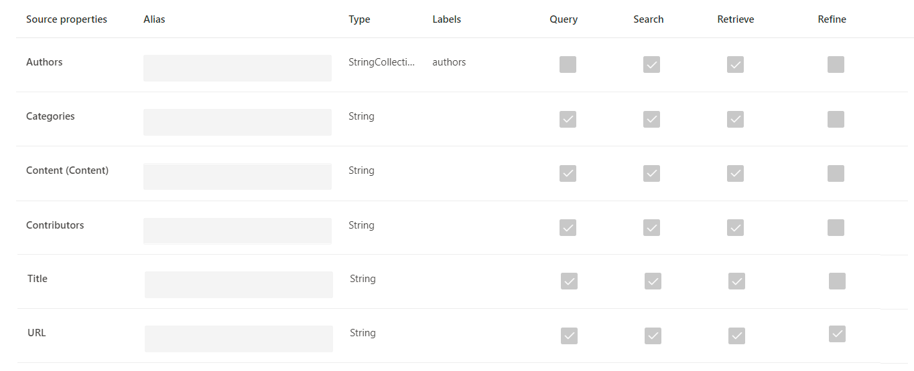
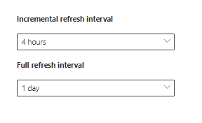

<!-- markdownlint-disable no-trailing-punctuation -->

# Configurar el conector creado por Microsoft para Microsoft Search

Este artículo le guiará por los pasos necesarios para configurar un conector creado por Microsoft. Se describe el flujo de configuración de una conexión en el [centro de administración](https://admin.microsoft.com)de Microsoft 365. Para obtener más información sobre cómo configurar conectores creados por Microsoft específicos, consulte estos artículos:

* [Azure Data Lake Storage Gen2](azure-data-lake-connector.md)
* [Azure DevOps](azure-devops-connector.md)
* [SQL de Azure](MSSQL-connector.md)
* [Sitios web de la empresa](enterprise-web-connector.md)
* [MediaWiki](mediawiki-connector.md)
* [Microsoft SQL Server](MSSQL-connector.md)
* [ServiceNow](servicenow-connector.md)

## Configurar

Complete los pasos siguientes para configurar cualquiera de los conectores creados por Microsoft.

1. Vaya a la [pestaña conectores](https://admin.microsoft.com/Adminportal/Home#/MicrosoftSearch/Connectors) en el [centro de administración de Microsoft 365](https://admin.microsoft.com).
2. Inicie sesión en su cuenta con las credenciales de su inquilino de [Microsoft 365](https://www.microsoft.com/microsoft-365) .
3. Seleccione **Agregar un conector**.
4. En la lista de conectores disponibles, seleccione el conector de su elección.

### Nombre del conector

Para crear una conexión, primero especifique estos atributos:

1. Nombre de la conexión
2. IDENTIFICADOR de conexión
3. Descripción (opcional)

El identificador de conexión crea propiedades implícitas para el conector. Debe contener solo caracteres alfanuméricos y tener un máximo de 32 caracteres.

### Conectarse a un origen de datos

El proceso de conexión de datos varía en función del tipo de conector. Para obtener más información sobre cómo conectarse a su origen de datos local, vea [instalar una puerta de enlace de datos local](https://aka.ms/configuregateway).

### Seleccionar Propiedades de origen

Los campos de datos establecidos por el origen de datos de terceros como propiedades de origen se indizan en Microsoft Search. Para modificar estas propiedades, seleccione **Editar propiedades** en la barra lateral situada a la derecha de la página **conectores** . Puede seleccionar **hasta 64 propiedades de origen**.

### Administrar el esquema de búsqueda

Los administradores pueden establecer los atributos del esquema de búsqueda para controlar la funcionalidad de búsqueda de cada propiedad de origen. Un esquema de búsqueda ayuda a determinar los resultados que se muestran en la página de resultados de búsqueda y la información que los usuarios finales pueden ver y a los que se accede.

Los atributos de esquema de búsqueda incluyen **búsquedas**, **consultas**y **recuperables**. En la siguiente tabla se enumeran todos los atributos compatibles con los conectores de Microsoft Graph y se explican sus funciones.

Atributo de esquema de búsqueda | Función | Ejemplo
--- | --- | ---
QUE permiten búsquedas | Hace que el contenido de texto de una propiedad permita la búsqueda. El contenido de la propiedad se incluye en el índice de texto completo. | Si la propiedad es **title**, una consulta de **Enterprise** devuelve respuestas que contienen la palabra **Enterprise** en cualquier texto o título.
CONSULTABLE | Busca una coincidencia para una propiedad determinada en la consulta. A continuación, se puede especificar el nombre de la propiedad en la consulta, ya sea mediante programación o literalmente. |  Si la propiedad **title** es consultable, el título de la consulta **: Enterprise** es compatible.
RECUPERABLE | Solo se pueden usar propiedades recuperables en el tipo de resultado y se muestran en los resultados de la búsqueda. |

Para todos los conectores, los tipos personalizados deben establecerse manualmente. Para activar las capacidades de búsqueda para cada campo, necesita un esquema de búsqueda asignado a una lista de propiedades. El Asistente para la conexión selecciona automáticamente un esquema de búsqueda en función del conjunto de propiedades de origen que elija. Puede modificar este esquema activando las casillas de verificación de cada propiedad y atributo en la página esquema de búsqueda.

Estas restricciones y recomendaciones se aplican a la configuración del esquema de búsqueda:

* Para los conectores que indizan tipos personalizados, se recomienda **no** marcar el campo que contiene el contenido principal **recuperable**. Se producen problemas de rendimiento significativos cuando los resultados de búsqueda se representan con ese atributo de búsqueda. Un ejemplo es el campo de contenido de **texto** de un artículo de base de conocimiento de [ServiceNow](https://www.servicenow.com) .
* Solo las propiedades marcadas como representables recuperables en los resultados de búsqueda y se pueden usar para crear tipos de resultado modernos (MRTs).
* Solo las propiedades de cadena se pueden marcar como buscables.

> [!Note]
> Después de crear una conexión, **no** puede modificar el esquema. Para ello, debe eliminar la conexión y crear una nueva.

### Administrar permisos de búsqueda

Las listas de control de acceso (ACL) determinan qué usuarios de la organización pueden tener acceso a cada elemento de datos. Todos los conectores admiten permisos de búsqueda que son visibles para todos los usuarios.

### Establecer la programación de actualización

La programación de la actualización determina la frecuencia con la que los datos se sincronizan con el índice en Microsoft Graph y Microsoft Search. Puede programar la actualización de dos maneras: rastreo completo o rastreo incremental.

Con un **rastreo completo**, el motor de búsqueda procesa e indiza todos los elementos del origen de contenido, independientemente de los rastreos anteriores. El rastreo completo funciona mejor en estas situaciones:

* Detección de eliminaciones de datos.
* El rastreo incremental no pudo rastrear el contenido de los errores.
* Las ACL se modificaron.
* Se modificaron las reglas de rastreo.
* Se necesita una actualización de software de Microsoft Search. Las actualizaciones modifican el esquema de búsqueda.

Con un **rastreo incremental**, el motor de búsqueda puede procesar e indizar sólo los elementos que se crearon o modificaron desde el último rastreo correcto. Por lo tanto, no todos los datos en el origen de contenido se vuelven a indizar. Los rastreos incrementales funcionan mejor para detectar contenido, metadatos, permisos y otras actualizaciones.

Los rastreos incrementales son mucho más rápidos que los rastreos completos porque no se procesan los elementos que no han cambiado. Para mantener una sincronización de datos precisa entre el origen de contenido y el índice de búsqueda, debe ejecutar ambos rastreos de forma periódica.

Cada conector tendrá un conjunto de programaciones de actualización óptimo diferente en función de la frecuencia con la que se modifican los datos y el tipo de modificaciones.

### Revisión de la configuración del conector

Después de configurar el conector, el [centro de administración](https://admin.microsoft.com) le lleva a una página en la que puede revisar la configuración. Puede volver a pasar por el proceso de configuración para editar cualquier configuración antes de confirmar la conexión. Para obtener más información, consulte [administrar el conector](manage-connector.md).

## Pasos siguientes: personalizar la página de resultados de búsqueda

Con la interfaz de usuario (UI) de Microsoft Search, los usuarios finales pueden buscar contenido de las aplicaciones de productividad de [microsoft 365](https://www.microsoft.com/microsoft-365) y el ecosistema de Microsoft más amplio. Una presentación vertical de búsqueda hace referencia a las pestañas que se muestran cuando un usuario ve los resultados de la búsqueda en [SharePoint](https://sharepoint.com/), [Microsoft Office](https://Office.com)y Microsoft Search en [Bing](https://Bing.com). Puede personalizar las presentaciones verticales de búsqueda para restringir los resultados, de modo que solo se muestre un tipo determinado de resultados de búsqueda. Estos verticales aparecen como una pestaña en la parte superior de la página de resultados de búsqueda. Un tipo de resultado moderno (MRT) es la interfaz de usuario que designa cómo se presentan los resultados.

Cree sus propios tipos de resultados y verticales, para que los usuarios finales puedan ver los resultados de la búsqueda de conexiones nuevas. Sin este paso, los datos de la conexión no se mostrarán en la página de resultados de búsqueda.

Para obtener más información sobre cómo crear sus verticales y MRTs, vea [Personalización](customize-search-page.md)de la página de resultados de búsqueda.

## ¿Cómo sé si funcionó la configuración de la conexión?

Vaya a la lista de las conexiones publicadas en la ficha **conectores** del [centro de administración](https://admin.microsoft.com). Para obtener información sobre cómo realizar actualizaciones y eliminaciones, consulte [administrar el conector](manage-connector.md).
