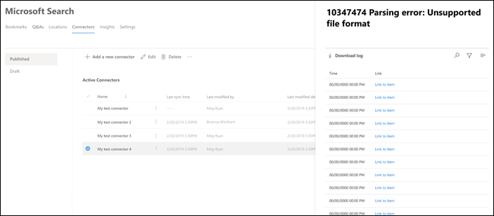

<!-- markdownlint-disable no-inline-html -->

# Ver detalles de conexión y errores

Para obtener acceso y administrar los conectores, debe estar designado como administrador de búsqueda para su inquilino. Póngase en contacto con el administrador de inquilinos para aprovisionar el rol de administrador de búsqueda.

Vaya a la [pestaña Conectores](https://admin.microsoft.com/Adminportal/Home#/MicrosoftSearch/Connectors) de [la Centro de administración de Microsoft 365](https://admin.microsoft.com).

Puede ver los detalles y errores de conexión al hacer clic en la conexión en la [pestaña Conectores](https://admin.microsoft.com/Adminportal/Home#/MicrosoftSearch/Connectors).  

## Ver la última información de rastreo

Una vez completado correctamente el primer rastreo incremental o completo inicial, los últimos valores de datos de rastreo se muestran en el último encabezado de rastreo en el panel de detalles. Si no se ejecutó el último rastreo, no verá ninguna información en el último encabezado de rastreo. Esta información sobre el último rastreo le ayudará a obtener información sobre cómo se realizó el rastreo y a realizar los pasos necesarios siempre que sea necesario.

Los siguientes últimos valores de rastreo estarán disponibles para cada conexión:

Valor | Descripción
--- | ---
**Completado en** | Fecha y hora en que se completó el último rastreo
**Tipo** | Rastreo incremental o completo
**Duration** | cuánto tiempo tardaron en completarse los últimos rastreos
**Operaciones correctas.** | Número de elementos que se han ingerido correctamente en el último rastreo
**Errores** | Número de elementos que se han producido errores en el último rastreo

## Supervisar errores

Para cada **Active Connector de** la pestaña Conectores, los errores de rastreo **existentes** se muestran en la **pestaña Error.** En la pestaña se enumeran los códigos de error, el recuento de cada una y las opciones de descarga del registro de errores. Vea el ejemplo en la siguiente imagen. Seleccione un **código de error** para ver los detalles del error.

Para ver los detalles específicos de un error, seleccione su código de error. Aparece una pantalla con detalles de error y un vínculo. Los errores más recientes aparecen en la parte superior. Vea el ejemplo en la tabla siguiente.

A continuación se muestra la lista de diferentes errores que pueden aparecer en cualquier conexión.

Código de error | Mensaje de error | Solución
--- | --- | ---
1000 | El origen de datos no está disponible. Compruebe la conexión a Internet o asegúrese de que el conector aún pueda acceder al origen de datos. | Este error se produce cuando el origen de datos no es accesible debido a un problema de red o cuando se elimina, mueve o cambia el nombre del origen de datos. Compruebe si los detalles del origen de datos proporcionados siguen siendo válidos.
1001 | No se pueden actualizar los datos, ya que el origen de datos limita el conector. | Para deshacer el origen de datos, compruebe si sus límites de escala pueden aumentarse o esperar hasta una hora del día con menos tráfico.
1002 | No se puede autenticar con el origen de datos. Compruebe que las credenciales asociadas con este origen de datos son correctas. | Haga **clic en Editar** para actualizar las credenciales de autenticación.
1003 | La cuenta asociada al conector no tiene permiso para tener acceso al elemento. |  Asegúrese de que la cuenta adecuada tiene acceso al elemento que desea indizar.
1004 | No se puede llegar a la puerta de enlace de datos local. Asegúrese de que el servicio de puerta de enlace se está ejecutando y de que los detalles de la puerta de enlace se actualizan en la configuración de conexión. | Compruebe el equipo con la puerta de enlace, abra la Power BI de puerta de enlace y asegúrese de que la puerta de enlace se está ejecutando. Compruebe que la puerta de enlace usa la misma cuenta de administrador que Búsqueda de Microsoft y, a continuación, asegúrese de que todos los detalles de la puerta de enlace estén actualizados en la configuración de conexión.
1005 | Las credenciales asociadas con este origen de datos han expirado. Renueve las credenciales y actualice la conexión. | Haga **clic en Editar** para actualizar las credenciales de autenticación.
1006 | La versión de la puerta de enlace no está actualizada y ya no es compatible con este conector. Deberá actualizar la puerta de enlace. | Visite [Instalar una puerta de](/data-integration/gateway/service-gateway-install) enlace de datos local para descargar e instalar la versión más reciente de la puerta de enlace Power BI en la máquina que contiene la puerta de enlace.
1007 | No se detectó Power BI licencia válida. Necesita una licencia de Power BI válida para realizar este rastreo. | Necesita una licencia de Power BI válida para realizar este rastreo. Compruebe que su organización tiene una licencia válida. Si lo hace, inténtelo de nuevo. Si no lo hace, obtenga una licencia y vuelva a intentarlo.
1008 | El uso total de la cuota del espacio empresarial ha alcanzado su límite. | Intente eliminar una conexión para liberar parte de la cuota o ajustar los filtros de ingesta para traer menos datos. Si no solucionan el problema, póngase en contacto con el soporte técnico de Microsoft.
1009 | El uso total de la cuota para la conexión ha alcanzado su límite. | Intenta ajustar los filtros de ingesta para traer menos datos. Si esto no soluciona el problema, póngase en contacto con el soporte técnico de Microsoft.
1010 | El uso total de cuota para indizar grupos que no son de Azure AD ha alcanzado su límite de 100.000. | Intente eliminar una conexión para liberar parte de la cuota o ajustar los filtros de ingesta para traer menos datos. Si no solucionan el problema, póngase en contacto con el soporte técnico de Microsoft.
1011 | El Graph de [conector no](graph-connector-agent.md) es accesible ni sin conexión. | 
1012 | Error en la autenticación en la conexión debido a un modo de autenticación no compatible. | Edite la conexión para actualizar la configuración de autenticación de la conexión.
2001 | La indización se limita debido a un gran número de actualizaciones en la cola. Según la cola, las actualizaciones pueden tardar algún tiempo en completarse. | Espere hasta que se borra la cola.
2002 | Error en la indización debido al formato de elemento no compatible. | Consulte la documentación específica del conector para obtener más información.
2003 | Error en la indización debido al contenido de elementos no admitido. | Consulte la documentación específica del conector para obtener más información.
2004 | Error en la indización debido al tamaño de archivo o elemento no admitido. | Consulte la documentación específica del conector para obtener más información.
2005 | Error en la indización porque el URI es demasiado largo. | Consulte la documentación específica del conector para obtener más información.
2006 | Error en la asignación de usuarios debido a una fórmula de asignación no válida o a que ningún usuario de Azure AD con esta propiedad. | Intente eliminar y volver a crear la conexión con una fórmula de asignación diferente. 
2007 | Este elemento no se mostrará en Búsqueda de Microsoft porque algunos usuarios o grupos sin permiso para ver este elemento no se pudieron indizar. | 
2008 | Las conexiones no pueden tener grupos que no son de Azure AD con más de 50 000 miembros. | Intente quitar usuarios de un grupo o intente quitar elementos ACLed con ese grupo de la ingesta y vuelva a crear la conexión.
2009 | La indización de grupos que no es de Azure AD se pausa temporalmente debido a un gran número de solicitudes. La indización se reanudará cuando el sistema termine de procesar estas solicitudes. Vuelva más tarde. | 
2010 | Esta conexión ya no es válida debido a una actualización realizada por Microsoft. Elimine la conexión y cree una nueva. | Elimine la conexión y cree una nueva.
5000 | Algo salió mal. Si esto continúa, póngase en contacto con el soporte técnico. |