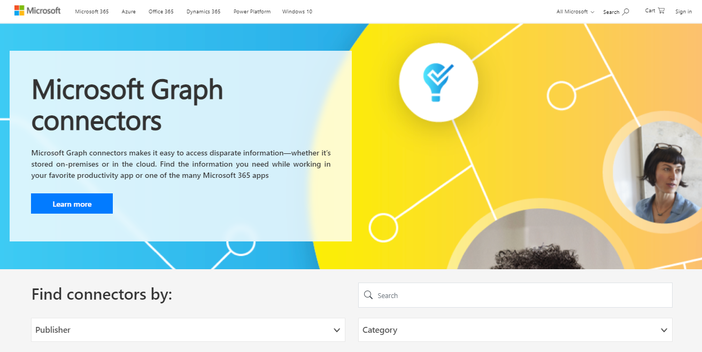

# Galería de conectores Graph Microsoft

La [galería de conectores de microsoft Graph](http://www.microsoft.com/microsoft-search/connectors) incluye una breve descripción de cada uno de los conectores creados por Microsoft y nuestros partners, y un vínculo al sitio web de cada partner.

Con más de 100 conectores disponibles actualmente, puedes conectarte a microsoft populares y no servicios Microsoft como servicios de Azure, Box, MediaWiki, ServiceNow, SalesForce, servicios de Google, MediaWiki y muchos más.

Visite la [galería Graph conectores de](http://www.microsoft.com/microsoft-search/connectors) Microsoft y busque toda la información que necesita.

 

