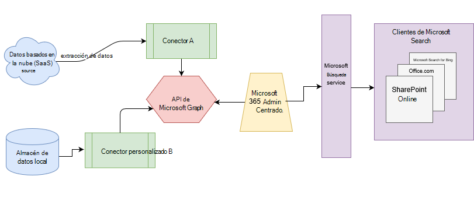

# Información general sobre los conectores de Microsoft Graph

Microsoft Search indiza todos los datos de [microsoft 365](https://www.microsoft.com/microsoft-365) para permitir que los usuarios puedan buscar en ellos. Con los conectores de Microsoft Graph, la organización puede indexar datos de terceros para que aparezcan en los resultados de Búsqueda de Microsoft. Los datos de terceros pueden hospedarse localmente o en nubes públicas o privadas. Los conectores amplían los tipos de orígenes de contenido que se pueden buscar en las aplicaciones de productividad de Microsoft 365 y el más amplio ecosistema de Microsoft.

> [!IMPORTANT]
> **Renuncia de responsabilidad** : los conectores de Microsoft Graph y las API de Microsoft Search (consulta e índice) están actualmente en estado de vista previa disponible para los inquilinos de la versión de destino. Para usar conectores con Microsoft Search o crear conectores, opte por la [versión dirigida](https://docs.microsoft.com/office365/admin/manage/release-options-in-office-365?view=o365-worldwide). Para obtener más información acerca de la vista previa, consulte [Connector Preview Program](connectors-preview.md).

## Arquitectura

El siguiente diagrama arquitectónico de la plataforma de Microsoft Graph muestra cómo el contenido del conector fluye a través de la indización de contenido a los resultados del usuario en los clientes de [Microsoft Search](https://docs.microsoft.com/microsoftsearch/overview-microsoft-search) . En este artículo se explica cada uno de los bloques de creación clave en el proceso de flujo de datos de los conectores de Microsoft Graph.

La API crea una instancia de una conexión por cada origen de datos. A continuación, la API indiza y almacena los datos. Las conexiones establecidas interactúan con Microsoft Search para que los usuarios puedan obtener resultados de búsqueda.

Puede configurar todos los conectores creados por Microsoft en el [centro de administración](https://admin.microsoft.com)de Microsoft 365. El centro de administración simplifica la configuración del conector con una interfaz de usuario sencilla.

Para crear una **conexión** a un origen de datos, los administradores necesitan acceso autenticado a los datos y a todo el repositorio de contenido. Los datos se suministran al servicio de conector de Graph para la indización.

## Conectores disponibles

Actualmente hay 6 conectores creados por Microsoft y más de 100 conectores están disponibles en nuestros socios de ecosistema.

Para obtener una vista previa de los conectores de uno de nuestros socios del ecosistema, póngase en contacto con ellos directamente. Para obtener más información, vea la [Galería de conectores de Microsoft Graph](connectors-gallery.md).

También puede [crear su propio conector](https://docs.microsoft.com/graph/search-concept-overview).

### Conectores de Microsoft

La versión preliminar de conectores de Microsoft Graph incluye 6 conectores creados por Microsoft. Puede configurarlos en el [centro de administración](https://admin.microsoft.com) y obtener información sobre cómo [configurar el conector creado por Microsoft](configure-connector.md).

En las secciones siguientes se proporcionan breves descripciones de estos conectores creados por Microsoft. Puede obtener más información en los artículos vinculados de cada conector.

- **[Azure Data Lake Storage](https://docs.microsoft.com/azure/storage/blobs/data-lake-storage-introduction)**. Con este conector de Microsoft Graph, los usuarios de la organización pueden buscar archivos y contenido almacenados en contenedores de blobs de Azure. El conector de Azure Data Lake Storage) también indexa las carpetas habilitadas para jerarquías en las cuentas de Azure Data Lake Storage-lectura que especifique.
Obtenga más información sobre el [conector de Azure Data Lake Storage](azure-data-lake-connector.md).

- **[Azure DevOps](https://azure.microsoft.com/services/devops)**. Con este conector de Microsoft Graph, los usuarios de la organización pueden buscar elementos de trabajo de la instancia de Azure DevOps.
Obtenga más información sobre el [conector de Azure DevOps](azure-devops-connector.md).

- **[SQL de Azure](https://azure.microsoft.com/services/sql-database)**. Con este conector de Microsoft Graph, los usuarios de la organización pueden buscar datos de la base de datos SQL de Azure.
Obtenga más información sobre [Azure SQL Connector](MSSQL-connector.md).

- **Sitios web de empresa**. Con este conector de Microsoft Graph, los usuarios de la organización pueden buscar en las páginas de cualquier sitio web que no sea de SharePoint Enterprise.
Obtenga más información sobre el [conector de sitios web de empresa](enterprise-web-connector.md).

- **[MediaWiki](https://www.mediawiki.org/wiki/MediaWiki)**. Con este conector de Microsoft Graph, los usuarios pueden buscar artículos de Knowledge base en sitios wiki que su organización crea con MediaWiki.
Obtenga más información sobre el [conector de MediaWiki](mediawiki-connector.md).

- **[Microsoft SQL Server](https://www.microsoft.com/sql-server/sql-server-2017)**. Con este conector de Microsoft Graph, los usuarios de la organización pueden buscar datos en bases de datos de SQL Server locales.
Obtenga más información sobre el [conector de Microsoft SQL Server](MSSQL-connector.md).

- **[ServiceNow](https://www.servicenow.com)**. Con este conector de Microsoft Graph, los usuarios de la organización pueden buscar artículos de Knowledge base desde su instancia de ServiceNow.
Obtenga más información sobre el [conector de ServiceNow](servicenow-connector.md).

### Conectores de nuestros socios

Hay más de 100 conectores disponibles para vista previa de nuestros socios del ecosistema. Para obtener una vista previa de los conectores de uno de nuestros socios del ecosistema, póngase en contacto con ellos directamente.
Obtenga más información sobre conectores de nuestros socios en la [Galería de conectores de Microsoft Graph](connectors-gallery.md).

### Crear su propio conector

Para indizar archivos o tipos de datos personalizados, los programadores pueden crear conectores en [Microsoft Graph](https://developer.microsoft.com/graph/). Un conector es una aplicación que [crea una conexión](https://docs.microsoft.com/graph/search-index-manage-connections) e inserta elementos en el índice de búsqueda de Microsoft. Para obtener más información, vea la [información general sobre cómo ampliar la experiencia de Microsoft Search para aplicaciones en Microsoft Graph](https://docs.microsoft.com/graph/search-concept-overview).

### Resultados de la búsqueda con el conector personalizado

Una vez indizados los datos personalizados, los desarrolladores pueden [consultar estos datos](https://docs.microsoft.com/graph/search-concept-custom-types). Puede ver los datos en cualquier aplicación. Para obtener más información, vea la [información general sobre cómo ampliar la experiencia de Microsoft Search para aplicaciones en Microsoft Graph](https://docs.microsoft.com/graph/search-concept-overview).

## Requisitos de licencia

Necesita una licencia válida de Microsoft 365 o de Office 365 y suficientes conectores de gráficos para que los usuarios de la organización puedan ver los datos de los conectores en los resultados de la búsqueda.

Para obtener más información, consulte [requisitos de licencia y precios](licensing.md).