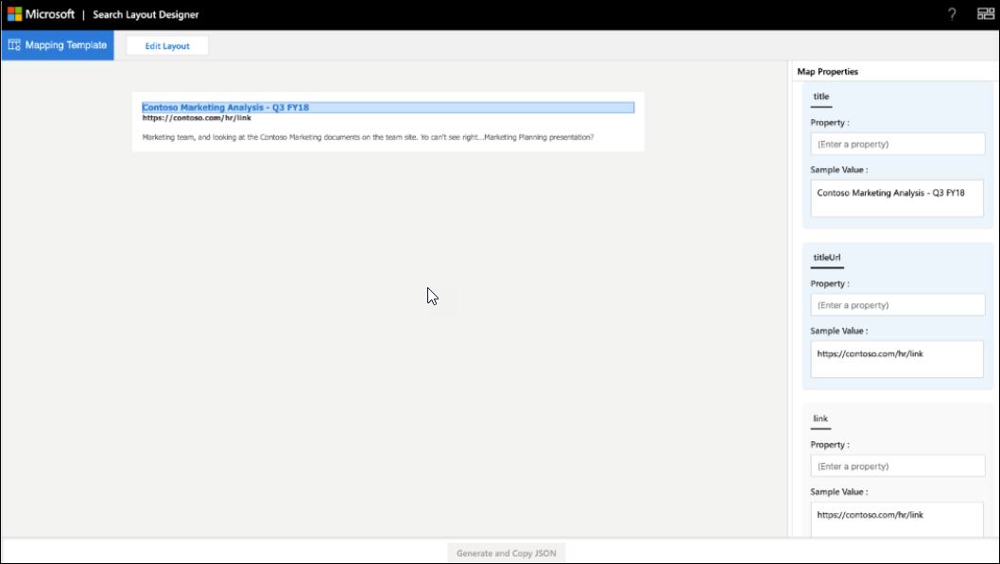

<!-- markdownlint-disable no-hard-tabs -->
# <a name="create-a-layout-to-customize-search-results"></a>Crear un diseño para personalizar los resultados de búsqueda

Puede diseñar el diseño de resultados para una vertical personalizada mediante el diseñador de diseños de búsqueda. Puedes empezar a diseñar el diseño eligiendo las plantillas que se ofrecen en el diseñador de diseños y usándolos si se ajustan a tus requisitos. O puede elegir editar estas plantillas de varias maneras para ajustarse a sus requisitos. Por ejemplo, agregar o quitar imágenes, agregar o quitar texto y modificar texto. Si ninguna de las plantillas cumple sus requisitos, puede empezar a diseñar el diseño con una plantilla en blanco.  

Después de que el diseño esté listo, use el lenguaje de plantilla [de](/adaptive-cards/templating/language) tarjetas adaptables para crear un JSON de diseño de resultados que se usa para definir un tipo de resultado. Las propiedades de resultado se asignan al diseño mediante el paso Asignación en el diseñador de diseños.  

## <a name="create-a-layout-on-your-own"></a>Crear un diseño por su cuenta

Crear un diseño por su cuenta requiere conocimientos de [tarjetas adaptables](/adaptive-cards/authoring-cards/getting-started) y su [esquema.](https://adaptivecards.io/explorer/) El diseño de resultados de búsqueda usa un subconjunto de los elementos ofrecidos por tarjetas adaptables y puede usar el diseñador de diseños para obtener información sobre el conjunto de elementos admitido.  

Al crear su propio diseño, cree el diseño de tarjeta adaptable con datos del conector y, a continuación, finalizar el diseño.
Hay dos pasos principales para crear su propio diseño:

- Diseñe el diseño.
- Separe los datos de la plantilla.

### <a name="design-the-layout"></a>Edite el diseño.

En este ejemplo, se muestra un diseño con un encabezado, un vínculo y un texto descriptivo.


Y este es el archivo JSON asociado del diseño:

```json
{
    "type": "AdaptiveCard",
    "version": "1.3",
    "body": [
        {
            "type": "ColumnSet",
            "columns": [
                {
                    "type": "Column",
                    "width": 8,
                    "items": [
                        {
                            "type": "TextBlock",
                            "text": "Contoso Marketing Analysis - Q3 FY18",
                            "color": "Accent",
                            "size": "Medium",
                            "spacing": "None",
                            "weight": "Bolder"
                        },
                        {
                            "type": "TextBlock",
                            "text": "https://contoso.com/hr/link",
                            "spacing": "None",
                            "color": "Dark",
                            "weight": "Bolder"
                        },
                        {
                            "type": "TextBlock",
                            "text": "Marketing team at Contoso.., and looking at the Contoso Marketing documents on the team site. This contains the data from FY20 and will taken over to FY21...Marketing Planning is ongoing for FY20..",
                            "wrap": true,
                            "maxLines": 2,
                            "spacing": "Medium"
                        }
                    ],
                    "horizontalAlignment": "Center",
                    "spacing": "None"
                }
            ]
        }
    ],
    "$schema": "http://adaptivecards.io/schemas/adaptive-card.json"
}
```

### <a name="separate-the-data-from-the-layout"></a>Separar los datos del diseño

Puede separar los datos del diseño y enlazar los datos.

Este es layout JSON después de enlazar los datos:

```json
{
    "type": "AdaptiveCard",
    "version": "1.3",
    "body": [
        {
            "type": "ColumnSet",
            "columns": [
                {
                    "type": "Column",
                    "width": 8,
                    "items": [
                        {
                            "type": "TextBlock",
                            "text": "[${title}](${titleUrl})",
                            "color": "Accent",
                            "size": "Medium",
                            "spacing": "None",
                            "weight": "Bolder"
                        },
                        {
                            "type": "TextBlock",
                            "text": "${link}",
                            "spacing": "None",
                            "color": "Dark",
                            "weight": "Bolder"
                        },
                        {
                            "type": "TextBlock",
                            "text": "${description}",
                            "wrap": true,
                            "maxLines": 2,
                            "spacing": "Medium"
                        }
                    ],
                    "horizontalAlignment": "Center",
                    "spacing": "None"
                }
            ]
        }
    ],
    "$schema": "http://adaptivecards.io/schemas/adaptive-card.json"
}
```

Datos de ejemplo: especifique datos de ejemplo en el **Editor** de datos de ejemplo para ver la tarjeta enlazada a datos cuando se encuentra en **modo de vista previa**.

```json
{

    "title": "Contoso Marketing Analysis - Q3 FY18",
    "titleUrl": "https://contoso.com/hr/link",
    "link": "https://contoso.com/hr/link",
    "description": "Marketing team, and looking at the Contoso Marketing documents on the team site. Yo can't see right...Marketing Planning presentation?"

}
```

## <a name="map-the-layout-to-the-result-properties"></a>Asignar el diseño a las propiedades de resultados

Debe asignar cada campo del diseño a una propiedad result o a una propiedad connector para generar el JSON de diseño de resultados.



Seleccione un campo en el diseño para resaltar las variables que deben asignarse. Puede usar varias variables para un solo campo y todos los campos deben asignarse a las propiedades de resultado.

### <a name="show-snippet-on-search-result"></a>Mostrar fragmento de código en el resultado de la búsqueda  

Los fragmentos de código dinámicos generados en la propiedad **de** contenido del resultado del conector se pueden mostrar en el resultado de la búsqueda. **ResultSnippet es** la propiedad del sistema que actúa como una propiedad de marcador de posición para los fragmentos de código generados para cada resultado de Connector. Para mostrar los fragmentos de código en el diseño de resultados, la propiedad del sistema **ResultSnippet** debe asignarse a un campo adecuado, por ejemplo Description, en el diseño de resultados de búsqueda. Los fragmentos de código generados en cada resultado también resaltan las coincidencias del fragmento de código con el término de consulta especificado por el usuario.

## <a name="things-to-consider"></a>Consideraciones que se deben tener en cuenta

Antes de empezar, hay algunas cosas que debe hacer y algunas cosas que debe evitar para asegurarse de que los diseños se realicen correctamente.

### <a name="do"></a>Correcto

- Edite una plantilla para proporcionar el vínculo de logotipo en el diseño si usa vínculos estáticos para logotipos y no propiedades de resultados.
- Valide el diseño de resultados para escenarios en los que no se devuelven datos para una propiedad de resultado usada en el JSON de resultados. Use la `$when` condición para ocultar un elemento si la propiedad no contiene datos.  
- Asegúrese de que los tipos de datos de la `$when` condición y la propiedad result coinciden. Por ejemplo, no se compare `Number` con `Text` la `$when` condición.  
- Piense en los requisitos del tema al diseñar un diseño de resultados.  
- Asegúrese de que el `Textblock`   elemento puede controlar el contenido dinámico. Puede usar las propiedades `wrap` del elemento and para este `maxLines` propósito.
- Formatee correctamente la fecha al usar `{DATE()}` en Markdown.  

### <a name="dont"></a>Incorrecto

- No defina tipos de datos no válidos al enlazar valores. Para obtener más información acerca de los tipos de datos, [vea Manage the Search schema](/sharepoint/search/manage-the-search-schema).
- Evite recortar el resultado en la página de resultados siguiendo el alto máximo del JSON de diseño de resultados. Si supera el alto máximo del diseño de resultados, el resultado se recortará en la página de resultados.
- No use valores `px` en propiedades de elemento.
- No use markdown con la **propiedad ResultSnippet** en el diseño de resultados para resaltar la coincidencia de consulta en el resultado de la búsqueda.

## <a name="resources"></a>Recursos

[Personalizar página de resultados de búsqueda](customize-search-page.md)

[Tarjetas adaptables](/adaptive-cards/authoring-cards/getting-started)

[Idioma de plantilla de tarjetas adaptables](/adaptive-cards/templating/language)

[Esquema de tarjeta adaptable](https://adaptivecards.io/explorer/)
