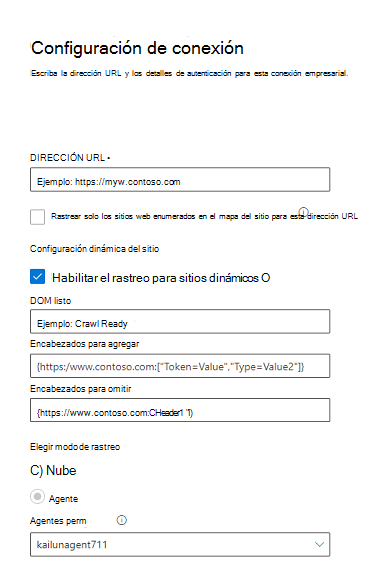

<!---Previous ms.author: monaray --->

<!-- markdownlint-disable no-inline-html -->

# Enterprise sitios web Graph conector

El Enterprise web Graph permite a su organización indizar artículos y **contenido de sus sitios web internos.** Después de configurar el conector y sincronizar el contenido del sitio web, los usuarios finales pueden buscar ese contenido desde cualquier Búsqueda de Microsoft cliente.

> [!NOTE]
> Lea el [**artículo Configurar el conector Graph para**](configure-connector.md) comprender las instrucciones de configuración Graph conectores generales.

Este artículo está para cualquier persona que configure, ejecute y monitore un conector Enterprise sitios web. Complementa el proceso de configuración general y muestra instrucciones que solo se aplican al conector Enterprise sitios web. En este artículo también se incluye información sobre [la solución de problemas.](#troubleshooting)

<!---## Before you get started-->

<!---Insert "Before you get started" recommendations for this data source-->

## Paso 1: Agregar un conector Graph en el Centro de administración de Microsoft 365

Siga las instrucciones [generales de configuración](./configure-connector.md).
<!---If the above phrase does not apply, delete it and insert specific details for your data source that are different from general setup instructions.-->

## Paso 2: Nombrar la conexión

Siga las instrucciones [generales de configuración](./configure-connector.md).
<!---If the above phrase does not apply, delete it and insert specific details for your data source that are different from general setup instructions.-->

## Paso 3: Configurar las opciones de conexión

Para conectarse al origen de datos, rellene la dirección URL raíz del sitio web, seleccione un origen de rastreo y el tipo de autenticación que desea usar: None, Basic Authentication o OAuth 2.0 con [Azure Active Directory (Azure AD).](/azure/active-directory/) Después de completar esta información, seleccione Probar conexión para comprobar la configuración.

### URL

Use el campo DIRECCIÓN URL para especificar la raíz del sitio web que desea rastrear. El conector de sitios web de empresa usará esta dirección URL como punto de partida y seguirá todos los vínculos de esta dirección URL para su rastreo.

### Rastrear sitios web enumerados en el mapa del sitio

Cuando se selecciona, el conector solo rastreará las direcciones URL que aparecen en el mapa del sitio. Si no está seleccionado o no se encuentra ningún mapa del sitio, el conector realizará un rastreo profundo de todos los vínculos encontrados en la dirección URL raíz del sitio.

### Configuración dinámica del sitio

Si su sitio web contiene contenido dinámico, por ejemplo, páginas web que viven en sistemas de administración de contenido como Confluence o Unily, puede habilitar un rastreador dinámico. Para activarlo, seleccione **Habilitar rastreo para sitios dinámicos.** El rastreador esperará a que se represente el contenido dinámico antes de comenzar el rastreo.

> [!div class="mx-imgBorder"]
> 

Además de la casilla, hay tres campos opcionales disponibles:

1. **Dom listo:** escriba el elemento DOM que el rastreador debe usar como señal de que el contenido se representa completamente y que el rastreo debe comenzar.
1. **Encabezados para agregar:** especifique qué encabezados HTTP debe incluir el rastreador al enviar esa dirección URL web específica. Puede establecer varios encabezados para diferentes sitios web. Se recomienda incluir valores de token de autenticación.
1. **Encabezados para omitir:** especifique los encabezados innecesarios que deben excluirse de las solicitudes de rastreo dinámico.

> [!NOTE]
> El rastreo dinámico solo es compatible con el modo de rastreo de agente.

### Modo de rastreo: nube o local

El modo de rastreo determina el tipo de sitios web que desea indizar, ya sea en la nube o local. Para los sitios web en la nube, **seleccione Nube** como modo de rastreo.

Además, el conector ahora admite el rastreo de sitios web locales. Para obtener acceso a los datos locales, primero debe instalar y configurar el agente Graph conector. Para obtener más información, [vea Graph connector agent](./graph-connector-agent.md).

Para los sitios web  locales, seleccione Agente como  modo de rastreo y, en el campo Agente local, elija el agente de conector de Graph que instaló y configuró anteriormente.  

### Autenticación

La autenticación básica requiere un nombre de usuario y una contraseña. Cree esta cuenta de bot mediante el [Centro de administración de Microsoft 365](https://admin.microsoft.com).

OAuth 2.0 con [Azure AD](/azure/active-directory/) requiere un identificador de recurso, id. de cliente y secreto de cliente. OAuth 2.0 solo funciona con el modo nube.

Para obtener más información, vea [Authorize access to Azure Active Directory web applications using OAuth 2.0 code grant flow](/azure/active-directory/develop/v1-protocols-oauth-code). Regístrese con los siguientes valores:

**Nombre:** Búsqueda de Microsoft  
**Redirect_URI:**`https://gcs.office.com/v1.0/admin/oauth/callback`

Para obtener los valores del recurso, client_id y client_secret, vaya a Usar el código de autorización para solicitar un **token** de acceso en la página web url de redireccionamiento.

Para obtener aún más información, vea [Inicio rápido: Registrar una aplicación con el Plataforma de identidad de Microsoft](/azure/active-directory/develop/quickstart-register-app).

## Paso 3a: Agregar direcciones URL para excluir (restricciones de rastreo opcionales)

Hay dos maneras de evitar que se rastreen las páginas: no permitirlas en el archivo robots.txt o agregarlas a la lista de exclusión.

### Compatibilidad con robots.txt

El conector comprueba si hay un archivo robots.txt para el sitio raíz y, si existe, seguirá y respetará las instrucciones que se encuentran en ese archivo. Si no desea que el conector rastree determinadas páginas o directorios en su sitio, puede llamar a esas páginas o directorios en las declaraciones "No permitir" en el archivo robots.txt web.

### Agregar direcciones URL para excluir

Opcionalmente, puede crear una lista **de** exclusión para excluir que algunas direcciones URL se rastreen si ese contenido es confidencial o no vale la pena rastrearlo. Para crear una lista de exclusión, examine la dirección URL raíz. Puede agregar las direcciones URL excluidas a la lista durante el proceso de configuración.

## Paso 4: Asignar etiquetas de propiedades

Puede asignar una propiedad de origen a cada etiqueta eligiendo en un menú de opciones. Aunque este paso no es obligatorio, tener algunas etiquetas de propiedades mejorará la relevancia de la búsqueda y garantizará resultados de búsqueda más precisos para los usuarios finales.

## Paso 5: Administrar esquema

En **la** pantalla Administrar esquema, puede cambiar los atributos de esquema (las opciones son **Consulta,** **Búsqueda,** Recuperar y **Refinar)** asociados con las propiedades, agregar alias opcionales y elegir la **propiedad Content.**

## Paso 6: Administrar permisos de búsqueda

El conector Enterprise sitios web solo admite permisos de búsqueda visibles para **todos**. Los datos indizados aparecen en los resultados de la búsqueda y son visibles para todos los usuarios de la organización.

## Paso 7: Establecer la programación de actualización

El conector Enterprise sitios web solo admite una actualización completa. Esto significa que el conector volverá a abrir todo el contenido del sitio web durante cada actualización. Para asegurarse de que el conector obtiene suficiente tiempo para rastrear el contenido, se recomienda establecer un intervalo de programación de actualización grande. Se recomienda una actualización programada entre una y dos semanas.

## Paso 8: Revisar la conexión

Siga las instrucciones [generales de configuración](./configure-connector.md).
<!---If the above phrase does not apply, delete it and insert specific details for your data source that are different from general setup instructions.-->

## Solución de problemas

Al leer el contenido del sitio web, el rastreo puede encontrar algunos errores de origen, que se representan mediante los códigos de error detallados a continuación. Para obtener más información sobre los tipos de errores, vaya a la página de detalles del **error** después de seleccionar la conexión. Seleccione el **código de error** para ver errores más detallados. Consulte también [Administrar el conector para](./manage-connector.md) obtener más información.

 Código de error detallado | Mensaje de error
 --- | ---
 6001 | El sitio que se intenta indizar no es accesible
 6005 | La página de origen que se intenta indizar se ha bloqueado según robots.txt configuración.
 6008 | No se puede resolver el DNS
 6009 | Para todos los errores del lado cliente (excepto HTTP 404, 408), consulte http 4xx códigos de error para obtener más información.
 6013 | No se pudo encontrar la página de origen que se está intentando indizar. (Error HTTP 404)
 6018 | La página de origen no responde y la solicitud ha dado tiempo de espera. (Error HTTP 408)
 6021 | La página de origen que se intenta indizar no tiene contenido textual en la página.
 6023 | La página de origen que se intenta indizar no es compatible (no una página HTML)
 6024 | La página de origen que se intenta indizar tiene contenido no compatible.

* Los errores 6001-6013 se producen cuando el origen de datos no es accesible debido a un problema de red o cuando se elimina, mueve o cambia el nombre del origen de datos. Compruebe si los detalles del origen de datos proporcionados siguen siendo válidos.
* Los errores 6021-6024 se producen cuando el origen de datos contiene contenido no textual en la página o cuando la página no es un HTML. Compruebe el origen de datos y agregue esta página en la lista de exclusión o ignore el error.
