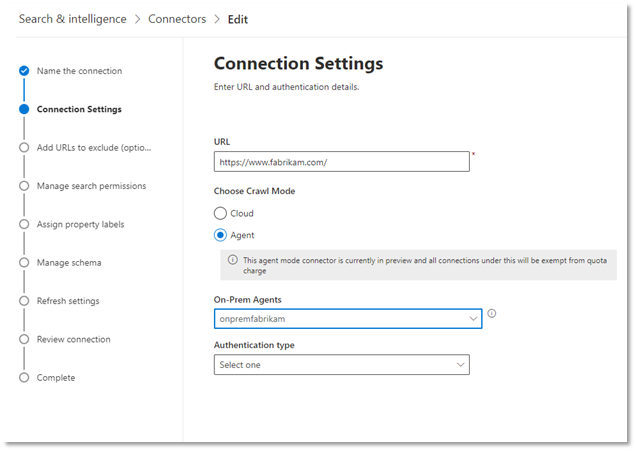

<!---Previous ms.author: monaray --->

<!-- markdownlint-disable no-inline-html -->

# Conector de Graph de sitios web empresariales

El conector de Graph de sitios web empresariales permite a su organización indizar artículos y **contenido de sus sitios web internos.** Después de configurar el conector y sincronizar el contenido del sitio web, los usuarios finales pueden buscar ese contenido desde cualquier cliente de Microsoft Search.

> [!NOTE]
> Lea el [**artículo configurar el conector de Graph**](configure-connector.md) para comprender el proceso de configuración general de los conectores de Graph.

Este artículo está dirigido a cualquier persona que configure, ejecute y monitore un conector de ServiceNow Graph. Complementa el proceso de configuración general y muestra instrucciones que solo se aplican al conector de ServiceNow Graph. En este artículo también se incluye información sobre [la solución de problemas](#troubleshooting) y las [limitaciones.](#limitations)

<!---## Before you get started-->

<!---Insert "Before you get started" recommendations for this data source-->

## Paso 1: Agregar un conector de Graph en el Centro de administración de Microsoft 365

Siga las instrucciones [generales de configuración.](https://docs.microsoft.com/microsoftsearch/configure-connector)
<!---If the above phrase does not apply, delete it and insert specific details for your data source that are different from general setup instructions.-->

## Paso 2: Nombrar la conexión

Siga las instrucciones [generales de configuración.](https://docs.microsoft.com/microsoftsearch/configure-connector)
<!---If the above phrase does not apply, delete it and insert specific details for your data source that are different from general setup instructions.-->

## Paso 3: Configurar las opciones de conexión

Para conectarse al origen de datos, debe rellenar la dirección URL raíz del sitio web, seleccionar un origen de rastreo y el tipo de autenticación que desea usar: Ninguno, Autenticación básica u OAuth 2.0 con [Azure Active Directory (Azure AD).](https://docs.microsoft.com/azure/active-directory/) Después de completar esta información, seleccione Probar conexión para comprobar la configuración.

### URL

Use el campo de dirección URL para especificar la raíz del sitio web que desea rastrear. El conector de sitios web de empresa usará esta dirección URL como punto de partida y seguirá todos los vínculos de esta dirección URL para su rastreo.

### Modo de rastreo: nube o local (versión preliminar)

El modo de rastreo determina el tipo de sitios web que desea indizar, ya sea en la nube o local. Para los sitios web de la nube, seleccione **Nube** como modo de rastreo.

Además, el conector ahora admite el rastreo de sitios web locales. Este modo está en versión preliminar. Para obtener acceso a los datos locales, primero debe instalar y configurar el agente del conector de Graph. Para obtener más información, consulte [Agente de conector de Graph.](https://docs.microsoft.com/microsoftsearch/on-prem-agent)

Para los sitios web  locales, seleccione Agente como  modo de rastreo y, en el campo Agente local, elija el agente de conector de Graph que instaló y configuró anteriormente.  

> [!div class="mx-imgBorder"]
> 

### Autenticación

La autenticación básica requiere un nombre de usuario y una contraseña. Cree esta cuenta de bot con el Centro [de administración de Microsoft 365.](https://admin.microsoft.com)

OAuth 2.0 con [Azure AD](https://docs.microsoft.com/azure/active-directory/) requiere un id. de recurso, id. de cliente y secreto de cliente. OAuth 2.0 solo funciona con el modo de nube.

Para obtener más información, vea Autorizar el acceso a las aplicaciones web de Azure Active Directory mediante el flujo de concesión de código [de OAuth 2.0.](https://docs.microsoft.com/azure/active-directory/develop/v1-protocols-oauth-code) Regístrate con los siguientes valores:

**Nombre:** Búsqueda de Microsoft  
**Redirect_URI:**`https://gcs.office.com/v1.0/admin/oauth/callback`

Para obtener los valores del recurso, client_id y client_secret, vaya **a Usar** el código de autorización para solicitar un token de acceso en la página web de url de redireccionamiento.

Para obtener más información, vea [Inicio rápido: Registrar una aplicación con la plataforma de identidad de Microsoft.](https://docs.microsoft.com/azure/active-directory/develop/quickstart-register-app)

## Paso 3a: Agregar direcciones URL para excluir (restricciones de rastreo opcionales)

Hay dos formas de evitar que se rastreen las páginas: no permitirlas en el archivo robots.txt o agregarlas a la lista de exclusión.

### Compatibilidad con robots.txt

El conector comprueba si hay un archivo robots.txt para el sitio raíz y, si existe, seguirá y respetará las indicaciones que se encuentran en ese archivo. Si no desea que el conector rastree determinadas páginas o directorios del sitio, puede llamar a esas páginas o directorios en las declaraciones "No permitir" en el archivo robots.txt web.

### Agregar direcciones URL para excluir

Opcionalmente, puede crear una lista **de** exclusión para excluir que algunas direcciones URL no se rastreen si ese contenido es confidencial o no merece la pena rastrearlo. Para crear una lista de exclusión, examine la dirección URL raíz. Puede agregar las direcciones URL excluidas a la lista durante el proceso de configuración.

## Paso 4: Asignar etiquetas de propiedad

Puede asignar una propiedad de origen a cada etiqueta eligiendo en un menú de opciones. Aunque este paso no es obligatorio, tener algunas etiquetas de propiedad mejorará la relevancia de la búsqueda y garantizará resultados de búsqueda más precisos para los usuarios finales.

## Paso 5: Administrar esquema

En **la** pantalla Administrar esquema, puede cambiar los atributos de esquema (las opciones son **Consulta,** **Búsqueda,** Recuperar y **Refinar)** asociados con las propiedades, agregar alias opcionales y elegir la propiedad **Content.**

## Paso 6: Administrar permisos de búsqueda

El conector de sitios web de empresa solo admite permisos de búsqueda visibles para todos los **usuarios.** Los datos indizados aparecen en los resultados de la búsqueda y son visibles para todos los usuarios de la organización.

## Paso 7: Establecer la programación de actualización

El conector de sitios web de empresa solo admite una actualización completa. Esto significa que el conector volverá a abrir todo el contenido del sitio web durante cada actualización. Para asegurarse de que el conector obtiene suficiente tiempo para rastrear el contenido, se recomienda establecer un intervalo de programación de actualización grande. Se recomienda una actualización programada entre una y dos semanas.

## Paso 8: Revisar la conexión

Siga las instrucciones [generales de configuración.](https://docs.microsoft.com/microsoftsearch/configure-connector)
<!---If the above phrase does not apply, delete it and insert specific details for your data source that are different from general setup instructions.-->

## Solución de problemas

Al leer el contenido del sitio web, el rastreo puede encontrarse con algunos errores de origen, que se representan mediante los códigos de error detallados a continuación. Para obtener más información sobre los tipos de errores, vaya a la página de detalles **del error** después de seleccionar la conexión. Seleccione el **código de error** para ver errores más detallados. Consulte también [Administrar el conector para](https://docs.microsoft.com/microsoftsearch/manage-connector) obtener más información.

 Código de error detallado | Mensaje de error
 --- | ---
 6001 | No se puede acceder al sitio que se está intentando indizar
 6005 | La página de origen que se intenta indizar se ha bloqueado según robots.txt configuración.
 6008 | No se puede resolver el DNS
 6009 | Para todos los errores del lado cliente (excepto HTTP 404, 408), consulte los códigos de error HTTP 4xx para obtener más información.
 6013 | No se pudo encontrar la página de origen que se está intentando indizar. (Error HTTP 404)
 6018 | La página de origen no responde y la solicitud ha pasado el tiempo de espera. (Error HTTP 408)
 6021 | La página de origen que se intenta indizar no tiene contenido textual en la página.
 6023 | La página de origen que se intenta indizar no es compatible (no una página HTML)
 6024 | La página de origen que se intenta indizar tiene contenido no admitido.

* Los errores 6001-6013 se producen cuando no se puede tener acceso al origen de datos debido a un problema de red o cuando se elimina, mueve o cambia el nombre del origen de datos. Compruebe si los detalles del origen de datos proporcionados siguen siendo válidos.
* Los errores 6021-6024 se producen cuando el origen de datos contiene contenido no textual en la página o cuando la página no es un HTML. Compruebe el origen de datos y agregue esta página a la lista de exclusión o ignore el error.

## Limitaciones

El conector de sitios web de empresa no admite la búsqueda de datos en **páginas web dinámicas.** Algunos ejemplos de esas páginas web se incluyen en sistemas de administración de contenido como [Confluencia](https://www.atlassian.com/software/confluence) y [Unily](https://www.unily.com/) o bases de datos que almacenan contenido de sitios web.