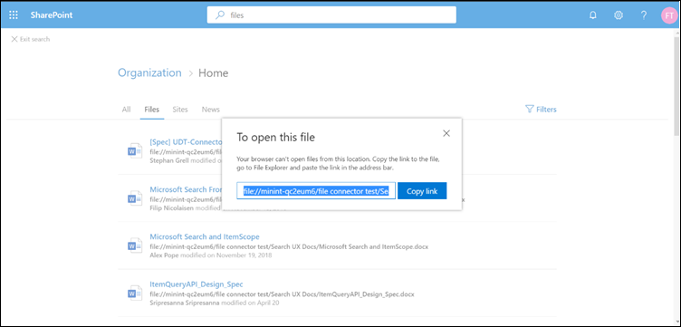

# <a name="file-share-connector"></a><span data-ttu-id="1e9a5-103">Conector de uso compartido de archivos</span><span class="sxs-lookup"><span data-stu-id="1e9a5-103">File share connector</span></span>

<span data-ttu-id="1e9a5-104">Con el conector de recursos compartidos de archivos, los usuarios de la organización pueden buscar recursos compartidos de archivos locales.</span><span class="sxs-lookup"><span data-stu-id="1e9a5-104">With the File share connector, users in your organization can search on-premises file shares.</span></span> <span data-ttu-id="1e9a5-105">Los resultados de la búsqueda de estos recursos compartidos se combinan con los resultados de SharePoint y Microsoft OneDrive para la empresa.</span><span class="sxs-lookup"><span data-stu-id="1e9a5-105">The search results from these shares merge with the results from SharePoint and Microsoft OneDrive for Business.</span></span>

<span data-ttu-id="1e9a5-106">Este artículo está destinado a los administradores de Microsoft 365 o a cualquiera que configure, ejecute y supervise un conector de recursos compartidos de archivos.</span><span class="sxs-lookup"><span data-stu-id="1e9a5-106">This article is for Microsoft 365 administrators or anyone who configures, runs, and monitors a File share connector.</span></span> <span data-ttu-id="1e9a5-107">Se explica cómo configurar las capacidades del conector y el conector, las limitaciones y las técnicas de solución de problemas.</span><span class="sxs-lookup"><span data-stu-id="1e9a5-107">It explains how to configure your connector and connector capabilities, limitations, and troubleshooting techniques.</span></span>

## <a name="install-a-data-gateway"></a><span data-ttu-id="1e9a5-108">Instalar una puerta de enlace de datos</span><span class="sxs-lookup"><span data-stu-id="1e9a5-108">Install a data gateway</span></span>
<span data-ttu-id="1e9a5-109">Para obtener acceso a los datos de terceros, debe instalar y configurar una puerta de enlace de Microsoft Power BI.</span><span class="sxs-lookup"><span data-stu-id="1e9a5-109">In order to access your third-party data, you must install and configure a Microsoft Power BI gateway.</span></span> <span data-ttu-id="1e9a5-110">Consulte [instalar una puerta de enlace local](https://docs.microsoft.com/data-integration/gateway/service-gateway-install) para obtener más información.</span><span class="sxs-lookup"><span data-stu-id="1e9a5-110">See [Install an on-premises gateway](https://docs.microsoft.com/data-integration/gateway/service-gateway-install) to learn more.</span></span>  

## <a name="content-requirements"></a><span data-ttu-id="1e9a5-111">Requisitos de contenido</span><span class="sxs-lookup"><span data-stu-id="1e9a5-111">Content requirements</span></span>
<span data-ttu-id="1e9a5-112">**Tipos de archivo**.</span><span class="sxs-lookup"><span data-stu-id="1e9a5-112">**File types**.</span></span> <span data-ttu-id="1e9a5-113">Solo se pueden indizar y buscar los archivos en estos formatos: DOC, DOCM, DOCX, DOT, DOTX, EML, GIF, HTML, JPEG, MHT, MHTML, MSG, NWS, DAB, OBT, ODP, ODS, ODT, ONE, PDF, POT, PPS, PPT, PPTM, PPTX, TXT, XLB, XLC, XLSB, XLS, XLSX, XLT, XLXM, XML, XPS y ZIP.</span><span class="sxs-lookup"><span data-stu-id="1e9a5-113">Only files in these formats can be indexed and searched: DOC, DOCM, DOCX, DOT, DOTX, EML, GIF, HTML, JPEG, MHT, MHTML, MSG, NWS, OBD, OBT, ODP, ODS, ODT, ONE, PDF, POT, PPS, PPT, PPTM, PPTX, TXT, XLB, XLC, XLSB, XLS, XLSX, XLT, XLXM, XML, XPS, and ZIP.</span></span> <span data-ttu-id="1e9a5-114">Solo se indiza el contenido textual de estos formatos.</span><span class="sxs-lookup"><span data-stu-id="1e9a5-114">Only the textual content of these formats is indexed.</span></span> <span data-ttu-id="1e9a5-115">Se omite todo el contenido multimedia.</span><span class="sxs-lookup"><span data-stu-id="1e9a5-115">All multimedia content is ignored.</span></span>
 
<span data-ttu-id="1e9a5-116">**Límites de tamaño de archivo**.</span><span class="sxs-lookup"><span data-stu-id="1e9a5-116">**File size limits**.</span></span> <span data-ttu-id="1e9a5-117">El tamaño máximo de archivo admitido es 100 MB.</span><span class="sxs-lookup"><span data-stu-id="1e9a5-117">The maximum supported file size is 100 MB.</span></span> <span data-ttu-id="1e9a5-118">Los archivos que superan los 100 MB se omiten de la indización.</span><span class="sxs-lookup"><span data-stu-id="1e9a5-118">Files that exceed 100 MB are skipped from indexing.</span></span> <span data-ttu-id="1e9a5-119">El límite de tamaño posterior al proceso es de 4 MB.</span><span class="sxs-lookup"><span data-stu-id="1e9a5-119">The maximum post-processed size limit is 4 MB.</span></span> <span data-ttu-id="1e9a5-120">El procesamiento se detiene cuando el tamaño de un archivo alcanza 4 MB.</span><span class="sxs-lookup"><span data-stu-id="1e9a5-120">Processing stops when a file's size reaches 4 MB.</span></span> <span data-ttu-id="1e9a5-121">Como resultado, es posible que algunas frases presentes en el archivo no funcionen para la búsqueda.</span><span class="sxs-lookup"><span data-stu-id="1e9a5-121">As a result, some phrases present in the file might not work for search.</span></span>

## <a name="connect-to-a-data-source"></a><span data-ttu-id="1e9a5-122">Conectarse a un origen de datos</span><span class="sxs-lookup"><span data-stu-id="1e9a5-122">Connect to a data source</span></span>
<span data-ttu-id="1e9a5-123">En la página **conectar con origen de datos** , seleccione **recurso compartido de archivos** y proporcione el nombre, el identificador de conexión y la descripción.</span><span class="sxs-lookup"><span data-stu-id="1e9a5-123">On the **Connect to data source** page, select **File share** and provide the name, connection ID, and description.</span></span> <span data-ttu-id="1e9a5-124">En la página siguiente, especifique la ruta de acceso al recurso compartido de archivos y seleccione la puerta de enlace instalada previamente.</span><span class="sxs-lookup"><span data-stu-id="1e9a5-124">In the next page, provide the path to the file share and select your previously installed gateway.</span></span> <span data-ttu-id="1e9a5-125">Escriba las credenciales de una cuenta de usuario de Windows con acceso de lectura a todos los archivos en el recurso compartido.</span><span class="sxs-lookup"><span data-stu-id="1e9a5-125">Enter the credentials for a Windows user account with read access to all the files in the share.</span></span> <span data-ttu-id="1e9a5-126">Recorra el resto de la configuración y publique la conexión.</span><span class="sxs-lookup"><span data-stu-id="1e9a5-126">Go through the rest of the settings and publish the connection.</span></span>

## <a name="set-the-refresh-schedule"></a><span data-ttu-id="1e9a5-127">Establecer la programación de actualización</span><span class="sxs-lookup"><span data-stu-id="1e9a5-127">Set the refresh schedule</span></span>
<span data-ttu-id="1e9a5-128">El intervalo de programación de actualización predeterminada recomendado es de 15 minutos, pero puede cambiarlo a otro intervalo que prefiera.</span><span class="sxs-lookup"><span data-stu-id="1e9a5-128">The recommended default refresh schedule interval is 15 minutes, but you can change it to another interval that you prefer.</span></span>

## <a name="set-up-your-search-results-page"></a><span data-ttu-id="1e9a5-129">Configurar la página de resultados de la búsqueda</span><span class="sxs-lookup"><span data-stu-id="1e9a5-129">Set up your search results page</span></span>
<span data-ttu-id="1e9a5-130">Para mostrar distintos resultados de conexión de archivos en las pestañas **todos** y **archivos** , debe configurar una página de resultados del motor de búsqueda de SharePoint:</span><span class="sxs-lookup"><span data-stu-id="1e9a5-130">To display different file connection results in the **All** and **Files** tabs, you need to set up a SharePoint search engine results page:</span></span>
- <span data-ttu-id="1e9a5-131">La tabla **All** muestra los resultados combinados de las conexiones de archivos, archivos de SharePoint, archivos de OneDrive y sitios de SharePoint.</span><span class="sxs-lookup"><span data-stu-id="1e9a5-131">The **All** table shows combined results from your file connections, SharePoint files, OneDrive files, and SharePoint sites.</span></span> 
- <span data-ttu-id="1e9a5-132">Los **archivos** verticales muestran todos los resultados de los archivos de las conexiones, SharePoint y OneDrive.</span><span class="sxs-lookup"><span data-stu-id="1e9a5-132">The **Files** vertical shows all file results from your connections, SharePoint, and OneDrive.</span></span>
<span data-ttu-id="1e9a5-133">Los resultados de las conexiones de archivos se agregan a los resultados ya existentes en los verticales de **todos** los **archivos** y.</span><span class="sxs-lookup"><span data-stu-id="1e9a5-133">Results from file connections are added to already existing results in both the **All** and **Files** verticals.</span></span>

<span data-ttu-id="1e9a5-134">Para configurar la página de resultados de la búsqueda, siga estos pasos:</span><span class="sxs-lookup"><span data-stu-id="1e9a5-134">To set up your search results page, take these steps:</span></span>
1. <span data-ttu-id="1e9a5-135">Cree una colección de sitios de SharePoint con una página de búsqueda moderna.</span><span class="sxs-lookup"><span data-stu-id="1e9a5-135">Create a SharePoint site collection with a modern search page.</span></span>

2. <span data-ttu-id="1e9a5-136">Instale un [Shell de administración de SharePoint Online](https://www.microsoft.com/download/details.aspx?id=35588).</span><span class="sxs-lookup"><span data-stu-id="1e9a5-136">Install a [SharePoint Online Management Shell](https://www.microsoft.com/download/details.aspx?id=35588).</span></span>

3. <span data-ttu-id="1e9a5-137">Abra el shell de administración de SharePoint Online como administrador e importe el módulo **Microsoft. SharePoint. Client. dll** que se encuentra en `C:\Windows\Microsoft.NET\assembly\GAC_MSIL\Microsoft.SharePoint.Client\v4.0_16.0.0.0__71e9bce111e9429c\Microsoft.SharePoint.Client.dll`.</span><span class="sxs-lookup"><span data-stu-id="1e9a5-137">Open SharePoint Online Management Shell as an administrator and import the **Microsoft.SharePoint.Client.dll** module present at `C:\Windows\Microsoft.NET\assembly\GAC_MSIL\Microsoft.SharePoint.Client\v4.0_16.0.0.0__71e9bce111e9429c\Microsoft.SharePoint.Client.dll`.</span></span>

> [!NOTE]
> <span data-ttu-id="1e9a5-138">Esta ruta de acceso puede no ser la misma para todos los usuarios.</span><span class="sxs-lookup"><span data-stu-id="1e9a5-138">This path might not be the same for all users.</span></span>

<span data-ttu-id="1e9a5-139">Para importar el módulo, ejecute este comando en el shell de administración de SharePoint Online:</span><span class="sxs-lookup"><span data-stu-id="1e9a5-139">To import the module, run this command in SharePoint Online Management Shell:</span></span>
```bash
Import-Module "C:\Windows\Microsoft.NET\assembly\GAC_MSIL\Microsoft.SharePoint.Client\v4.0_16.0.0.0__71e9bce111e9429c\Microsoft.SharePoint.Client.dll" 
```

4. <span data-ttu-id="1e9a5-140">Ahora, ejecute este script:</span><span class="sxs-lookup"><span data-stu-id="1e9a5-140">Now run this script:</span></span>
```bash
$orgName = Read-Host -prompt 'Please enter your org name'
$userName = Read-Host -prompt 'Enter user name'
$userCreds = Get-Credential -UserName $userName -Message "Type the password"
Connect-SPOService -Url https://$orgName-admin.sharepoint.com -Credential $userCreds

$url = Read-Host -Prompt 'Please enter the site url'
$site = Get-SPOSite -Identity $url
Set-SPOSite $url -DenyAddAndCustomizePages 0

$pwd = Read-Host -AsSecureString 'type the password'
$context = New-Object Microsoft.SharePoint.Client.ClientContext($url)
$credential = New-Object Microsoft.SharePoint.Client.SharePointOnlineCredentials($userName, $pwd)
$context.Credentials = $credential
$web = $context.Web
$context.Load($web)
$web.AllProperties["AllVerticalContent"] = "Combined"
$web.Update()
$context.ExecuteQuery()
$web.AllProperties["FilesVerticalContent"] = "ConnectorsOnly"
$web.Update()
$context.ExecuteQuery()
Set-SPOSite $url -DenyAddAndCustomizePages 1

Write-Host "Success" -ForegroundColor Cyan
Read-Host -Prompt 'Press enter to exit'
```

5. <span data-ttu-id="1e9a5-141">Escriba los valores necesarios en PowerShell, como el nombre de la organización, el nombre de usuario, la contraseña y la dirección URL del sitio.</span><span class="sxs-lookup"><span data-stu-id="1e9a5-141">Enter the required values in PowerShell, such as organization name, username, password, and site URL.</span></span> <span data-ttu-id="1e9a5-142">Por **ejemplo**, si las credenciales de administrador `admin@a830edad9050849823J19081300.onmicrosoft.com`son, el nombre de la organización es **a830edad9050849823J19081300**y la dirección URL `https:// a830edad9050849823J19081300.sharepoint.com`del sitio es.</span><span class="sxs-lookup"><span data-stu-id="1e9a5-142">As an **example**, if your admin credentials are `admin@a830edad9050849823J19081300.onmicrosoft.com`, then your organization name is **a830edad9050849823J19081300**, and your site URL is `https:// a830edad9050849823J19081300.sharepoint.com`.</span></span>

> [!NOTE]
> <span data-ttu-id="1e9a5-143">La configuración **AllProperties** solo puede realizarse en un nivel de colección de sitios (Teams/commes).</span><span class="sxs-lookup"><span data-stu-id="1e9a5-143">The **AllProperties** setting can only be done at a site collection level (Teams/Comms site).</span></span>

6. <span data-ttu-id="1e9a5-144">Ahora puede buscar archivos indizados y ver los resultados en las pestañas **todos** y **archivos** .</span><span class="sxs-lookup"><span data-stu-id="1e9a5-144">Now you can search for indexed files and see results in both the **All** and **Files** tabs.</span></span>

## <a name="search-for-file-share-content-in-the-search-results-page"></a><span data-ttu-id="1e9a5-145">Buscar contenido de recurso compartido de archivos en la página de resultados de búsqueda</span><span class="sxs-lookup"><span data-stu-id="1e9a5-145">Search for file share content in the search results page</span></span>
<span data-ttu-id="1e9a5-146">Para buscar contenido indizado, vaya a la Página principal de SharePoint de su inquilino de prueba.</span><span class="sxs-lookup"><span data-stu-id="1e9a5-146">To search for indexed content, go to the SharePoint home page of your test tenant.</span></span> <span data-ttu-id="1e9a5-147">Los resultados se mostrarán en las pestañas **todos** y **archivos** .</span><span class="sxs-lookup"><span data-stu-id="1e9a5-147">Results will be displayed in the **All** and **Files** tabs.</span></span>

<span data-ttu-id="1e9a5-148">Debido a las restricciones del explorador, no puede seleccionar un resultado de archivo para ver o abrir archivos en las búsquedas de recursos compartidos de archivos locales.</span><span class="sxs-lookup"><span data-stu-id="1e9a5-148">Because of browser restrictions, you can't select a file result to view or open files from local file share searches.</span></span> <span data-ttu-id="1e9a5-149">Para abrir estos archivos, copie el vínculo del resultado del archivo y péguelo en la barra de direcciones del explorador del sistema.</span><span class="sxs-lookup"><span data-stu-id="1e9a5-149">To open these files, copy the file result's link and paste it into the address bar of your system's browser.</span></span> <span data-ttu-id="1e9a5-150">Para Windows, use el explorador de Windows.</span><span class="sxs-lookup"><span data-stu-id="1e9a5-150">For Windows, use Windows Explorer.</span></span> <span data-ttu-id="1e9a5-151">A continuación, puede abrir el archivo en el sistema.</span><span class="sxs-lookup"><span data-stu-id="1e9a5-151">Then you can open the file on your system.</span></span>



## <a name="troubleshooting"></a><span data-ttu-id="1e9a5-153">Solución de problemas</span><span class="sxs-lookup"><span data-stu-id="1e9a5-153">Troubleshooting</span></span>
<span data-ttu-id="1e9a5-154">Si algo es muy incorrecto en una conexión, su estado indica que **ha fallado**.</span><span class="sxs-lookup"><span data-stu-id="1e9a5-154">If something is critically wrong with a connection, its status shows as **failed**.</span></span> <span data-ttu-id="1e9a5-155">Para obtener más información acerca de los tres tipos de errores, vaya a la página de **detalles del error** y seleccione la conexión con error.</span><span class="sxs-lookup"><span data-stu-id="1e9a5-155">To get more information on the three types of errors, go to the **error details** page and select the failing connection.</span></span> <span data-ttu-id="1e9a5-156">Consulte [administrar el conector](manage-connector.md) para obtener más información.</span><span class="sxs-lookup"><span data-stu-id="1e9a5-156">See [Manage your connector](manage-connector.md) to learn more.</span></span>
1. <span data-ttu-id="1e9a5-157">**No se puede obtener acceso a la puerta de enlace (código de error: 11)**.</span><span class="sxs-lookup"><span data-stu-id="1e9a5-157">**Gateway not reachable (error code: 11)**.</span></span> <span data-ttu-id="1e9a5-158">La máquina de la puerta de enlace para la conexión está inactiva.</span><span class="sxs-lookup"><span data-stu-id="1e9a5-158">The gateway machine for the connection is down.</span></span> <span data-ttu-id="1e9a5-159">Compruebe si el proceso de Microsoft Power BI se ejecuta en la máquina de la puerta de enlace.</span><span class="sxs-lookup"><span data-stu-id="1e9a5-159">Verify if the Microsoft Power BI process runs on the gateway machine.</span></span>
2. <span data-ttu-id="1e9a5-160">**Error de autenticación (código de error: 12)**.</span><span class="sxs-lookup"><span data-stu-id="1e9a5-160">**Authentication error (error code: 12)**.</span></span> <span data-ttu-id="1e9a5-161">Las credenciales usadas para crear la conexión expiraron o ya no son válidas.</span><span class="sxs-lookup"><span data-stu-id="1e9a5-161">The credentials that were used for creating the connection expired or are no longer valid.</span></span> <span data-ttu-id="1e9a5-162">Para resolver este error, escriba credenciales válidas.</span><span class="sxs-lookup"><span data-stu-id="1e9a5-162">To resolve this error, enter valid credentials.</span></span>
3. <span data-ttu-id="1e9a5-163">**Error interno (código de error: cualquier cosa que no sea 11 o 12)**.</span><span class="sxs-lookup"><span data-stu-id="1e9a5-163">**Internal error (error code: anything other than 11 or 12)**.</span></span> <span data-ttu-id="1e9a5-164">Hay un error en la infraestructura del conector.</span><span class="sxs-lookup"><span data-stu-id="1e9a5-164">There's an error in the connector infrastructure.</span></span> <span data-ttu-id="1e9a5-165">Vea el artículo de comentarios para obtener [información](connectors-feedback.md) sobre cómo informar de estos errores.</span><span class="sxs-lookup"><span data-stu-id="1e9a5-165">See the [Feedback](connectors-feedback.md) article to find out how to report these errors.</span></span>

## <a name="limitations"></a><span data-ttu-id="1e9a5-166">Limitaciones</span><span class="sxs-lookup"><span data-stu-id="1e9a5-166">Limitations</span></span>
<span data-ttu-id="1e9a5-167">El conector de recursos compartidos de archivos tiene estas limitaciones en la versión preliminar:</span><span class="sxs-lookup"><span data-stu-id="1e9a5-167">The File share connector has these limitations in the preview release:</span></span>
* <span data-ttu-id="1e9a5-168">Solo se pueden Indizar archivos con propiedades fijas, no con propiedades personalizadas.</span><span class="sxs-lookup"><span data-stu-id="1e9a5-168">You can only index files with fixed properties, not files with custom properties.</span></span>
* <span data-ttu-id="1e9a5-169">Actualmente no se admiten las listas de control de acceso (ACL) del recurso compartido de archivos.</span><span class="sxs-lookup"><span data-stu-id="1e9a5-169">File share Access Control Lists (ACLs) aren't currently supported.</span></span> <span data-ttu-id="1e9a5-170">Solo se admiten las ACL de archivos NTFS.</span><span class="sxs-lookup"><span data-stu-id="1e9a5-170">Only file NTFS ACLs are supported.</span></span>
* <span data-ttu-id="1e9a5-171">Las identidades externas no son compatibles.</span><span class="sxs-lookup"><span data-stu-id="1e9a5-171">External identities aren't supported.</span></span> <span data-ttu-id="1e9a5-172">Deben estar asignados a identidades de Azure Active Directory.</span><span class="sxs-lookup"><span data-stu-id="1e9a5-172">They must be mapped to Azure Active Directory identities.</span></span>
