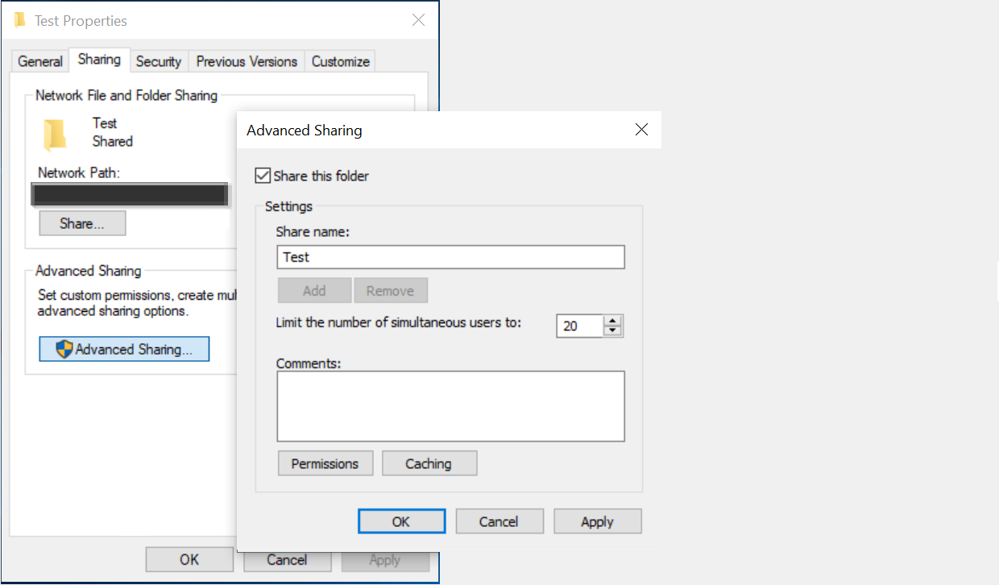

<!---Previous ms.author: rusamai --->

# Conector de Gráfico de recurso compartido de archivosFile share Graph connector

El conector de Gráfico de recursos compartidos de archivos permite a los usuarios de la organización buscar recursos compartidos de archivos locales de Windows.The File share Graph connector allows users in your organization to search on-premise Windows file shares.

> [!NOTE]
> Lea el [**artículo Configurar para el conector de Graph**](configure-connector.md) para comprender el proceso de configuración general de los conectores de Graph.Read the [**Setup for your Graph connector**](configure-connector.md) article to understand the general Graph connectors setup process.

## Antes de empezarBefore you get started

### Instalar el agente de conector de GraphInstall the Graph connector agent

Para indizar los recursos compartidos de archivos de Windows, debes instalar y registrar el agente de conector de Graph.To index your Windows file shares, you must install and register the Graph connector agent. Consulte [Instalar el agente de conector de Graph](on-prem-agent.md) para obtener más información.See [Install the Graph connector agent](on-prem-agent.md) to learn more.  

### Requisitos de contenidoContent requirements

### Tipos de archivoFile types

El contenido de los siguientes formatos se puede indizar y buscar: DOC, DOCM, DOCX, DOT, DOTX, EML, GIF, HTML, JPEG, MHT, MHTML, MSG, NWS, OBD, OBT, ODP, ODS, ODT, ONE, PDF, POT, PPS, PPT, PPTM, PPTX, TXT, XLB, XLC, XLSB, XLSB, XLSX, XLT, XLXM, XML, XPS y ZIP.Content of the following formats can be indexed and searched: DOC, DOCM, DOCX, DOT, DOTX, EML, GIF, HTML, JPEG, MHT, MHTML, MSG, NWS, OBD, OBT, ODP, ODS, ODT, ONE, PDF, POT, PPS, PPT, PPTM, PPTX, TXT, XLB, XLC, XLSB, XLS, XLSX, XLT, XLXM, XML, XPS, and ZIP. Solo se indiza el contenido textual de estos formatos.Only the textual content of these formats is indexed. Se omite todo el contenido multimedia.All multimedia content is ignored. Para cualquier archivo que no pertenezca a este formato, solo se indizan los metadatos.For any file that doesn't belong to this format, the metadata alone is indexed.

### Límites de tamaño de archivoFile size limits

El tamaño máximo de archivo admitido es de 100 MB.The maximum supported file size is 100 MB. Los archivos que superen los 100 MB no se indizan.Files that exceed 100 MB aren't indexed. El límite máximo de tamaño posterior al procesado es de 4 MB.The maximum post-processed size limit is 4 MB. El procesamiento se detiene cuando el tamaño de un archivo alcanza los 4 MB.Processing stops when a file's size reaches 4 MB. Por lo tanto, es posible que algunas frases presentes en el archivo no funcionen para la búsqueda.Therefore, some phrases present in the file might not work for search.

## Paso 1: Agregar un conector de Graph en el Centro de administración de Microsoft 365Step 1: Add a Graph connector in the Microsoft 365 admin center

Siga las instrucciones [generales de configuración](./configure-connector.md).Follow the general [setup instructions](./configure-connector.md).
<!---If the above phrase does not apply, delete it and insert specific details for your data source that are different from general setup instructions.-->

## Paso 2: Nombrar la conexiónStep 2: Name the connection

Siga las instrucciones [generales de configuración](./configure-connector.md).Follow the general [setup instructions](./configure-connector.md).
<!---If the above phrase does not apply, delete it and insert specific details for your data source that are different from general setup instructions.-->

## Paso 3: Configurar las opciones de conexiónStep 3: Configure the connection settings

En la **página Conectarse al origen de** datos, seleccione Recurso **compartido** de archivos y proporcione el nombre, el identificador de conexión y la descripción.On the **Connect to data source** page, select **File share** and provide the name, connection ID, and description. En la página siguiente, proporcione la ruta de acceso al recurso compartido de archivos y seleccione el agente de conector de Graph instalado anteriormente.On the next page, provide the path to the file share and select your previously installed Graph connector agent. Escriba las credenciales de una [cuenta de usuario de Microsoft Windows](https://microsoft.com/windows) con acceso de lectura a todos los archivos del recurso compartido de archivos.Enter the credentials for a [Microsoft Windows](https://microsoft.com/windows) user account with read access to all the files in the file share.

### Conservar el último tiempo de accesoPreserve last access time

Cuando el conector intenta rastrear un archivo, se actualiza el campo "Última hora de acceso" en sus metadatos.When the connector attempts to crawl a file, the "last access time" field in its metadata is updated. Si depende de ese campo para las soluciones de archivado y copia de seguridad y no desea actualizarlo cuando el conector tiene acceso a él, puede configurar esta opción en la página **Configuración** avanzada.If you depend on that field for any archiving and backup solutions and doesn't want to update it when the connector accesses it, you can configure this option in the **Advanced settings** page.

## Paso 4: Administrar permisos de búsquedaStep 4: Manage search permissions

Puede restringir el permiso para buscar cualquier archivo basado en listas de control de acceso compartido o listas de control de acceso del Sistema de archivos de nueva tecnología (NTFS), seleccionando la opción deseada en la página Administrar permisos de **búsqueda.**You can restrict the permission to search for any file based on Share Access Control Lists or New Technology File System (NTFS) Access Control Lists, by selecting the desired option in **Manage search permissions** page. Las cuentas de usuario y los grupos proporcionados en estas listas de control de acceso deben administrarse mediante Active Directory (AD).The user accounts and groups provided in these Access Control Lists must be managed by Active Directory (AD). Si usa cualquier otro sistema para la administración de cuentas de usuario, puede seleccionar la opción "todos", que permite a los usuarios buscar todos los archivos sin restricciones de acceso.If you are using any other system for user accounts management, you can select 'everyone' option, which lets users search for all the files without any access restrictions. Sin embargo, cuando los usuarios intentan abrir el archivo, se aplican los controles de acceso establecidos en el origen.However, when users try to open the file, access controls set at the source apply.

Tenga en cuenta que windows proporciona de forma predeterminada el permiso "Leer" a "Todos" en compartir ACL cuando se comparte una carpeta en la red.Note that windows by default provides 'Read' permission to 'Everyone' in Share ACLs when a folder is shared on network. Por extensión, si elige Compartir ACL en Administrar permisos de **búsqueda,** los usuarios podrán buscar todos los archivos.By extension, if you are choosing Share ACLs in **Manage search permissions**, users will be able to search for all the files. Si desea restringir el acceso, quite el acceso "Leer" para "Todos" en recursos compartidos de archivos y proporcione acceso solo a los usuarios y grupos deseados.If you want to restrict access, remove 'Read' access for 'Everyone' in file shares and provide access only to the desired users and groups. A continuación, el conector lee estas restricciones de acceso y las aplica a la búsqueda.The connector then reads these access restrictions and applies them to search.

Solo puede elegir Compartir ACL si la ruta de acceso al recurso compartido que proporcionó sigue el formato de ruta UNC.You can choose Share ACLs only if the share path you provided follows UNC path format. Puede crear una ruta de acceso en formato UNC yendo a "Uso compartido avanzado" en la opción "Uso compartido".You can create a path in UNC format by going to 'Advanced Sharing' under 'Sharing' option.

## Paso 5: Asignar etiquetas de propiedadesStep 5: Assign property labels

Siga las instrucciones [generales de configuración](./configure-connector.md).Follow the general [setup instructions](./configure-connector.md).
<!---If the above phrase does not apply, delete it and insert specific details for your data source that are different from general setup instructions.-->

## Paso 6: Administrar esquemaStep 6: Manage schema

Siga las instrucciones [generales de configuración](./configure-connector.md).Follow the general [setup instructions](./configure-connector.md).
<!---If the above phrase does not apply, delete it and insert specific details for your data source that are different from general setup instructions.-->

## Paso 7: Elegir la configuración de actualizaciónStep 7: Choose refresh settings

Siga las instrucciones [generales de configuración](./configure-connector.md).Follow the general [setup instructions](./configure-connector.md).
<!---If the above phrase does not apply, delete it and insert specific details for your data source that are different from general setup instructions.-->

## Paso 8: Revisar la conexiónStep 8: Review connection

Siga las instrucciones [generales de configuración](./configure-connector.md).Follow the general [setup instructions](./configure-connector.md).
<!---If the above phrase does not apply, delete it and insert specific details for your data source that are different from general setup 
instructions.-->

<!---## Troubleshooting-->
<!---Insert troubleshooting recommendations for this data source-->

<!---## Limitations-->
<!---Insert limitations for this data source-->