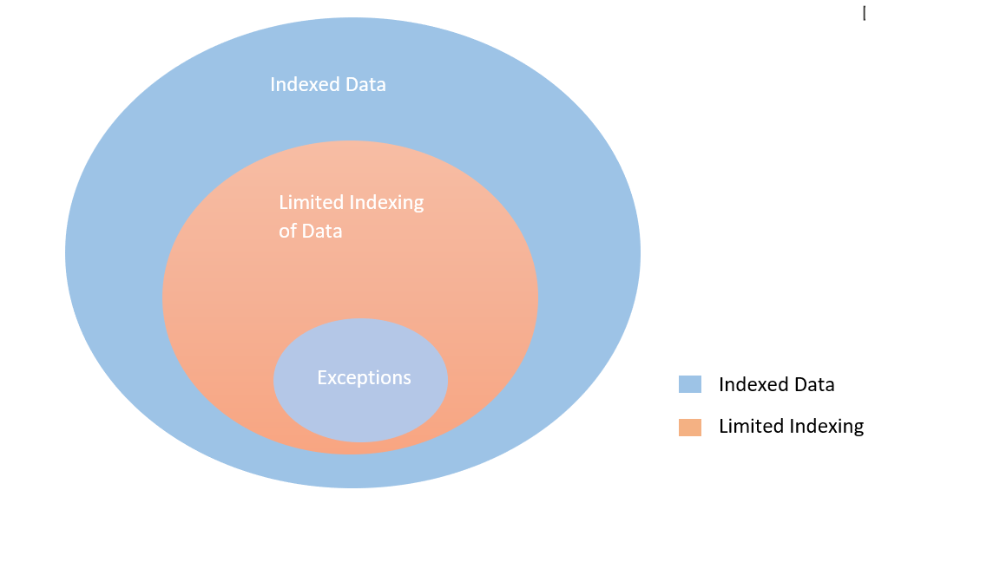

<!---Previous ms.author: rusamai --->

# Conector de Graph archivo

El conector de Graph de recursos compartidos de archivos permite a los usuarios de la organización buscar recursos compartidos Windows archivos locales.

> [!NOTE]
> Lea el [**artículo Setup for your Graph connector para**](configure-connector.md) comprender el proceso de configuración de Graph conectores generales.

## Antes de empezar

### Instalar el agente Graph conector de conexión

Para indizar los recursos Windows archivos compartidos, debe instalar y registrar el agente Graph conector. Consulte [Install the Graph connector agent para](graph-connector-agent.md) obtener más información.  

### Requisitos de contenido

### Tipos de archivo

El contenido de los siguientes formatos se puede indizar y buscar: DOC, DOCM, DOCX, DOT, DOTX, EML, GIF, HTML, JPEG, MHT, MHTML, MSG, NWS, OBD, OBT, ODP, ODS, ODT, ONE, PDF, POT, PPS, PPT, PPTM, PPTX, TXT, XLB, XLC, XLSB, XLSB, XLSX, XLT, XLXM, XML, XPS y ZIP. Solo se indiza el contenido textual de estos formatos. Se omite todo el contenido multimedia. Para cualquier archivo que no pertenezca a este formato, solo se indizan los metadatos.

### Límites de tamaño de archivo

El tamaño máximo de archivo admitido es de 100 MB. Los archivos que superen los 100 MB no se indizan. El límite máximo de tamaño posterior al procesado es de 4 MB. El procesamiento se detiene cuando el tamaño de un archivo alcanza los 4 MB. Por lo tanto, es posible que algunas frases presentes en el archivo no funcionen para la búsqueda.

## Paso 1: Agregar un conector Graph en el Centro de administración de Microsoft 365

Siga las instrucciones [generales de configuración](./configure-connector.md).
<!---If the above phrase does not apply, delete it and insert specific details for your data source that are different from general setup instructions.-->

## Paso 2: Nombrar la conexión

Siga las instrucciones [generales de configuración](./configure-connector.md).
<!---If the above phrase does not apply, delete it and insert specific details for your data source that are different from general setup instructions.-->

## Paso 3: Configurar las opciones de conexión

En la **Conectar de origen** de datos, seleccione Recurso **compartido** de archivos y proporcione el nombre, el identificador de conexión y la descripción. En la página siguiente, proporcione la ruta de acceso al recurso compartido de archivos y seleccione el agente de conector Graph instalado anteriormente. Escriba las credenciales de una [cuenta de usuario de Microsoft Windows](https://microsoft.com/windows) con acceso de lectura a todos los archivos del recurso compartido de archivos.

### Conservar el último tiempo de acceso

Cuando el conector intenta rastrear un archivo, se actualiza el campo "Última hora de acceso" en sus metadatos. Si depende de ese campo para las soluciones de archivado y copia de seguridad y no desea actualizarlo cuando el conector tiene acceso a él, puede configurar esta opción en la página **Configuración** avanzada.

## Paso 4: Límites para la indización de archivos

Al configurar una conexión de recurso compartido de archivos, el administrador podría limitar la indización de archivos y carpetas. Habría varias maneras de hacerlo:

#### Basado en tipos de archivo

Solo se indiza el contenido textual de estos formatos: DOC, DOCM, DOCX, DOT, DOTX, EML, HTML, MHT, MHTML, MSG, NWS, OBD, OBT, ODP, ODS, ODT, ONE, PDF, POT, PPS, PPT, PPTM, PPTX, TXT, XLB, XLC, XLSB, XLSB, XLSX, XLT, XLXM, XML, XPS. Para archivos multimedia y archivos que no pertenecen a este formato, los únicos metadatos se indizan.

#### Basado en la última fecha de modificación o número de días desde la última modificación

#### Ruta de acceso de red completa de archivo/carpeta o expresión regular para limitar la indización 

En la ruta de acceso de red, use el carácter de escape ( \\ ) antes de caracteres especiales como \\ . Ejemplo: para la ruta \\ \\ DE ACCESO CONTOSO FILE \\ \\ SHAREDFOLDER, la forma correcta \\ \\ \\ \\ \\ \\ \\ de entrada \\ es CONTOSO FILE SHAREDFOLDER

Las reglas para escribir expresiones regulares se pueden [encontrar aquí](https://docs.microsoft.com/dotnet/standard/base-types/regular-expression-language-quick-reference)

El administrador también tendría la capacidad de dar una excepción a la regla de límite. La prioridad de la regla de excepción reemplazará a las reglas de límite. De forma similar, la excepción podría definirse al dar ruta de acceso de carpeta o archivo para los elementos que queremos incluir en la indización.

## Paso 5: Administrar permisos de búsqueda

Puede restringir el permiso para buscar cualquier archivo basado en listas de control de acceso compartido o listas de control de acceso del Sistema de archivos de nueva tecnología (NTFS), seleccionando la opción deseada en la página Administrar permisos de **búsqueda.** Las cuentas de usuario y los grupos proporcionados en estas listas de control de acceso deben administrarse mediante Active Directory (AD). Si usa cualquier otro sistema para la administración de cuentas de usuario, puede seleccionar la opción "todos", que permite a los usuarios buscar todos los archivos sin restricciones de acceso. Sin embargo, cuando los usuarios intentan abrir el archivo, se aplican los controles de acceso establecidos en el origen.

Tenga en cuenta que windows proporciona de forma predeterminada el permiso "Leer" a "Todos" en compartir ACL cuando se comparte una carpeta en la red. Por extensión, si elige Compartir ACL en Administrar permisos de **búsqueda,** los usuarios podrán buscar todos los archivos. Si desea restringir el acceso, quite el acceso "Leer" para "Todos" en recursos compartidos de archivos y proporcione acceso solo a los usuarios y grupos deseados. A continuación, el conector lee estas restricciones de acceso y las aplica a la búsqueda.

Solo puede elegir Compartir ACL si la ruta de acceso al recurso compartido que proporcionó sigue el formato de ruta UNC. Puede crear una ruta de acceso en formato UNC yendo a "Uso compartido avanzado" en la opción "Uso compartido".

## Paso 6: Asignar etiquetas de propiedades

Siga las instrucciones [generales de configuración](./configure-connector.md).
<!---If the above phrase does not apply, delete it and insert specific details for your data source that are different from general setup instructions.-->

## Paso 7: Administrar esquema

Siga las instrucciones [generales de configuración](./configure-connector.md).
<!---If the above phrase does not apply, delete it and insert specific details for your data source that are different from general setup instructions.-->

## Paso 8: Elegir la configuración de actualización

Siga las instrucciones [generales de configuración](./configure-connector.md).
<!---If the above phrase does not apply, delete it and insert specific details for your data source that are different from general setup instructions.-->

## Paso 9: Revisar conexión

Siga las instrucciones [generales de configuración](./configure-connector.md).
<!---If the above phrase does not apply, delete it and insert specific details for your data source that are different from general setup 
instructions.-->

<!---## Troubleshooting-->
<!---Insert troubleshooting recommendations for this data source-->

<!---## Limitations-->
<!---Insert limitations for this data source-->
