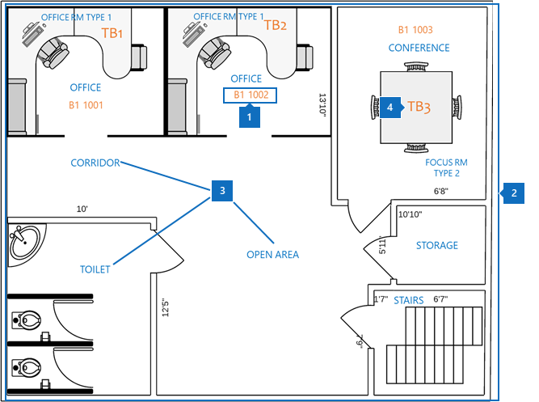
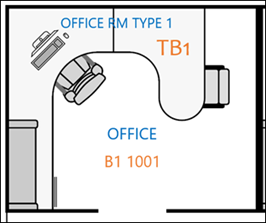
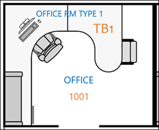
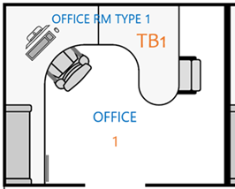

# Procedimientos recomendados

Para implementar correctamente los planes de planta de Microsoft Search, debe coordinar tres datos:

- **Creación de datos de ubicación**: ¿Qué formato y cómo agregar?
- **Mapa del plano de planta en formato DWG**: ¿Cómo ver y qué datos debe contener para un éxito máximo?
- **Ubicación de la oficina del empleado en [Azure Active Directory (Azure ad)](https://azure.microsoft.com/services/active-directory/)**: ¿Qué formato usar y cómo agregar?  

En las siguientes secciones también se describen los procedimientos recomendados para implementar planes de planta de Microsoft Search.

## Creación de datos de ubicación
Antes de agregar planes de planta, necesita agregar los edificios a las ubicaciones de búsqueda de Microsoft. Proporcione los siguientes datos de compilación necesarios:

|Datos de compilación necesarios  |Ejemplo  |
|---------|---------|
|Nombre     |    Edificio 1, ciudad de Nueva York     |
|Dirección     |     123 cualquier Avenue, Nueva York, NY 10118  |
|Latitud-longitud (opcional)   |    40,760539,-73,975341      |
|Palabras clave     |    Oficina de Nueva York, edificio 1, oficina principal, oficina central     |

Puede agregar varios edificios a la vez mediante la característica de **importación** en la ficha **ubicaciones** , en lugar de agregar ubicaciones de una en una. Con la característica de **importación** , puede especificar la latitud-longitud. Para obtener más información, vea [Manage locations](manage-locations.md).

## Mapa del plano de planta en formato DWG
Para compilar mapas en Microsoft Search, debe cargar planos de planta en formato DWG con información específica. Para obtener información sobre cómo crear y ver archivos con formato DWG, consulte [visores de DWG](https://www.autodesk.in/products/dwg). 

Los mapas de plano de planta muestran cuatro elementos:

1. **Números de sala**: en el ejemplo siguiente, los números de sala se definen como **B1 1001** y **B1 1002**. **B1** es el código de edificio y 1001 contiene el número de piso **1** y el número de oficina **001**.
1. **Diseños de sala**: para ayudar a aclarar los detalles cuando varios usuarios comparten una oficina, puede definir diseños como sillas y escritorio.
1. **Tipos de salas**: algunos ejemplos son Office, pasillo, área abierta y inodoro.
1. **Información de activos**: si los usuarios se encuentran en un espacio abierto, puede indicar en qué escritorio se siente. En este ejemplo, los escritorios se indican mediante **TB1** y **TB2**.

En este diagrama, los números de sala son el elemento más importante. Están asignados a la ubicación de la oficina de una persona en su cuenta de usuario, como se muestra en la siguiente imagen.

Esta información se almacena en Azure AD en la propiedad **PhysicalDeliveryOfficeName** . En el centro de [Administración](https://admin.microsoft.com)de 365 de Microsoft, se denomina propiedad de **Office** y puede agregarse **a usuarios activos**.

### Archivos DWG
Microsoft Search necesita archivos de planeación de planta en DWG, que es el formato de un formato de dibujo de AutoCAD. Los archivos deben contener datos de **diseño** y **etiqueta** . Los **números de sala** son las etiquetas más importantes para los planos de planta.

Le recomendamos que cree el sistema de numeración de Office con el método de coincidencia exacta que se muestra en la siguiente tabla. Pero no está limitado a esa etiqueta. Por ejemplo, si la ubicación de la oficina del usuario en Azure AD es **B1 1001**, puede etiquetar el número de sala en el archivo DWG con cualquiera de las opciones siguientes.

|Coincidir  |Diseño  |
|---------|---------|
|Coincidencia exacta con la ubicación de la oficina (recomendado)   **B1 1001**   Código de creación: B1 Piso: 1  Número de sala: 001    |         |
|Coincidencia de número de piso y sala   **1001** Piso: 1  Número de sala: 001    |      |
|Asociar solo el número de sala   **1** Número de sala: 1        |         |

## Ubicación de la oficina de cuentas de usuario
Para asignar la ubicación de un empleado, los números de salas de los archivos DWG se asignan a ubicaciones de oficinas en la cuenta del usuario en Azure AD. La propiedad ubicación de la **Oficina** tiene que coincidir con la información de la ubicación de la oficina en el archivo DWG.

En la tabla siguiente se explican los procedimientos recomendados para asignar datos de Ubicación:

|Procedimiento recomendado  |Explicación |
|---------|---------|
|Incluya el código de edificio, el piso y el número de sala.     |   Estos datos le ofrecen la mejor oportunidad de realizar coincidencias exactas.     |
|Incluya un separador después de crear códigos y suelos.     |  Separe los códigos de edificio de los números de planta y de sala con un separador o un espacio, como en estos ejemplos:  B1 1001  B1/1001   B1-1001   |
|El número de sala siempre sigue la información sobre el código, el ala y el suelo.     |  Si el número de sala es **1001**, establezca la ubicación de la oficina en **B1 1001**, **B1/1001**o **B1-1001**.   Si el número de sala es **F1-001**, establezca la ubicación de la oficina en **B1 F1-001** o **B1/F1-001**.   Si el número de sala es **1**, establezca la ubicación de Azure ad en **B1 1001**, **B1/1001**o **B1-F1-001**.       |
|

## Pasos siguientes
[Administrar ubicaciones](manage-locations.md) 
[Administrar planos de planta](manage-floorplans.md)