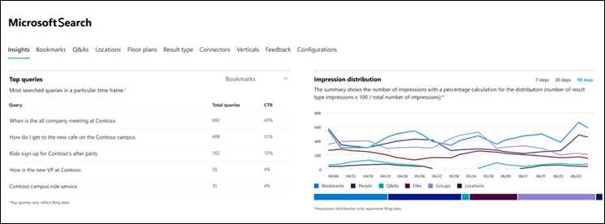
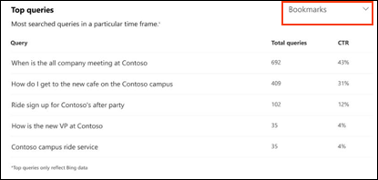
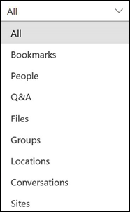
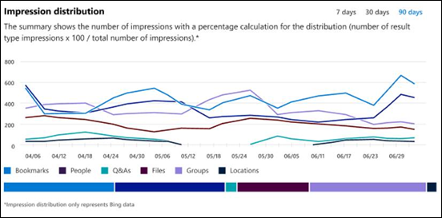

# Informes del panel de información de Microsoft SearchMicrosoft Search Insights dashboard reports

Puede usar el panel de información de Microsoft Search para administrar los datos de [Bing](https://Bing.com) para sus respuestas publicadas.You can use the Microsoft Search Insights dashboard to manage [Bing](https://Bing.com) data for your published answers. Esto es tan solo uno de los pasos necesarios para que el [contenido sea fácil de encontrar](make-content-easy-to-find.md) para los usuarios.This is just one of the steps needed to [make content easy to find](make-content-easy-to-find.md) for your users.

La primera vez que se dirige a Microsoft Search en el [centro de administración de 365](https://admin.microsoft.com)de Microsoft, se escribe en el panel de información.When you first go to Microsoft Search in the [Microsoft 365 admin center](https://admin.microsoft.com), you enter on the Insights dashboard.

Los siguientes informes están disponibles en el panel de información.The following reports are available on the Insights dashboard.

> [!NOTE]
> Los datos de los informes solo representan datos de [Bing](https://Bing.com) .The data in the reports only represents [Bing](https://Bing.com) data.

## Consultas principalesTop queries

Este informe proporciona detalles sobre las 2000 principales consultas de búsqueda de [Bing](https://Bing.com) que los usuarios ejecutan.This report gives details about the top 2000 [Bing](https://Bing.com) search queries that users run. Para que una consulta aparezca en **las principales consultas**, la consulta debe obtener al menos tres clics.For a query to appear in **Top queries**, the query must get at least three clicks.

Una tasa de clics bajas (CTR) significa que los usuarios no encuentran lo que están buscando.A low click-through rate (CTR) means that users aren’t finding what they’re looking for.

Puede elegir distintas vistas del informe filtrando según el tipo de respuesta.You can choose different views of the report by filtering on the type of answer. Por ejemplo, si solo quiere ver las consultas principales para marcadores, seleccione la lista desplegable situada en la esquina superior derecha del informe y, a continuación, seleccione **marcadores**.For example, if you just want to view the top queries for Bookmarks, select the drop-down in the upper-right corner of the report, and then select **Bookmarks**. De forma predeterminada, se muestran **todos los** tipos de respuesta.By default, **All** answer types are shown.

## Distribución de impresionesImpression distribution

Este informe muestra la distribución de impresiones en [Bing](https://Bing.com) a lo largo del tiempo para varias respuestas.This report shows impression distribution in [Bing](https://Bing.com) over time for various answers. Algunos ejemplos son bookmarks, People, Q&A, files, locations, File sites, Groups, and Conversations.Examples are bookmarks, people, Q&A, files, locations, file sites, groups, and conversations.

La distribución de impresiones puede ayudar a los administradores a comprender qué ven los usuarios durante un período especificado.Impression distribution can help admins understand what users look for during a specified period.
