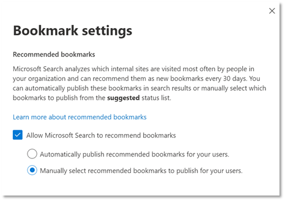

# Administrar marcadores

Los marcadores ayudan a los usuarios a encontrar rápidamente sitios y herramientas importantes con solo una búsqueda. Cada marcador incluye un título, una dirección URL, un conjunto de palabras clave fáciles de usar para desencadenar el marcador y una categoría.

## Lo que hace que un gran marcador

Un gran marcador tiene cuatro elementos clave:

1. Un título fuerte e **informativo**. Apunta a no más de ocho palabras o unos 60 caracteres como máximo. Desea que los usuarios haga clic en el título y vea el contenido, pero evite el clickbait obvio:
    - Bueno: pruebe los favoritos de esta semana en el menú de la cafetería. El título es claro, conciso e interesante, pero podría ser sobrepromisor.
    - Mejor: menú de la cafetería de esta semana. No se sobrepromite ni suena como un anuncio.
    - Evite: no creerá lo que viene al menú de la cafetería esta semana. Usa los clichés de clickbait que suenan como un anuncio.
2. Una descripción **sucinta**, de unos 300 caracteres, que resume el propósito o la funcionalidad del recurso vinculado.
3. Una colección de **palabras clave que** ayudará a los usuarios a encontrar el marcador cuando busquen. Se recomienda un mínimo de cinco palabras clave. Además, incluya variaciones que las personas de su organización puedan usar, por ejemplo, menú de comida, menús de almuerzo y menú de café podrían ser variaciones para el menú de la cafetería.
4. Un conjunto útil de **categorías que** facilitan la ordenación y el filtro de marcadores en el Centro de administración. Los usuarios nunca ven las categorías asignadas.

## Crear respuestas de marcador

En el [Centro de administración de Microsoft 365](https://admin.microsoft.com/), vaya a [Marcadores](https://admin.microsoft.com/Adminportal/Home#/MicrosoftSearch/bookmarks) y elija cómo desea crear nuevos marcadores:

- Agregar marcadores
- Importar SharePoint resultados
- Agregar marcadores predeterminados y marcadores sugeridos
- Importar marcadores
- Publicar o revisar marcadores recomendados

### Agregar marcadores

Los administradores y editores de búsqueda pueden agregar marcadores en el Centro de administración de Microsoft 365 y publicarlos o guardarlos en borrador. La publicación de un marcador actualiza inmediatamente el índice de búsqueda, lo que hace que sea detectable para los usuarios de inmediato. También puede programar un marcador especificando la fecha y hora en que se publicará.

- **Publicado:** los marcadores están disponibles para los usuarios de la organización a través de Búsqueda de Microsoft.
- **Borrador:** Los marcadores guardados como borradores no están disponibles para los usuarios. Use este estado si usted u otras partes interesadas desean revisar o actualizar los marcadores antes de publicarlos.
- **Programado:** marcadores que se publicarán en la fecha y hora especificadas.

Puede usar la extensión del Búsqueda de Microsoft del creador de contenido para agregar fácilmente marcadores. Solo tiene que ir al sitio que desea agregar como marcador y haga clic en Agregar en la extensión. Para instalar la extensión para Microsoft Edge o Google Chrome, ve a la tienda [web de Chrome](https://chrome.google.com/webstore/detail/microsoft-search-content/nocnablpaoeecfmfnjoheefkogmleipm) y agrégála al explorador.

### Importar SharePoint resultados

Si su organización configura resultados promocionados en SharePoint, puede importar los títulos, las direcciones URL y las descripciones de los resultados promocionados de su espacio empresarial a Búsqueda de Microsoft y hacer que el contenido importado esté disponible para los usuarios. En la mayoría de los casos, importar SharePoint resultados tarda solo unos minutos. Si va a importar un gran número de resultados, puede tardar hasta 48 horas. Esta es una forma fácil de rellenar rápidamente los resultados de búsqueda y hacerlos más eficaces para los usuarios. Se recomienda usar los resultados promocionados SharePoint como referencia para comprender cómo nombrar y crear resultados de búsqueda relevantes.

### Agregar marcadores predeterminados y sugeridos

Hemos incluido algunos marcadores sugeridos predeterminados que los usuarios pueden resultar útiles, incluidos los marcadores para recursos humanos, ventajas, soporte de TI, administración de contraseñas y mucho más. Revise, actualice y publique estos marcadores sugeridos para proporcionar resultados de alta calidad a los usuarios de inmediato.

Los usuarios también pueden sugerir marcadores que les gustaría ver agregados mediante vínculos de comentarios en Búsqueda de Microsoft. Sus recomendaciones aparecerán como marcadores sugeridos.

### Importar marcadores

Use la característica Importar para que agregar o editar un gran número de marcadores sea más rápido y fácil. Úselo para:

- Agregar marcadores en masa: agregue detalles en el archivo de plantilla de marcador y, a continuación, impórlo.
- Marcadores de edición masiva: exporte marcadores a un archivo .csv, edite los detalles del marcador en el archivo exportado y, a continuación, importe el archivo editado.

Algunos puntos importantes sobre el archivo de plantilla:

- Nunca edite los datos en estos campos: *ID,* *Last Modified* y Last *Modified By*
- Si incluye el *identificador de* un marcador existente, se reemplazará por la información del archivo de importación.
- Para los marcadores existentes con el mismo título o dirección URL, el marcador se actualizará con información en el archivo de importación.
- No todos los campos del archivo de plantilla son necesarios y hay campos obligatorios que varían según el estado del marcador.
- Según el *campo Estado,* los marcadores se guardarán como borradores, sugeridos, programados, excluidos o se publicarán automáticamente.
- Para los partners que administran varias organizaciones, puede exportar los marcadores de una organización e importarlos a otra. Pero debe quitar los datos de la columna *id. antes* de importar.

### Evitar errores de importación

Si hay datos obligatorios que faltan o no son válidos, recibirá un mensaje de error y se generará un archivo de registro con información adicional acerca de las filas y columnas que se deben corregir. Realice cualquier cambio necesario y pruebe a importar de nuevo el archivo. No puede importar ni guardar ningún marcador hasta que se resuelvan todos los errores.

Para evitar errores, asegúrese de que el archivo de importación tiene el formato adecuado y de que:

- Incluye todas la fila de encabezado y todas las columnas que había en la plantilla de importación
- El orden de las columnas es el mismo que en la plantilla de importación
- Todas las columnas tienen valores, excepto las tres que pueden estar vacías: *ID,* *Last Modified* y Last *Modified By*
- La *columna* Estado no está vacía, es información necesaria
- Al importar marcadores publicados, sugeridos, programados o borradores, se necesitan las columnas *Título,* *DIRECCIÓN URL* y *Palabras* clave
- Al importar marcadores excluidos, se requiere la columna *url*

Para evitar errores de duplicación de marcador a marcador:

- No use direcciones URL duplicadas para diferentes marcadores. Si se asigna una dirección URL a otro marcador e intenta volver a agregarla desde un archivo de importación, se producirá un error. Esto también se aplica a direcciones URL duplicadas para otros tipos de respuestas.
- Al actualizar los marcadores existentes, use la *columna id. de* marcador. Puede actualizar cualquier otra propiedad de un marcador existente, como palabra  clave o descripción, pero debe asegurarse de que el identificador de marcador se encuentra en la columna adecuada del archivo de importación. Si el *identificador de* marcador está presente, no se tratará como nueva adición y no se procesará como un error.

### Publicar o revisar marcadores recomendados

Para reducir el esfuerzo manual necesario para agregar marcadores, Búsqueda de Microsoft evaluar los vínculos de SharePoint de la organización y recomendar marcadores. Puede revisarlas antes de publicarlas o establecerlas para que se publiquen automáticamente. No se necesita ninguna configuración para los marcadores recomendados, están habilitados y establecidos en autopublicar de forma predeterminada. Para cambiar esta configuración en cualquier momento, seleccione **Administrar marcadores** para abrir el panel Configuración de marcadores.

Si se habilitan los marcadores recomendados, el motor de recomendación evaluará los SharePoint de la organización para identificar vínculos de alto tráfico. Después de un período de evaluación inicial, los marcadores recomendados se publicarán automáticamente o se agregarán a la lista de marcadores sugeridos. A continuación, se iniciará el siguiente ciclo, un período de evaluación de 30 días seguido de la publicación automática o la adición de marcadores sugeridos.

Se recomienda que los administradores o editores de búsqueda revisen estos marcadores autoeditados o sugeridos con regularidad. Además, los marcadores recomendados nunca incluirán direcciones URL encontradas en los marcadores publicados, sugeridos, programados o excluidos existentes.

Para asegurarse de que solo los usuarios con acceso verán un marcador recomendado en los resultados del trabajo, se incluye una característica de comprobación de acceso para todos los marcadores recomendados. Los usuarios nunca verán un marcador recomendado para un sitio SharePoint al que no puedan acceder. Esta comprobación de acceso se controla mediante la opción Solo personas con acceso a **este vínculo** en la configuración Grupos para cada marcador recomendado.

La comprobación de acceso se detendrá si se cambia la dirección URL del marcador recomendado o la configuración Grupos.

Para evitar que el motor de recomendación publique o sugiera un marcador en un sitio determinado, puede agregar la dirección URL a una lista excluida. El motor de recomendación nunca publicará ni sugerirá un marcador para un sitio excluido o una página dentro de un sitio excluido.

## Acerca de las palabras clave y las palabras clave reservadas

Un marcador puede tener varias palabras clave y compartir la misma palabra clave, pero la palabra clave reservada no se puede compartir. Una palabra clave reservada es un término o frase único que desencadena un marcador específico. Una palabra clave reservada solo se puede asociar con una respuesta. Use palabras clave reservadas con moderación.

## Preguntas más frecuentes

**P: ¿Cuánto tiempo se necesita para que un marcador esté visible en Búsqueda de Microsoft después de su publicación?**

**A:**  Un marcador está disponible en Búsqueda de Microsoft inmediatamente después de la publicación.

**P: ¿Cuánto tiempo se necesita para que aparezca un marcador recomendado?**

**A:**  Los marcadores recomendados solo aparecerán en Búsqueda de Microsoft si están habilitados los marcadores recomendados y la publicación automática. Durante el período de evaluación inicial, el motor de recomendación evaluará el tráfico SharePoint para identificar los marcadores adecuados y, a continuación, publicarlos automáticamente. Una vez publicados, estarán disponibles inmediatamente en Búsqueda de Microsoft.

**P: ¿Cuánto tiempo se necesita para quitar un marcador eliminado de Búsqueda de Microsoft resultados?**

**A**: Los marcadores eliminados se quitan inmediatamente de los resultados del trabajo.

**P: ¿Búsqueda de Microsoft los marcadores de los sitios en todos los idiomas?**

**A**: Sí, Búsqueda de Microsoft puede recomendar marcadores de cualquier sitio SharePoint, independientemente del idioma.

**P: ¿Puedo dejar de mostrar marcadores recomendados en los resultados de búsqueda?**

**A:** Para dejar de mostrar los marcadores recomendados, desactiva la configuración de publicación automática en el Centro de administración. Los marcadores recomendados se agregarán a la lista de marcadores sugeridos.

**P: ¿Cómo puedo identificar un marcador recomendado en los resultados de búsqueda o en el Centro de administración?**

**A:** En los resultados de búsqueda, los marcadores recomendados incluyen la frase "Suggested for you" antes de la dirección URL. En el Centro de administración, los marcadores recomendados tendrán un valor owner de "SYSTEM".

**P: ¿Cómo se administra el acceso a un marcador recomendado?**

**A:** Un motor de acceso diseñado por Microsoft determina si la dirección URL del marcador es accesible para un usuario determinado y solo mostrará el marcador recomendado a la audiencia correcta. Sin embargo, si se edita la dirección URL o se cambia la configuración Grupos, se deshabilitará el motor de acceso diseñado.

**P: ¿Qué sucede si no se hace ninguna acción en los marcadores recomendados agregados a la lista De sugerencias?**

**A**: Para evitar un gran volumen de marcadores en la lista sugerida, se purgará un marcador recomendado (propietario = SISTEMA) después de 180 días.

**P: ¿Dónde puedo encontrar el identificador de la aplicación para una Power App?**

**A**: Vaya al sitio Power Apps y vea el panel Detalles de la aplicación. Obtenga más información [sobre cómo obtener un identificador de aplicación](/powerapps/maker/canvas-apps/get-sessionid#get-an-app-id).