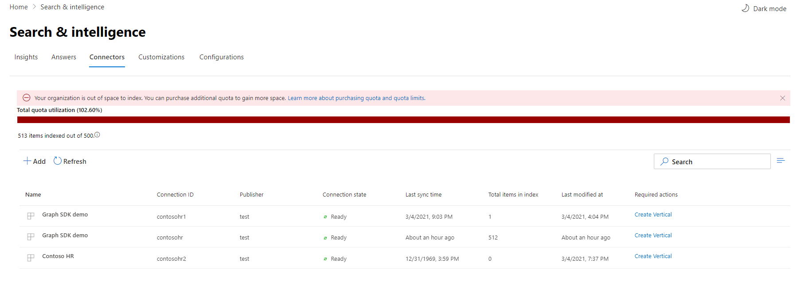

<!-- markdownlint-disable no-inline-html -->

# Supervise las conexionesMonitor your connections

Para obtener acceso y administrar los conectores, debe estar designado como administrador de búsqueda para su inquilino.To access and manage your connectors, you must be designated as a search administrator for your tenant. Póngase en contacto con el administrador de inquilinos para aprovisionar el rol de administrador de búsqueda.Contact your tenant administrator to provision you for the search administrator role.

## Operaciones de conexiónConnection Operations

Vaya a la [pestaña Conectores](https://admin.microsoft.com/Adminportal/Home#/MicrosoftSearch/Connectors) en el Centro de administración de [Microsoft 365](https://admin.microsoft.com).Navigate to the [Connectors tab](https://admin.microsoft.com/Adminportal/Home#/MicrosoftSearch/Connectors) in the [Microsoft 365 admin center](https://admin.microsoft.com).

Para cada tipo de conector, el Centro de [administración de Microsoft 365](https://admin.microsoft.com) admite las operaciones que se muestran en la tabla siguiente:For each connector type, the [Microsoft 365 admin center](https://admin.microsoft.com) supports the operations shown in the following table:

OperaciónOperation | Conectores de Graph por MicrosoftGraph connectors by Microsoft | Conectores de Partner o GraphPartner or Graph connectors
--- | --- | ---
Agregar una conexiónAdd a connection | :heavy_check_mark: (Vea Información [general sobre el programa de instalación](configure-connector.md))(See [Setup overview](configure-connector.md)) | :x: (Consulte a su socio o experiencia de usuario de administrador de conectores personalizados)(Refer to your partner or custom-built connector admin UX)
Eliminar una conexiónDelete a connection | :heavy_check_mark: | :heavy_check_mark:
Editar una conexión publicadaEdit a published connection | :heavy_check_mark: Nombre y descripciónName and Description   :heavy_check_mark: Configuración de conexiónConnection settings   :heavy_check_mark: Etiquetas de propiedadesProperty labels   :heavy_check_mark: EsquemaSchema   :heavy_check_mark: Programación de actualizaciónRefresh schedule   | :heavy_check_mark: NameName   :heavy_check_mark: DescripciónDescription
Editar un borrador de conexiónEdit a draft connection | :heavy_check_mark: | :x:

## Supervisar el estado de conexiónMonitor your connection state

Después de crear una conexión, el número de elementos **procesados** se muestra en la pestaña Conectores de la **página Búsqueda de Microsoft.**After you create a connection, the number of processed items shows on the **Connectors** tab on the **Microsoft Search** page. Una vez completado correctamente el rastreo completo inicial, se muestra el progreso de los rastreos incrementales periódicos.After the initial full crawl completes successfully, the progress for periodic incremental crawls displays. Esta página proporciona información sobre las operaciones diarias del conector y una introducción a los registros y el historial de errores.This page provides information about the connector's day-to-day operations and an overview of the logs and error history.

Cuatro estados se muestran en la **columna Estado** en cada conexión:Four states show up in the **State** column against each connection:

* **Sincronización**.**Syncing**. El conector rastrea los datos del origen para indizar los elementos existentes y realizar cualquier actualización.The connector is crawling the data from the source to index the existing items and make any updates.

* **Listo:** la conexión está lista y no hay ningún rastreo activo ejecutándose en ella.**Ready**: The connection is ready, and there's no active crawl running against it. **La última hora de sincronización** indica cuándo se produjo el último rastreo correcto.**Last sync time** indicates when the last successful crawl happened. La conexión es tan nueva como la última hora de sincronización.The connection is as fresh as the last sync time.

* **Paused**.**Paused**. Los administradores pausan los rastreos a través de la opción de pausa.The crawls are paused by the admins through the pause option. El siguiente rastreo solo se ejecuta cuando se reanuda manualmente.The next crawl runs only when it's manually resumed. Sin embargo, los datos de esta conexión siguen siendo de búsqueda.However, the data from this connection continues to be searchable.

* **Error**.**Failed**. La conexión tuvo un error crítico.The connection had a critical failure. Este error requiere una intervención manual.This error requires manual intervention. El administrador debe realizar las acciones adecuadas en función del mensaje de error que se muestra.The admin needs to take appropriate action based on the error message shown. Los datos que se indizaron hasta que se produjo el error son de búsqueda.Data that was indexed until the error occurred is searchable.

## Supervisar el uso de la cuota de índiceMonitor your index quota utilization

La cuota de índice y el consumo disponibles se muestran en la página de aterrizaje de conectores.The available index quota and consumption is displayed on the connectors landing page.

 
>[!NOTE]
>Durante el período de vista previa, a todas las organizaciones que probaron los conectores de Graph se les proporcionó una cuota fija gratuita de hasta 2 millones de elementos en todas las conexiones.During the preview period, every organization trying out Graph connectors was provided a free fixed quota of up to 2 million items across all connections. Con los conectores de Graph disponibles en general, la cuota gratuita expirará el 1 de abril de 2021 para las organizaciones que han estado usando conectores de Graph en versión preliminar.With Graph connectors being generally available, the free quota will expire on April 1st, 2021 for those organizations who have been using Graph connectors in preview.
>Los conectores graph creados por Microsoft etiquetados como ["Versión preliminar"](./connectors-overview.md) no se incluirán en la cuota total de índice cargado para su organización.Microsoft-built Graph connectors labeled as ["Preview"](./connectors-overview.md) will not be included in the total charged index quota for your organization. Sin embargo, contará para el número máximo de 10 conexiones que puede configurar para su organización y el número máximo de 7 millones de elementos que su organización puede indizar entre conexiones; cada conexión tiene un límite de 700 000 elementos.However, it will count towards the max number of 10 connections you can configure for your organization and the max number of 7 million items your organization can index across connections; each connection is limited 700,000 items. 

La barra de uso de cuota indicará varios estados en función del consumo de cuota por parte de la organización:The quota utilization bar will indicate various states based on consumption of quota by your organization:

EstadoState | Niveles de uso de cuotaQuota utilization levels
--- | --- 
NormalNormal | 0-79%0-79%
AltoHigh | 80-89%80-89%
CríticoCritical | 90%-99%90%-99%
FullFull | 100 %100%

<!-- 

-->

El número de elementos indizados también se mostrará con cada conexión.The number of items indexed will also be displayed with each connection. El número de elementos indizados por cada conexión contribuye a la cuota total disponible para su organización.The number of items indexed by each connection contributes to the total quota available for your organization.

Cuando se supere la cuota de índice para la organización, todas las conexiones activas se verán afectadas y dichas conexiones funcionarán en estado de **límite superado.**When index quota is exceeded for your organization, all active connections will be impacted, and those connections will operate in **limit exceeded** state. En este estado, las conexiones activasIn this state, your active connections  

* No podrá agregar nuevos elementos.Will not be able to add new items.

* Podrá actualizar o eliminar elementos existentes.Will be able to update or delete existing items.

Para solucionar esto, puede hacer lo siguiente:To fix this, you can do any of the following:

* Obtenga información sobre cómo comprar cuota de índice para su organización en [Requisitos de licencias y precios.](licensing.md)Learn how to purchase index quota for your organization at [Licensing requirements and pricing](licensing.md).

* Identificar las conexiones que tienen demasiado contenido que se está ingiere y actualizarlas para indizar menos elementos para dar espacio a la cuota.Identify connections which have too much content being ingested and update them to index fewer items to make room for quota. Para actualizar la conexión, debe eliminar y crear una nueva conexión con un nuevo filtro de ingesta que traiga menos elementos.To update the connection, you must delete and create a new connection with a new ingestion filter which brings in fewer items.

* Eliminar de forma permanente una o más conexionesPermanently delete one or more connections