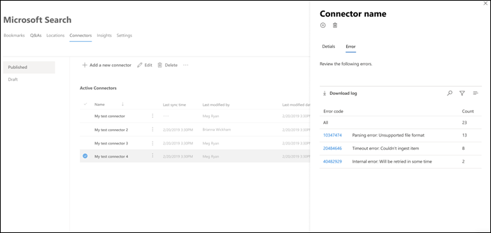

# Administrar el conector para Microsoft SearchManage your connector for Microsoft Search

Para obtener acceso a los conectores y administrarlos, debe estar designado como administrador de búsqueda de su espacio empresarial.To access and manage your connectors, you must be designated as a search administrator for your tenant. Póngase en contacto con el administrador de inquilinos para que le proporcione el rol de administrador de búsqueda.Contact your tenant administrator to provision you for the search administrator role.

## IntroducciónGet started

Vaya a la [pestaña conectores](https://admin.microsoft.com/Adminportal/Home#/MicrosoftSearch/Connectors) en el [centro de administración de Microsoft 365](https://admin.microsoft.com).Navigate to the [Connectors tab](https://admin.microsoft.com/Adminportal/Home#/MicrosoftSearch/Connectors) in the [Microsoft 365 admin center](https://admin.microsoft.com).

Para cada tipo de conector, el [centro de administración de Microsoft 365](https://admin.microsoft.com) admite las operaciones que se muestran en la tabla siguiente:For each connector type, the [Microsoft 365 admin center](https://admin.microsoft.com) supports the operations shown in the following table:

OperaciónOperation | Conector creado por MicrosoftMicrosoft-built connector | Asociado o conector personalizadoPartner or custom-built connector
--- | --- | ---
Agregar una conexiónAdd a connection | : heavy_check_mark: (vea [configurar el conector creado por Microsoft](configure-connector.md)):heavy_check_mark: (See [Configure your Microsoft-built connector](configure-connector.md)) | : x: (consulte a su partner o a la experiencia del administrador del conector integrado personalizado):x: (Refer to your partner or custom-built connector admin UX)
Eliminar una conexiónDelete a connection | : heavy_check_mark::heavy_check_mark: | : heavy_check_mark::heavy_check_mark:
Editar una conexión PublicadaEdit a published connection | : heavy_check_mark: nombre:heavy_check_mark: Name   : heavy_check_mark: Descripción:heavy_check_mark: Description   : heavy_check_mark: credenciales de autenticación para el origen de datos externo:heavy_check_mark: Authentication credentials for your external data source   : heavy_check_mark: credenciales de puerta de enlace para el origen de datos local:heavy_check_mark: Gateway credentials for your on-premises data source   : heavy_check_mark: actualizar programación:heavy_check_mark: Refresh schedule   | : heavy_check_mark: nombre:heavy_check_mark: Name   : heavy_check_mark: Descripción:heavy_check_mark: Description
Edición de una conexión de borradorEdit a draft connection | : heavy_check_mark::heavy_check_mark: | días:x:

## Supervisar el estado de conexiónMonitor your connection status

Después de crear una conexión, el número de elementos procesados se muestra en la ficha **conectores** de la página de **Microsoft Search** .After you create a connection, the number of processed items shows on the **Connectors** tab on the **Microsoft Search** page. Una vez finalizado correctamente el rastreo completo inicial, se muestra el progreso de los rastreos incrementales periódicos.After the initial full crawl completes successfully, the progress for periodic incremental crawls displays. Esta página proporciona información sobre las operaciones cotidianas del conector y una introducción a los registros y el historial de errores.This page provides information about the connector's day-to-day operations and an overview of the logs and error history.

Se muestran cuatro Estados en la columna **Estado** para cada conexión:Four states show up in the **Status** column against each connection:

* **Sincronización**.**Syncing**. El conector está rastreando los datos del origen para indizar los elementos existentes y realizar actualizaciones.The connector is crawling the data from the source to index the existing items and make any updates.

* **Habilitada**: la conexión está habilitada y no se está ejecutando un rastreo activo en ella.**Enabled**: The connection is enabled, and there's no active crawl running against it. **Hora de la última sincronización** indica cuándo se ha producido el último rastreo correcto.**Last sync time** indicates when the last successful crawl happened. La conexión es tan nueva como la hora de la última sincronización.The connection is as fresh as the last sync time.

* **Pausado**.**Paused**. Los administradores pausan los rastreos a través de la opción PAUSE.The crawls are paused by the admins through the pause option. El siguiente rastreo se ejecuta solo cuando se reanuda de forma manual.The next crawl runs only when it's manually resumed. Sin embargo, los datos de esta conexión continúan siendo aptos para la búsqueda.However, the data from this connection continues to be searchable.

* **Produjo un error**.**Failed**. La conexión tuvo un error crítico.The connection had a critical failure. Este error requiere intervención manual.This error requires manual intervention. El administrador debe realizar las acciones adecuadas según el mensaje de error que se muestra.The admin needs to take appropriate action based on the error message shown. Los datos que se indizaron hasta que se produjo el error se pueden buscar.Data that was indexed until the error occurred is searchable.

### Supervisar erroresMonitor errors

En cada **conector activo** de la ficha **conectores** , los errores de rastreo existentes se muestran en la ficha **error** . La pestaña enumera los códigos de error, el número de cada una de ellas y las opciones de descarga de registros de errores.For each **Active Connector** on the **Connectors** tab, any existing crawl errors show under the **Error** tab. The tab lists error codes, the count of each, and error log download options. Vea el ejemplo de la siguiente imagen.See the example in the following image. Seleccione un **código de error** para ver los detalles del error.Select an **error code** to view the error's details.

Para ver los detalles específicos de un error, seleccione su código de error.To view an error's specific details, select its error code. Aparecerá una pantalla con los detalles del error y un vínculo.A screen appears with error details and a link. Los errores más recientes aparecen en la parte superior.The most recent errors appear at the top. Vea el ejemplo de la tabla siguiente.See the example in the following table.

A continuación se muestra una lista de los distintos errores que pueden aparecer en cualquier conexión.Below is the list of different errors that can appear against any connection. Si estas soluciones no funcionan, póngase en contacto con el soporte técnico o envíenos [sus comentarios](connectors-feedback.md).If these solutions don’t work, contact support or send us [feedback](connectors-feedback.md).

Código de errorError code | Mensaje de errorError message | SoluciónSolution
--- | --- | ---
10001000 | El origen de datos no está disponible.The data source isn't available. Compruebe la conexión a Internet o asegúrese de que el conector sigue teniendo acceso al origen de datos.Check your internet connection or make sure the data source is still accessible by the connector. | Este error se produce cuando el origen de datos no es accesible debido a un problema de red o cuando el propio origen de datos se elimina, se mueve o se cambia de nombre.This error occurs when the data source is not reachable due to a network issue or when the data source itself is deleted, moved, or renamed. Compruebe si los detalles del origen de datos proporcionados siguen siendo válidos.Check if the data source details provided are still valid.
10011001 | No se pueden actualizar los datos porque el origen de datos está limitando el conector.Can't update the data, because the data source is throttling the connector. | Para deslimitar el origen de datos, compruebe si se pueden aumentar los límites de escala o esperar hasta una hora menos intensa del día.To unthrottle the data source, check if its scale limits can be increased or wait until a less traffic-heavy time of the day.
10021002 | No se puede autenticar con el origen de datos.Can't authenticate with the data source. Compruebe que las credenciales asociadas a este origen de datos sean correctas.Verify that the credentials associated with this data source are correct. | Haga clic en **Editar** para actualizar las credenciales de autenticación.Click **Edit** to update the authentication credentials.
10031003 | La cuenta asociada con el conector no tiene permiso para obtener acceso al elemento.The account associated with the connector doesn't have permission to access the item. |  Asegúrese de que la cuenta correcta tiene acceso al elemento que desea indizar.Ensure the proper account has access to the item you want indexed.
10041004 | No se puede acceder a la puerta de enlace de datos local.Unable to reach the on-premises data gateway. Asegúrese de que el servicio de puerta de enlace se esté ejecutando y de que los detalles de la puerta de enlace se actualicen en la configuración de conexión.Make sure the gateway service is running and the gateway details are updated in the connection configuration. | Compruebe el equipo con la puerta de enlace, abra la aplicación de puerta de enlace de Power BI y asegúrese de que la puerta de enlace se esté ejecutando.Check the computer with the gateway, open the Power BI Gateway application and make sure the gateway is running. Compruebe que la puerta de enlace usa la misma cuenta de administrador que Microsoft Search y, a continuación, asegúrese de que todos los detalles de la puerta de enlace se han actualizado en la configuración de conexión.Verify that the gateway is using the same admin account as Microsoft Search, then make sure all the gateway details are all updated in the connection configuration.
10051005 | Las credenciales asociadas a este origen de datos han expirado.Credentials associated with this data source have expired. Renovar las credenciales y actualizar la conexión.Renew the credentials and update the connection. | Haga clic en **Editar** para actualizar las credenciales de autenticación.Click **Edit** to update the authentication credentials.
10061006 | La versión de la puerta de enlace ya no está actualizada y no es compatible con este conector.Your gateway version is out of date and doesn’t support this connector anymore. Tendrá que actualizar la puerta de enlace.You will need to update the gateway. | Visite [instalar una puerta de enlace de datos local](https://docs.microsoft.com/data-integration/gateway/service-gateway-install) para descargar e instalar la versión más reciente de la puerta de enlace de Power BI en el equipo que contiene la puerta de enlace.Please visit [Install an on-premises data gateway](https://docs.microsoft.com/data-integration/gateway/service-gateway-install) to download  and install the latest version of the Power BI gateway on the machine containing the gateway.
10071007 | No se detectó ninguna licencia de Power BI válida.No valid Power BI license detected. Necesita una licencia de Power BI válida para realizar este rastreo.You need a valid Power BI license to perform this crawl. | Necesita una licencia de Power BI válida para realizar este rastreo.You need a valid Power BI license to perform this crawl. Compruebe que la organización tiene una licencia válida.Check that your organization has a valid license. Si es así, inténtalo de nuevo.If it does, try again. Si no es así, obtenga una licencia y vuelva a intentarlo.If it doesn’t, obtain a license and then try again.
10081008 | El total de uso de la cuota de su inquilino ha alcanzado su límite.The total quota utilization of your tenant has reached its limit. Pruebe a eliminar una conexión para liberar parte de su cuota o ajustar los filtros de ingesta para incluir menos datos.Try deleting a connection to free up some of your quota or adjusting your ingestion filters to bring in less data. | Pruebe a eliminar una conexión para liberar parte de su cuota o ajustar los filtros de ingesta para incluir menos datos.Try deleting a connection to free up some of your quota or adjusting your ingestion filters to bring in less data. Si estos no resuelven el problema, póngase en contacto con el soporte técnico de Microsoft.If these don't solve the issue, contact Microsoft support.
20012001 | La indización se limita debido a un gran número de actualizaciones en la cola.Indexing is throttled because of a large number of updates in the queue. Dependiendo de la cola, la actualización puede tardar algún tiempo en completarse.Depending on the queue, it can take some time for the updates to complete. | Espere hasta que se borre la cola.Please wait until the queue gets cleared.
20022002 | Error de indización debido a un formato de elemento no admitido.Indexing failed due to unsupported item formatting. | Consulte la documentación específica del conector para obtener más información.See connector-specific documentation for more information.
20032003 | Error de indización debido a contenido de elemento no admitido.Indexing failed due to unsupported item content. | Consulte la documentación específica del conector para obtener más información.See connector-specific documentation for more information.
50005000 | Se ha producido un error.Something went wrong. Si el proceso sigue, póngase en contacto con el soporte técnico.If this continues, contact support. |

## Limitaciones de la vista previaPreview limitations

* Al **publicar** un conector creado por Microsoft, la conexión puede tardar unos minutos en crearse.When you **publish** a Microsoft-built connector, it might take a few minutes for the connection to be created. Durante este tiempo, la conexión muestra su estado como pendiente.During that time, the connection shows its status as pending. Además, no se actualiza automáticamente, por lo que debe actualizarse manualmente.Also, there's no auto-refresh, so you need to refresh manually.

* El [centro de administración de Microsoft 365](https://admin.microsoft.com) no permite ver y editar el **esquema de búsqueda** una vez que se ha publicado una conexión.The [Microsoft 365 admin center](https://admin.microsoft.com) doesn't support viewing and editing the **search schema** after a connection is published. Para editar el esquema de búsqueda, elimine la conexión y, a continuación, cree una nueva.To edit the search schema, delete your connection and then create a new one.

* Al administrar la **programación de actualización**de la conexión, se muestra el número de elementos que se sincronizan durante cada sesión.When you manage your connection's **refresh schedule**, the number of items that sync during each session are displayed. Sin embargo, el historial de sincronización no está disponible.However, the sync history isn't available.
