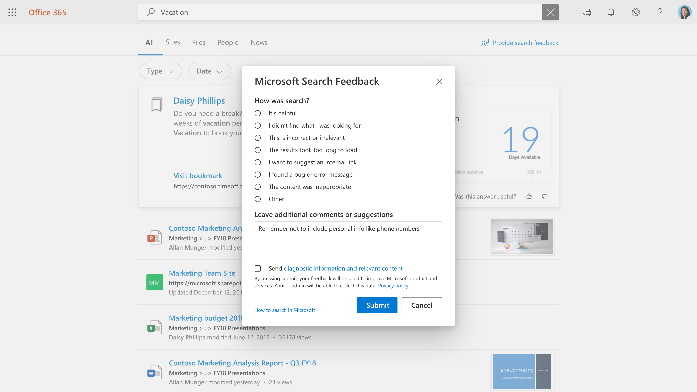

# Administración de comentarios de los usuariosManaging user feedback

La creación de una buena experiencia de búsqueda para los usuarios es una colaboración entre Microsoft y el administrador de búsqueda.Creating a great search experience for your users is a partnership between Microsoft and the search administrator. Los comentarios de los usuarios nos permiten evaluar de forma continua el producto y ajustarlo para obtener la mejor experiencia.Feedback from your users allows us to continuously evaluate the product and tune it for the best experience. Sin embargo, algunos comentarios son los que se le ofrecen mejor.Some feedback, however, is best addressed by you.

Ahora estamos ofreciendo herramientas que le permitirán revisar y administrar los comentarios que los usuarios ofrecen en la experiencia de búsqueda.We are now offering tools that will allow you to review and manage the feedback your users are providing on the search experience.

## Cómo envían comentarios los usuariosHow users submit feedback

Como los usuarios de la organización usan Microsoft Search, es posible que tengan comentarios sobre la experiencia.As people in your organization use Microsoft Search, they may have feedback on the experience. Al hacer clic en un vínculo de comentarios de la página de resultados, pueden clasificar sus comentarios e incluir comentarios adicionales.When they click a feedback link on the results page, they can categorize their feedback and include additional comments.

Los usuarios también tienen la opción de enviar su consulta y otra información de diagnóstico, junto con la categoría y los comentarios, a Microsoft.Users also have the option to send their query and other diagnostic info, along with the category and comments, to Microsoft. La información de diagnóstico incluirá algunos datos personales, como un identificador de usuario.Diagnostic info will include some personal data such as a user identifier. [Obtenga más información](https://privacy.microsoft.com/en-US/privacystatement) sobre privacidad y cómo se protegen estos datos.[Learn more](https://privacy.microsoft.com/en-US/privacystatement) about privacy and how we protect this data. Los datos de diagnóstico contienen la información más importante que Microsoft necesita para usar el elemento de comentarios para mejorar el producto.The diagnostic data contains the most critical information that Microsoft needs to use the feedback item for product improvement.

La mayoría de los envíos de comentarios aparecen en la sección de [comentarios](https://admin.microsoft.com/Adminportal/Home#/MicrosoftSearch/feedback) del centro de administración de búsqueda de Microsoft.Most feedback submissions appear in the [Feedback](https://admin.microsoft.com/Adminportal/Home#/MicrosoftSearch/feedback) section of the Microsoft Search admin center. Los comentarios enviados con la categoría deseo **sugerir un vínculo interno** aparecen como un marcador sugerido en la sección [marcadores](https://admin-ignite.microsoft.com/Adminportal/Home#/MicrosoftSearch/bookmarks) y se pueden ver filtrando según el estado **sugerido** .Feedback sent with the **I want to suggest an internal link** category appears as a suggested bookmark in the [Bookmarks](https://admin-ignite.microsoft.com/Adminportal/Home#/MicrosoftSearch/bookmarks) section and can be seen by filtering on **Suggested** status.

## Revisar comentariosReview Feedback

En la página [comentarios](https://admin.microsoft.com/Adminportal/Home#/MicrosoftSearch/feedback) , puede revisar y exportar comentarios que los usuarios de su organización han enviado en los últimos 30 días.On the [Feedback](https://admin.microsoft.com/Adminportal/Home#/MicrosoftSearch/feedback) page, you can review and export feedback that people in your organization have sent during the past 30 days. Una vez que un usuario envíe comentarios, aparecerá en esta lista en un plazo de 20 minutos.Once a user submits feedback it will appear in this list within 20 minutes. Puede usar el botón actualizar para asegurarse de que está viendo los datos más actualesYou can use the refresh button to ensure you are looking at the most current data

Mediante el uso de un filtro, puede ver comentarios sobre tipos de respuesta específicos.By using a filter, you can see feedback for specific answer types. También puede filtrar por origen y por intervalo de fechas.You can also filter by source and date range.

Puede usar el cuadro de búsqueda sobre la lista de comentarios para buscar comentarios en una consulta específica.You can use the search box above the feedback list to search for feedback on a specific query.

En la lista de comentarios, la columna textual indica qué comentarios del usuario también incluyen un comentario o una sugerencia.In the feedback list, the Verbatim column indicates what user's feedback also includes a comment or suggestion. Para leerlo, haga clic en la consulta para abrir el panel de **detalles** .To read it, click the query to open the **Detail** panel.

## Estado de comentarios de actualizaciónUpdate feedback state

A medida que lleguen los comentarios, éste estará en un estado *nuevo* y permanecerá ahí hasta que lo cambie a *resuelto* o *duplicado*.As feedback comes in, it will be in a *New* state and will remain there until you change it to *Resolved* or *Duplicate*.

Para cambiar este estado:To change this state:

1. Junto a la consulta, seleccione **más opciones** (tres puntos verticales).Next to the query, select **More Options** (three vertical dots).
1. En el menú, seleccione **marcar como resuelto** o **marcar como duplicado.**On the menu, select **Mark as resolved** or **Mark as duplicate.**
1. La lista se actualizará y se mostrará el estado actualizado.The list will refresh and show the updated state.

También puede actualizar el estado de varios elementos, simplemente seleccionarlos y, a continuación, seleccionar más opciones a continuación de cualquiera de estos elementos.You can also update the state for multiple items, just select them, then select More Options next any of those items.

## Exportar comentariosExport feedback

Si desea compartir los comentarios de búsqueda con otros o conservarlos durante más de 30 días, haga clic en **exportar.**If you want to share search feedback with others or retain them for longer than 30 days, click **Export.** Se descargará automáticamente un archivo. csv denominado comentarios con fecha, como "Feedbacks_10_31_2020.csv".A .csv file named Feedbacks with the date, like "Feedbacks_10_31_2020.csv", will be automatically downloaded.

## Enviar comentarios de los usuarios a MicrosoftSend user feedback to Microsoft

De forma predeterminada, todos los comentarios de los usuarios se envían a Microsoft y se agregan a usted.By default, all user feedback is sent to Microsoft and addition to you. Para dejar de enviar comentarios a Microsoft, haga clic en **Administrar configuración** y desactive la casilla de verificación **enviar automáticamente comentarios de los usuarios a Microsoft** .To stop sending feedback to Microsoft, click **Manage settings** , and clear the **Automatically send user feedback to Microsoft** check box. Este cambio puede tardar hasta 24 horas en surtir efecto.It can take up to 24 hours for this change to take effect.

Si ha decidido no enviar comentarios a Microsoft de forma automática, podrá seguir enviando comentarios individuales a Microsoft.If you've decided to not send feedback to Microsoft automatically, you can still send individual pieces of feedback to Microsoft.

1. Seleccione los comentarios que desea compartir.Select the feedback that you want to share.
1. En la barra de acciones, seleccione más (tres puntos) y haga clic en **Enviar comentarios a Microsoft**.In the action bar, select More (three dots), and click **Send feedback to Microsoft**.

1. El estado de la columna enviado a Microsoft cambiará a pendiente.The status in the Sent to Microsoft column will change to Pending. Cuando se envíen los comentarios, se cambiará a sí.When the feedback is sent, it will change to Yes.

Si comparte los comentarios de forma automática o manual, nunca incluye consultas y otra información de diagnóstico para los usuarios que opten por no incluir esta información.If you share feedback automatically or manually, it never includes queries and other diagnostic info for users that opted to not include this information.

## Sugerencias sobre cómo usar los comentariosSuggestions on how to use feedback

Como administrador de búsqueda, debe comprender los principales roles de la organización y los tipos de contenido con los que los usuarios interactúan normalmente y buscar.As a search administrator you should understand the major personas in your organization and what types of content those people typically interact with and search for. Con esta comprensión, puede usar comentarios para realizar mejoras dirigidas a la experiencia de búsqueda de los usuarios.With this understanding, you can use feedback to make targeted improvements to your users' search experience.

1. "No he encontrado lo que busco" y se pueden usar comentarios similares para identificar el contenido que los usuarios quieren, pero actualmente no está incluido en el índice de búsqueda.“I did not find what I was looking for” and similar feedback can be used to identify content users want, but is not currently included in the search index. La determinación de esto suele llevar a cabo la investigación y la inferencia según la comprensión de los usuarios.Determining this often takes investigation and inference based on understanding your users. Una vez encontrado, decida qué métodos para incluir ese contenido sería más adecuado:Once found, decide which methods of including that content would be most appropriate:
    1. Los marcadores son útiles para orígenes de contenido que tienen una página de inicio de alta calidad y una variedad limitada de términos de búsqueda, de modo que la comunidad de usuarios obtiene un resultado de gran calidad del marcador y, a continuación, encuentra lo que busca.Bookmarks are useful for content sources having a high-quality landing page and a limited variety of search terms, so that the user community gets a high-quality result from the bookmark and can then efficiently find what they are looking for.
    1. Q&A son útiles para respuestas individuales que son bastante frecuentes, pero no cambian.Q&A are useful for individual answers that are fairly frequent, yet do not change.
    1. Los conectores son útiles para orígenes de contenido con una amplia variedad de contenido y una amplia variedad de términos de búsqueda.Connectors are useful for content sources with a wide variety of content and wide variety of search terms.
1. "Los resultados tardaron demasiado en cargarse" & "he encontrado un problema" puede ser un indicador de un problema más amplio.“The results took too long to load” & “I found a problem” may be indicators of a broader problem. Buscar estos comentarios diariamente puede ayudarle y, si aparecen varios casos, puede comprobar la experiencia de búsqueda para usted mismo y abrir un caso de soporte técnico de Microsoft si es necesario.Looking for this feedback daily may help and if multiple cases appear, you can verify the search experience for yourself and open a support case with Microsoft if needed. Este tipo de comentarios también es importante para Microsoft y es una razón excelente para enviarnos comentarios.This type of feedback is also important to Microsoft and is an excellent reason to flow all feedback to us.
1. "Quiero sugerir un vínculo interno" puede evaluarse para agregarse como marcadores o como contenido conectado.“I want to suggest an internal link” can be evaluated for being added as bookmarks or connected content. El primer pensamiento debe ser un marcador; Si el marcador obtiene un uso elevado, puede considerar la posibilidad de traer contenido a través de un conector para habilitar una experiencia de búsqueda incluso más rica.Your first thought should be a bookmark; if the bookmark gets high usage, you can consider bringing in content through a connector to enable an even richer search experience.
