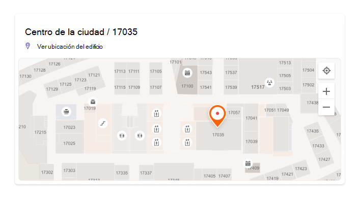
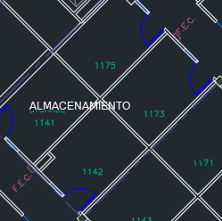
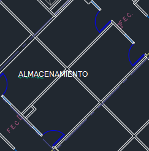
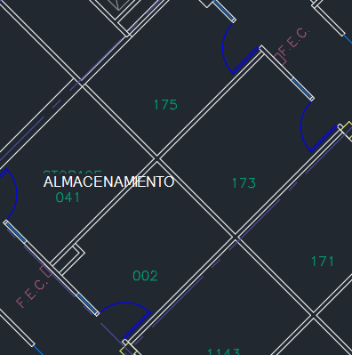

# Administrar planos de planta

Los planes de planta de Búsqueda de Microsoft ayudan a los usuarios a encontrar personas, salas y espacios dentro de un edificio. Los patrones de consulta que incluyen el nombre completo, el nombre, el nombre de la sala o la ubicación de la sala de una persona, como estos ejemplos, devolverán un plan de planta:

- ¿Dónde está la oficina de Allan Deyoung?
- ¿Dónde está la oficina de Daisy?
- Edificio 2 planta 3
- Workspace-1
- B1/1.20

## Qué experiencia tienen los usuarios

Los usuarios pueden ver las respuestas del plan de [planta Bing](https://bing.com), [SharePoint](http://sharepoint.com/)y [Office 365](https://office.com). También se admiten otros puntos de entrada que devuelven Bing resultados, incluidos Windows búsqueda y la barra Microsoft Edge de direcciones. Cuando los usuarios busquen un nombre o una ubicación de sala, verán el punto de interés marcado en la respuesta del plan de planta.

> [!div class="mx-imgBorder"]
> 

Cuando busquen la oficina de una persona, verán una respuesta similar, con la imagen de perfil de la persona en el marcador.

> [!div class="mx-imgBorder"]
> 

## Agregar planos de planta

Siga estos pasos para configurar las respuestas de los planes de planta en Búsqueda de Microsoft.

### Paso 1: Determinar los códigos de creación

Los códigos de creación se usan como parte de la ubicación de la oficina de un usuario. Usará estos códigos al actualizar perfiles de usuario. Supongamos que su organización tiene un edificio en esta dirección: *Edificio 2, 350 5th Avenue, Nueva York, NY 10016*

Estos son algunos buenos ejemplos para el código del edificio: 2, B2, Building2, Building 2 o NYCB2. Cada edificio debe tener un código único.

### Paso 2: Revisar los planes de planta

Los archivos de planos de planta deben estar en formato DWG, que admite etiquetas de texto. Cuando una etiqueta de texto marca una sala, se denomina etiqueta de sala. Estos son algunos ejemplos de archivos DWG con diferentes tipos de etiquetas:

| Etiquetas de texto, incluidas las etiquetas de sala | Etiquetas de texto pero sin etiquetas de sala | Sin etiquetas de texto |
|:-----:|:-----:|:-----:|
||||

Como práctica recomendada, las etiquetas de texto DECD deben contener números de planta, números de ala (si son relevantes) y números de sala, en ese orden. Consulta las preguntas más frecuentes para obtener más ejemplos de [formatos](#frequently-asked-questions) de etiquetas de texto e información sobre cómo ver y actualizar archivos DWG.

### Paso 3: Actualizar ubicaciones de oficina en perfiles de usuario

La ubicación de la oficina de un usuario es una combinación de un código de creación y una etiqueta de sala. Por ejemplo, si el código de creación es *2* y la etiqueta de la sala es *1173*, la ubicación de la oficina sería *2/1173*.

Agregar o actualizar ubicaciones de oficina para usuarios con una ubicación de trabajo asignada. Puede hacerlo desde su perfil de usuario en los centros de administración de [Microsoft 365](https://admin.microsoft.com) o [Azure Active Directory,](https://portal.azure.com/) o su Active Directory local (se sincronizará con Azure Active Directory). *PhysicalDeliveryOfficeName* es el campo usado para la ubicación de la oficina. Si las etiquetas de sala no incluyen números de planta, consulta las preguntas más frecuentes para obtener [sugerencias.](#frequently-asked-questions)

En este ejemplo, la oficina de Allan está en la sala 1173 de la planta 1 del edificio 2.

> [!div class="mx-imgBorder"]
> 

Para configurar planes de planta para salas de reuniones, agregue ubicaciones de oficina para ellas en la sección Salas [& equipamiento](https://admin.microsoft.com/Adminportal/Home#/ResourceMailbox) de la Centro de administración de Microsoft 365. Para obtener más información, vea Configurar buzones de [sala y equipamiento.](/microsoft-365/admin/manage/room-and-equipment-mailboxes#set-up-room-and-equipment-mailboxes) Si los usuarios de la organización pueden programar la sala o el recurso para una reunión o evento, vea Cambiar cómo un buzón de sala administra las [solicitudes de reunión](/Exchange/recipients/room-mailboxes#change-how-a-room-mailbox-handles-meeting-requests). Para obtener información acerca de la configuración de áreas de trabajo, incluida la configuración de buzones de sala, vea la publicación sobre reservar un área de trabajo [en Outlook](https://techcommunity.microsoft.com/t5/exchange-team-blog/book-a-workspace-in-outlook/ba-p/1524560).

### Paso 4: Comprobar la ubicación de la oficina

Use Búsqueda de Microsoft para buscar un usuario y comprobar que su ubicación de oficina aparece correctamente. Es posible que deba esperar hasta **72 horas** para que las actualizaciones aparezcan en los resultados de la búsqueda.

> [!div class="mx-imgBorder"]
> 

### Paso 5: Agregar ubicaciones de creación

Los planes de planta [usan Ubicaciones](manage-locations.md) para definir los edificios. En el [Centro de administración de Microsoft 365](https://admin.microsoft.com), vaya a [**Ubicaciones**](https://admin.microsoft.com/Adminportal/Home#/MicrosoftSearch/locations)y, a continuación, seleccione **Agregar**. Escriba el nombre, la dirección y las palabras clave del edificio. Agrega tantos edificios como necesites.

> [!div class="mx-imgBorder"]
> 

Para obtener más información acerca de las ubicaciones, vea [Administrar ubicaciones](manage-locations.md)

### Paso 6: Recopilar y organizar ubicaciones de oficina

Para poder cargar planes de planta, las ubicaciones de oficina deben indizarse. Esta operación única que puede tardar hasta 48 horas en completarse. El tiempo total dependerá del tamaño de la organización.

En [el Centro de administración,](https://admin.microsoft.com)vaya a Planos de [**planta**](https://admin.microsoft.com/Adminportal/Home#/MicrosoftSearch/floorplans)y, a continuación, seleccione Comenzar **la indización.** Si no ve este aviso, este paso ya se ha completado para su organización

### Paso 7: Upload planos de planta

1. En el [Centro de administración,](https://admin.microsoft.com)vaya a [**Planos de planta**](https://admin.microsoft.com/Adminportal/Home#/MicrosoftSearch/floorplans).

2. Seleccione un edificio en la lista desplegable y seleccione **Siguiente**. Si el edificio no aparece en la lista, vuelva atrás y [agregue ubicaciones de creación.](#step-5-add-building-locations)

3. Seleccione **Upload archivos y,** a continuación, elija el plan de planta que desea cargar.

4. Una vez completada la carga, debe escribir el número de planta que se representa en el archivo de plano de planta. Después, seleccione **Siguiente**.

5. (Opcional) Si el piso tiene alerones o zonas, escriba ese detalle.

6. Verá una pantalla de revisión que muestra cuántas ubicaciones de oficina se asignaron a los planes de planta. Seleccione **Detalles** para asegurarse de que la asignación es correcta.
    - Si no hay usuarios asignados o no está satisfecho con la asignación, seleccione **Continuar asignación**.
    - Para publicar, seleccione **Omitir y publicar**.

1. Escriba el código de creación de este plan de planta. El código de creación se puede encontrar en la propiedad de ubicación de la oficina de los usuarios. Por ejemplo, si la ubicación de la oficina de un usuario es **2/1173**, el código de creación es **2**.

1. En la pantalla de revisión, repita el paso 6 para asegurarse de que la asignación es correcta. Si está satisfecho con la asignación, seleccione **Continuar asignación** y **Omita y publique**. Si no es así, **seleccione Continuar asignación** y vaya a la pantalla Especificar patrones de ubicación.

1. (Opcional) Revise e identifique la lógica de nomenclatura de todos los patrones de ubicación únicos de este edificio en el directorio de Azure y, a continuación, **seleccione Siguiente**.

1. En la pantalla de revisión, repita el paso 6 para asegurarse de que la asignación es correcta.

1. Cuando esté listo, seleccione **Publicar para** que el plan de planta esté disponible en Búsqueda de Microsoft.

> [!NOTE]
> **Los planes de planta tardan 48 horas en publicarse.** Después, los usuarios verán los resultados de un plan de planta similar al siguiente cuando busquen la oficina de un compañero de trabajo.

> [!div class="mx-imgBorder"]
> 

### Paso 8: (opcional) Especificar patrones de ubicación

Después de cargar un plan de planta, las etiquetas de texto de la sala se comparan con las ubicaciones de oficina en los perfiles de los usuarios. Si las ubicaciones de office o las **etiquetas** de texto no siguen de forma coherente los patrones de nomenclatura recomendados en los pasos [2](#step-2-review-your-floor-plans) y [3,](#step-3-update-office-locations-on-user-profiles)use la pantalla Especificar patrones de ubicación para agregar más información para completar la asignación. Los patrones de ubicación se usan para extraer información de piso, ala y sala de las ubicaciones de oficina de AAD.

> [!div class="mx-imgBorder"]
> 

El piso y el ala son opcionales, solo se requiere espacio y puede omitir ubicaciones según sea necesario.

## Actualizar planos de planta

Antes de actualizar un plan de planta existente, asegúrese de que las ubicaciones de oficina de AAD estén actualizadas y haya esperado durante 48 horas a que se procese cualquier actualización de AAD. Para actualizar un plan de planta, vaya a Planos de planta, seleccione el edificio para el plan de planta y **seleccione Editar**. Si el plano de planta ha cambiado estructuralmente, por ejemplo, debido a la remodelación, quite el archivo antiguo y, a continuación, cargue y publique el nuevo archivo DWG.

> [!NOTE]
> No es necesario actualizar los planes de planta cuando los usuarios se mueven a un piso que ya está asignado. Solo tiene que actualizar su perfil de usuario para reflejar la nueva ubicación de la oficina:
>
> - En el Centro de administración de Microsoft 365 (Usuarios activos > cuenta > Administrar información de contacto)
> - En el Centro de administración de Azure Active Director (Usuarios > perfil > editar información de contacto)
> - En su Active Directory local (se sincronizará con Azure Active Directory)

## Eliminar planos de planta

Para eliminar un solo plan de planta, vaya a [Planos de planta](https://admin.microsoft.com/Adminportal/Home#/MicrosoftSearch/floorplans) y seleccione el edificio. A continuación, seleccione el plano de planta y **seleccione Quitar**. Para eliminar todos los planos de planta de un edificio, vaya a [Ubicaciones](https://admin.microsoft.com/Adminportal/Home#/MicrosoftSearch/locations), seleccione el edificio y **seleccione Eliminar**.  

## Solución de problemas

| Paso | Mensaje de error | Tipo | Acción |
|:-----|:-----|:-----|:-----|
|Upload planos de planta|No se puede leer CC_1.dwg. Vuelva a cargar o eliminar el plan de planta.|Error|Intente cargar el archivo de nuevo. Si eso no funciona, elimine el archivo e inténtelo de nuevo.|
|Upload planos de planta|Hay dos archivos denominados CC_1.dwg. Elimine uno de ellos o vuelva a cargarlo con otro nombre.|Error|Si el nombre del archivo es incorrecto, agregue el número de planta o de ala para crear un nombre de archivo único y cargarlo de nuevo. Si agregaste accidentalmente el mismo archivo dos veces, elimina uno de ellos.|
|Upload planos de planta|No se encontraron datos.|Error|Compruebe el archivo para asegurarse de que es el correcto y, a continuación, vuelva a cargarlo o elimínelo.|
|Upload planos de planta|Faltan referencias externas en este archivo. Cargue CC_1_furniture.dwg o elimine este archivo.|Advertencia|Upload archivos de referencia externos o eliminar.|
|Upload planos de planta|No se pudieron leer los números de sala ni las etiquetas en el archivo DWG. Elimine este archivo.|Advertencia|Compruebe el archivo DWG para asegurarse de que los datos están incluidos y, a continuación, elimine el archivo e inténtelo de nuevo.|
|Vincular ubicaciones de oficina|No se encuentran ubicaciones de oficina en Azure Active Directory. Agregue datos de ubicación a Azure Active Directory antes de configurar los planes de planta.|Error|[Actualizar ubicaciones de oficina en perfiles de usuario](#step-3-update-office-locations-on-user-profiles) |

## Preguntas frecuentes

**P:** ¿Cómo puedo ver y editar archivos DWG?

**A:** Use cualquiera de estas opciones para ver archivos DWG:

- Upload el archivo para SharePoint y abrirlo.
- Abra el archivo en [Microsoft Visio](https://support.office.com/article/Open-insert-convert-and-save-DWG-and-DXF-AutoCAD-drawings-60cab691-0f4c-4fc9-b775-583273c8dac5) o en Autodesk [DWG TrueView](https://www.autodesk.com/products/dwg).
- Upload el archivo al [Visor en línea de Autodesk](https://viewer.autodesk.com/).

Puede crear o editar un archivo DWG en cualquier editor DE ARCHIVOS DWG, incluidos los Visio o los archivos de AutoCAD. Para usar Visio, vea [Create a floor plan](https://support.microsoft.com/office/create-a-floor-plan-ec17da08-64aa-4ead-9b9b-35e821645791). El tamaño máximo de archivo para un único archivo DWG es de 16 MB.

**P:** ¿Cómo agredo etiquetas de texto a salas sin marcar?

**A:** Abra el archivo DWG en un editor y [agregue etiquetas de salón.](https://knowledge.autodesk.com/support/autocad-map-3d/learn-explore/caas/CloudHelp/cloudhelp/2019/ENU/MAP3D-Learn/files/GUID-4854F184-6279-4E0C-9487-34A4759017F6-htm.html)

**P:** ¿Cuál es el mejor formato para etiquetas de texto en archivos DWG?

**A:** Para obtener los mejores resultados, las etiquetas de texto de DWG deben ser una sola línea que contenga números de planta, números de ala (si procede) y números de sala, en ese orden. Los ejemplos siguientes usan 2 o CITY CENTER para el código de creación.
<!-- markdownlint-disable no-inline-html -->
|Tipos de etiquetas de sala|Floor|Wing/Zone|Sala|Etiqueta de texto de ejemplo|Office ubicación (código de creación/etiqueta de texto)|
|:-----|:-----|:-----|:-----|:-----|:-----|
|Tiene el piso y el número de sala|1| |173|1173|2/1173|
|| 21| |45|21045|2/21045|
||23| |100K|23-100K|23/23-100K|
||1| |G06-07|1G06-07|CITY CENTER/1G06-07|
||2| |1024A|02.1024A|CITY CENTER/02.1024A|
|Tiene el número de sala, el ala y el piso|1|A|173|1A173|2/1A173
||2|Z1|128b|2Z1128b|2/2Z1128b

Además, en el archivo DWG no se incluyen etiquetas de texto adicionales, como las dimensiones de la sala o el nombre del arquitecto.

**P:** ¿Hay límites de caracteres para las etiquetas de texto?

**A:** Las etiquetas de texto deben ser una sola línea. Los caracteres especiales se pueden usar para crear códigos o etiquetas de salón, pero no para valores de piso o ala.

**P:** ¿Puedo usar un archivo DWG que no incluya números de planta?

**A:** Se recomienda que las etiquetas de texto de DWG incluyan números de planta, pero no son necesarias, vea patrones de nomenclatura en [el paso 2](#step-2-review-your-floor-plans). Además, debe incluir el número de planta como parte de la ubicación de la oficina en la información de contacto del usuario. Después de cargar el archivo DWG, tendrás que usar la pantalla opcional Especificar patrones de ubicación para completar el proceso de asignación de estas **etiquetas** no estándar.

Por ejemplo, un archivo DWG que incluye números de sala, pero no números de planta, puede tener un aspecto similar al siguiente:

> [!div class="mx-imgBorder"]
> 

La ubicación de la oficina en el perfil del usuario sería 2/1175 donde "2" es el código de edificio, "1" es el número de planta y "175" es el número de sala.

**P:** He agregado una ubicación de edificio, ¿por qué no ves la opción de agregar un plan de planta?

**A:** Es posible que las ubicaciones de creación agregadas o actualizadas recientemente aún no se encontrarán en el índice de búsqueda. Las ubicaciones nuevas o modificadas pueden tardar varias horas en aparecer en los resultados de la búsqueda. Además, si el edificio tiene un borrador o un plan de planta publicado, seleccione el nombre del edificio y, a continuación, agregue más planes.

**P:** ¿Por qué la lista Seleccionar un edificio no muestra mi lista completa de ubicaciones?

**A:** Solo los edificios sin planos de planta aparecen en la lista Seleccionar un edificio. Para los edificios con al menos un borrador o planes de planta publicados, agregue más planos de planta seleccionando el edificio en la lista y, a continuación, carcándose.

**P:** ¿Hay límites en el número de planes de planta que puedo cargar?

**A:** No. No hay un máximo, ya sea por edificio o por organización.

**P:** ¿Puedo usar un archivo DWG que contenga planes para varias zonas o alerones dentro de un solo piso?

**A:** Siempre que todos los planes estén para el mismo piso, puede cargar un archivo DWG que contenga planos de planta para varias zonas o alerones. Asegúrese de que las etiquetas de texto y las ubicaciones de oficina siguen los procedimientos recomendados de nomenclatura de los pasos [2](#step-2-review-your-floor-plans) y [3](#step-3-update-office-locations-on-user-profiles).

Si el archivo DWG contiene datos para varias alas, deje el campo de ala en blanco al cargar.

**P:** ¿Puedo cargar dos archivos DWG para el mismo piso, uno con el piso definido y el otro con el piso y el ala definidos?

**A:** Puede cargar más de un archivo DWG para el mismo piso, pero deberá indicar un ala o zona para cada archivo. En el ejemplo siguiente, deberá escribir un valor wing o zone para el archivo FloorPlan1.dwg antes de poder ir a la siguiente pantalla. Si el archivo de plano plano no tiene un ala o tiene varias alitas, escriba un valor como 0 o X en el campo Ala o zona para continuar.

> [!div class="mx-imgBorder"]
> 

**P:** ¿Puedo cargar y actualizar varios planes de planta al mismo tiempo?

**A:** Puede cargar varios planos de planta para un solo edificio al mismo tiempo. Las operaciones masivas, como la importación de planes de planta para varios edificios, no están disponibles.

**P:** Mi organización tiene cientos de usuarios. ¿Necesito especificar patrones de ubicaciones para cada uno?

**A:** No. Si siguió las recomendaciones de formato para etiquetas y ubicaciones de oficina en los pasos [2](#step-2-review-your-floor-plans) y [3](#step-3-update-office-locations-on-user-profiles)y completó los elementos del 1 al 8 en el paso [7,](#step-7-upload-floor-plans)no debe especificar patrones de ubicaciones.

Pero, si los usuarios aún no están asignados o no está satisfecho con la asignación, complete el [paso 8 opcional.](#step-8-optional-specify-location-patterns) En el paso 8,  debe definir cada patrón de ubicación único que se encuentra en Azure AD para ese código de creación. Por ejemplo, está cargando un plan de planta para el edificio A, que tiene 1.000 oficinas. Se usan cinco patrones de ubicación diferentes para las oficinas del edificio A. Al especificar patrones de ubicación, deberá definir los cinco patrones que aparecen en Azure AD para el edificio.

**P:** ¿Puedo crear respuestas de plano de planta para salas de conferencias, salas de reuniones o espacios que no tengan una persona asignada?

**A:** Sí, puede. Solo tienes que agregar la sala de reuniones a tu lista de salas y equipamiento. Para obtener más información, vea Configurar buzones de [sala y equipamiento.](/microsoft-365/admin/manage/room-and-equipment-mailboxes#set-up-room-and-equipment-mailboxes) Si los usuarios de la organización pueden programar la sala o el recurso para una reunión o evento, vea Cambiar cómo un buzón de sala administra las [solicitudes de reunión](/Exchange/recipients/room-mailboxes#change-how-a-room-mailbox-handles-meeting-requests). Para configurar áreas de trabajo, incluida la configuración de buzones de sala, vea la publicación sobre reservar un área de trabajo [en Outlook](https://techcommunity.microsoft.com/t5/exchange-team-blog/book-a-workspace-in-outlook/ba-p/1524560). Para los planos de planta, siga las recomendaciones para las etiquetas de salón DEDA en [el paso 2](#step-2-review-your-floor-plans) y la ubicación del perfil en [el paso 3](#step-3-update-office-locations-on-user-profiles). Después de agregar una sala o área de trabajo, deberá esperar 72 horas para que el índice se actualice antes de cargar el plan de planta.

**P:** He completado todos los pasos para agregar un plan de planta. ¿Por qué no aparecen en Búsqueda de Microsoft resultados?

**A:** Es posible que aparezca un vínculo a la respuesta del plan de planta en medio de la página de resultados de búsqueda. Este tipo de clasificación puede ocurrir cuando hay menos confianza en que la respuesta coincide con la intención de búsqueda. Si no aparece información en la página de resultados, compruebe que las búsquedas siguen un patrón de consulta compatible: un nombre de oficina, un nombre de usuario o una ubicación de oficina tal como aparece en AAD. Las coincidencias de palabras parciales o difusas no son compatibles con las búsquedas de planos de planta.

**P:** He agregado planes de planta para los espacios de trabajo de mi organización. ¿Por qué no aparecen al reservar un área de trabajo en Outlook?

**A:** Actualmente, solo Outlook Mobile admite planes de planta del área de trabajo. No están disponibles en el escritorio o la aplicación web. Para obtener más información, vea la publicación sobre [reservar un área de trabajo en Outlook](https://techcommunity.microsoft.com/t5/exchange-team-blog/book-a-workspace-in-outlook/ba-p/1524560).

**P:** ¿Pueden mis usuarios reservar una sala de reuniones desde una respuesta de plano de planta?

**A:** Las respuestas del plan de planta no incluyen la posibilidad de reservar o reservar una sala. Usa el [asistente de programación o el](https://support.microsoft.com/office/use-the-scheduling-assistant-and-room-finder-for-meetings-in-outlook-2e00ac07-cef1-47c8-9b99-77372434d3fa) buscador de salas Outlook para reservar una sala de reuniones.

**P:** ¿Puede describir un escenario en el que tendría que especificar patrones de ubicación?

**A:** Supongamos que tiene un edificio con el código "Diseño B" y está intentando agregar un plan para el primer piso, "F1". Las ubicaciones de oficina en los perfiles de los usuarios tienen estos valores que indican sus números de cubículo en el piso:

- Usuario 1: DesignB/F121
- Usuario 2: DesignB/F122
- Usuario 3: DesignB/F123
- Usuario 4: DesignB/F124
- Usuario 5: DesignB/F1-25
- Usuario 6: DesignB/F1-26

El archivo DWG del piso tiene estas etiquetas de texto para los mismos cubículos:

-  21
- 22
- 23
- 24
- 25
- 26

Debido a las diferencias entre las ubicaciones de oficina que aparecen en los perfiles de los usuarios y las etiquetas de texto correspondientes (DesignB/F121 y 21, DesignB/F1-25 y 25), Búsqueda de Microsoft no puede coincidir con ellas. Después de cargar el archivo, la revisión inicial muestra que no se han asignado ubicaciones. Continúe la asignación y, en la fase Vincular ubicaciones de oficina, escriba el código de creación DesignB.

En la segunda fase de revisión, Búsqueda de Microsoft omite el valor de código de creación en las ubicaciones de oficina de los usuarios e intenta de nuevo coincidir con las ubicaciones de oficina y las etiquetas de texto (F121 y 21, F1-25 y 25). La segunda revisión muestra que se han asignado cero ubicaciones. Tendrás que seguir asignando de nuevo. En este momento, se le pedirá que especifique patrones de ubicación.

Al especificar patrones de ubicación, no es necesario agregar información para todas las *oficinas,* solo para los patrones únicos que aparecen en Azure AD. En esta fase, Búsqueda de Microsoft determina todos los patrones de ubicación únicos para el edificio, no se limita al plan de planta que haya cargado. Para los usuarios de este escenario, hay dos patrones de ubicación únicos. Verá una ubicación de selección aleatoria para cada patrón. Escriba los valores de planta y sala correspondientes:

|Ubicación|&nbsp;|Floor|Ala o zona|Sala|
|:-----|:-----|:-----|:-----|:-----|
|DesignB/F123| |F1 | |23|
|DesignB/F1-26| |F1| |-26|

A continuación, Búsqueda de Microsoft la lógica de coincidencia a todas las ubicaciones del edificio que usan esos patrones y realiza dos comprobaciones:

1. Para Rooms, ¿los valores coinciden con alguna de las etiquetas de texto del archivo DWG?
1. Cuando se concatenan, ¿los valores Floor, Wing y Room coinciden con alguna de las etiquetas de texto del archivo DWG?

Si cualquiera de las dos casillas devuelve una coincidencia, la asignación de ubicación de ese patrón se realiza correctamente y se pasa a la fase final. En la fase Listo para ir, verá el número de usuarios asignados a las ubicaciones del plan de planta. Para comprobarlo, vaya al panel Detalles. En este escenario, solo se asignarían usuarios del 1 al 4. El método preferido para asignar usuarios 5 y 6 es actualizar su perfil de usuario para seguir el patrón especificado, DesignB/F125. También puede editar las etiquetas de texto en el archivo DWG para que coincidan con el patrón único, -25 en lugar de 25.
