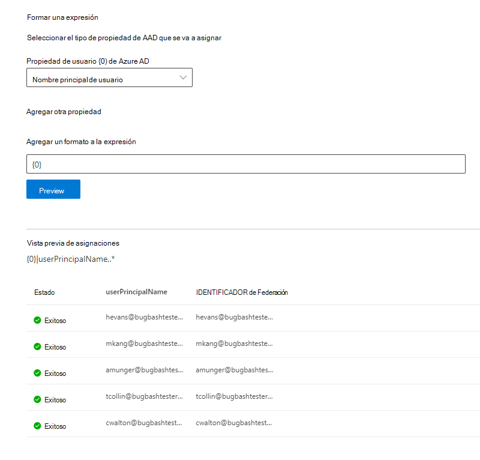

# Asignar las identidades de Azure ADMap your Azure AD Identities  

Este artículo le guiará por los pasos de la asignación de identidades de Azure AD a un identificador único para su origen de datos (identidad que no es de Azure AD), de modo que los usuarios de la lista de control de acceso (ACL) con identidades que no son de Azure AD puedan ver los resultados de la búsqueda del conector en su ámbito.This article walks you through the steps of mapping your Azure AD identities to a unique identifier for your data source (non-Azure AD identity) so that people in your Access Control List (ACL) with non-Azure AD identities can see connector search results scoped to them.

Estos pasos solo son relevantes para los administradores de búsqueda que están configurando un conector de [Salesforce](salesforce-connector.md) por Microsoft con los permisos de búsqueda de "solo personas con acceso a este origen de datos" e identidad tipo "AAD".These steps are only relevant to search administrators who are setting up a [Salesforce](salesforce-connector.md) connector by Microsoft with search permissions for "Only people with access to this data source" and identity type "AAD." Los siguientes pasos le guiarán por el proceso de asignación de las propiedades de usuario de Azure AD a los **identificadores de Federación** de los usuarios.The following steps walk you through how to map your Azure AD user properties to your users' **Federation IDs**.

>[!NOTE]
>Si está configurando un [conector de Salesforce](salesforce-connector.md) y **selecciona solo personas con acceso a este origen de datos** y un tipo de identidad **que no es AAD** en la pantalla de permisos de búsqueda, consulte el artículo sobre [mapas de identidades que no son de Azure ad](map-non-aad.md) para conocer los pasos sobre cómo asignar identidades que no son de Azure ad.If you are setting up a [Salesforce connector](salesforce-connector.md) and select **Only people with access to this data source** and identity type **non-AAD** on the search permissions screen, refer to the [Map your non-Azure AD Identities](map-non-aad.md) article for steps on how to map non-Azure AD identities.  

## Pasos para asignar las propiedades de Azure ADSteps for mapping your Azure AD properties

### 1. seleccionar Propiedades de usuario de Azure AD para asignar1. Select Azure AD user properties to map

Puede seleccionar las propiedades de Azure AD que necesita asignar al identificador de Federación.You can select the Azure AD properties you need to map to the Federation ID.

Puede seleccionar una propiedad de usuario de Azure AD en la lista desplegable.You can select an Azure AD user property from the dropdown. También puede Agregar tantas propiedades de usuario de Azure AD como quiera si estas propiedades son necesarias para crear la asignación del identificador de Federación de su organización.You can also add as many Azure AD user properties as you would like if these properties are necessary to create the Federation ID mapping for your organization.

### 2. crear una fórmula para completar la asignación2. Create formula to complete mapping

Puede combinar los valores de las propiedades de usuario de Azure AD para formar el identificador de Federación único.You can combine the values of the Azure AD user properties to form the unique Federation ID.

En el cuadro de fórmula, " {0} " corresponde a la *primera* propiedad de Azure ad que seleccionó.In the formula box, "{0}" corresponds to the *first* Azure AD property you selected. " {1} " corresponde a la *segunda* propiedad de Azure ad que seleccionó."{1}" corresponds to the *second* Azure AD property you selected. " {2} " corresponde a la *tercera* propiedad de Azure ad, y así sucesivamente."{2}" corresponds to the *third* Azure AD property, and so on.  

A continuación se muestran algunos ejemplos de fórmulas con salidas de expresión regular de ejemplo y resultados de fórmulas:Below are some examples of formulas with sample regular expression outputs and formula outputs:

| Fórmula de ejemploSample formula                  | Valor de {0} la propiedad para un usuario de muestraValue of property {0} for a sample user                 | Valor de {1} la propiedad para un usuario de muestraValue of property {1} for a sample user           | Resultado de la fórmulaOutput of formula                  |
| :------------------- | :------------------- |:---------------|:---------------|
| {0}.{1} @contoso. com{0}.{1}@contoso.com  | Namefirstname | Apellidolastname |firstname.lastname@contoso.comfirstname.lastname@contoso.com
| {0}@domain. com{0}@domain.com                 | identificadouserid                 |             |userid@domain.comuserid@domain.com

Después de proporcionar la fórmula, puede hacer clic opcionalmente en **vista previa** para ver una vista previa de 5 usuarios aleatorios del origen de datos con sus correspondientes asignaciones de usuario aplicadas.After you provide your formula, you can optionally click **Preview** to see a preview of 5 random users from your data source with their respective user mappings applied. El resultado de la vista previa incluye el valor de las propiedades de usuario de Azure AD seleccionadas en el paso 1 para los usuarios y el resultado de la fórmula final que se proporciona en el paso 2 para ese usuario.The output of the preview includes the value of the Azure AD user properties selected in step 1 for those users and the output of the final formula provided in step 2 for that user. También indica si los resultados de la fórmula podrían resolverse en un usuario de Azure AD del espacio empresarial a través de un icono de "éxito" o "error".It also indicates whether the output of the formula could be resolved to an Azure AD user in your tenant via a "Success" or "Failed" icon.  

>[!NOTE]
>Todavía puede continuar con la creación de la conexión si una o más asignaciones de usuario tienen el estado "error" después de hacer clic en **vista previa**.You can still proceed with creating your connection if one or more user mappings have a "Failed" status after you click **Preview**. La vista previa muestra 5 usuarios aleatorios y sus asignaciones desde el origen de datos.The preview shows 5 random users and their mappings from your data source. Si la asignación que proporciona no asigna todos los usuarios, es posible que experimente este caso.If the mapping you provide does not map all users, you may experience this case.

## Ejemplo de asignación de Azure ADSample Azure AD mapping

Vea la siguiente instantánea para obtener una asignación de Azure AD de ejemplo.See the snapshot below for a sample Azure AD mapping.

## LimitacionesLimitations  

- Solo se admite una asignación para todos los usuarios.Only one mapping is supported for all users. No se admiten las asignaciones condicionales.Conditional mappings are not supported.  

- No puede cambiar la asignación una vez publicada la conexión.You cannot change your mapping once the connection is published.  

- Las expresiones basadas en regex contra las propiedades de usuario de Azure AD no son compatibles con la transformación de ID de Federación de Azure AD.Regex-based expressions against the Azure AD user properties are not supported for the Azure AD to Federation ID transformation.