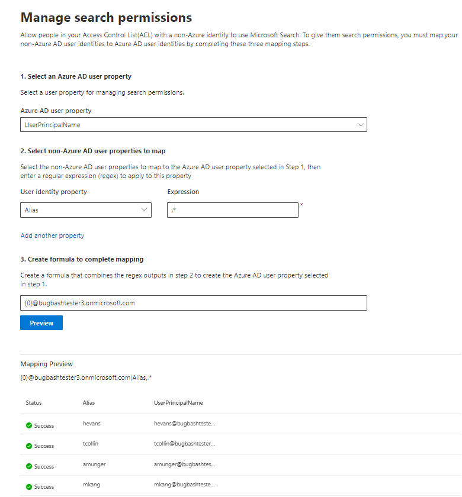

# Asignar identidades que no son de Azure AD  

En este artículo se le guían los pasos para asignar identidades que no son de Azure AD a las identidades de Azure AD para que los usuarios de la lista de control de acceso (ACL) con identidades que no son de Azure AD puedan ver los resultados de búsqueda del conector en el ámbito de ellos.

Estos pasos solo son relevantes para los administradores de búsqueda que están configurando los conectores [de ServiceNow](servicenow-connector.md) o [Salesforce](salesforce-connector.md) de Microsoft con permisos de búsqueda para "Solo las personas con acceso a este origen de datos" y el tipo de identidad "Non-AAD".

>[!NOTE]
>Si va a configurar un  conector de Salesforce y selecciona Solo las personas con acceso a este origen de datos y el tipo de identidad **AAD** en la pantalla de permisos de búsqueda, consulte el artículo Asignar las identidades de [Azure AD](map-aad.md) para obtener pasos sobre cómo asignar identidades de Azure AD.  

## Pasos para asignar las propiedades que no son de Azure AD

### 1. Seleccione una propiedad de usuario de Azure AD  

Puede seleccionar la propiedad de usuario de Azure AD para la que está creando la asignación. Esta es la propiedad de destino a la que pretende asignar las identidades que no son de Azure AD.  

Puede seleccionar una de las siguientes propiedades de Azure AD:

| Azure AD (propiedad)    | Definición           | Ejemplo         |
| :------------------- | :------------------- |:--------------- |
| Nombre principal de usuario (UPN)  | Un UPN consta de un prefijo UPN (el nombre de cuenta de usuario) y un sufijo UPN (un nombre de dominio DNS). El prefijo se une con el sufijo mediante el símbolo "@". | us1@contoso.onmicrosoft.com |
| Id. de Azure AD                 | Un identificador de Azure AD para un usuario determinado es el GUID único del usuario.                 | 58006c96-9e6e-45ea-8c88-4a56851eefad            |
| Id. de seguridad de Active Directory (SID)                  | SID (identificador de seguridad) es un identificador único que Active Directory usa para identificar objetos como entidad de seguridad.                  | S-1-5-21-453406510-812318184-4183662089             |

### 2. Seleccione propiedades de usuario que no son de Azure AD para asignar

Puede seleccionar propiedades que no son de Azure AD sacadas del origen de datos para aplicar expresiones regulares. Para obtener más información sobre dónde encontrar estas propiedades en el origen de datos, consulte las [páginas ServiceNow](servicenow-connector.md) y [Salesforce.](salesforce-connector.md)  

Puede seleccionar una propiedad de usuario que no sea de Azure AD en el desplegable y proporcionar una expresión regular que se aplicará a esos valores de propiedad de usuario. Para obtener más información acerca de las expresiones regulares, vea [referencia de expresión regular]( https://docs.microsoft.com/dotnet/standard/base-types/regular-expression-language-quick-reference).  

A continuación se muestran algunos ejemplos de expresiones regulares y sus salidas aplicadas a una cadena de ejemplo: 

| Cadena de ejemplo                  | Expresión regular                 | Salida de expresión regular en cadena de ejemplo           |
| :------------------- | :------------------- |:---------------|
| Alexis Vásquez  | .* | Alexis Vásquez |
| Alexis Vásquez                 | ..$                 | ez            |
| Alexis Vásquez                  | (\w+)$                  | Vásquez             |

Puedes agregar tantas propiedades de usuario que no son de Azure AD como quieras para las expresiones. Puede aplicar expresiones regulares diferentes a la misma propiedad de usuario si la fórmula final lo garantiza.  

### 3. Crear fórmula para completar la asignación

Puede combinar los resultados de las expresiones regulares aplicadas a cada una de las propiedades de usuario que no son de Azure AD para formar la propiedad de Azure AD seleccionada en el paso 1.

En el cuadro de fórmula, " " corresponde al resultado de la expresión regular aplicada a la primera propiedad que no es {0} de Azure AD seleccionada.  " " corresponde al resultado de la expresión regular aplicada a la segunda propiedad que no es {1} de Azure AD seleccionada.  " " corresponde al resultado de la expresión regular aplicada a la tercera propiedad que no es {2} de Azure AD, y así sucesivamente.   

A continuación se muestran algunos ejemplos de fórmulas con salidas de expresión regular de ejemplo y salidas de fórmula: 

| Fórmula de ejemplo                  | Valor de {0} en el usuario de ejemplo                 | Valor de {1} en el usuario de ejemplo           | Salida de fórmula                  |
| :------------------- | :------------------- |:---------------|:---------------|
| {0}.{1} @contoso.com  | firstname | lastname |firstname.lastname@contoso.com
| {0}@domain.com                 | userid                 |             |userid@domain.com

Después de proporcionar la fórmula,  opcionalmente puede hacer clic en Vista previa para ver una vista previa de 5 usuarios aleatorios de su origen de datos con sus respectivas asignaciones de usuario aplicadas. El resultado de la vista previa incluye el valor de las propiedades de usuario que no son de Azure AD seleccionadas en el paso 2 para esos usuarios y el resultado de la fórmula final proporcionada en el paso 3 para ese usuario. También indica si el resultado de la fórmula podría resolverse para un usuario de Azure AD en el inquilino a través de un icono "Correcto" o "Error".  

>[!NOTE]
>Todavía puede continuar con la creación de la conexión si una o varias asignaciones de usuario tienen un estado "Error" después de hacer clic en **Vista previa**. La vista previa muestra 5 usuarios aleatorios y sus asignaciones desde el origen de datos. Si la asignación que proporciona no asigna a todos los usuarios, puede que experimente este caso.

## Asignación de ejemplo que no es de Azure AD

Vea la instantánea siguiente para obtener una asignación de ejemplo que no es de Azure AD.

## Limitaciones  

- Solo se admite una asignación para todos los usuarios. No se admiten asignaciones condicionales.  

- No puede cambiar la asignación una vez publicada la conexión.  

- Actualmente, solo se admiten expresiones basadas en regex en las propiedades de usuario que no son de AAD para la transformación.

- Solo hay 3 identidades de Azure AD a las que puedes asignar (UPN, Id. de Azure AD y SID de AD).