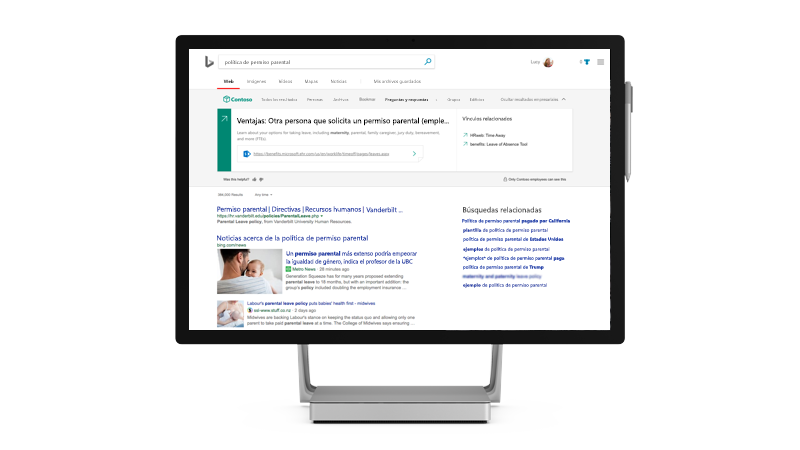

# Microsoft Search

<ul class="panelContent cardsW cols cols2">
    <li>
        

            

                

                    

                        

                            
                        

                    

                    

                    

                

            

        

    </li>
    <li>
        

            

                

                    

                        <h2>¿Por qué Microsoft de búsqueda</h2>
                        
Obtener una experiencia de búsqueda de empresa que aumenta la productividad y ahorra tiempo, ya que proporciona resultados de búsqueda más relevantes para su organización

                        
<a href="why-microsoft-search.md">Descubrir cómo</a>

                    

                

            

        

    </li>
</ul>

<h2>Temas destacados</h2>

<ul class="panelContent cardsW">
    <li>
        

            

                

                    

                        

                            
                        

                    

                    

                        <h3>Características clave</h3>
                        
Ver las características que están disponibles para administradores y usuarios, incluido lo que podrá encontrar al buscar

                        
<a href="features.md">Más información</a>

                    

                

            

        

    </li>
    <li>
        

            

                

                    

                        

                            
                        

                    

                    

                        <h3>Configurar rápida de administración</h3>
                        
Obtenga información acerca de cómo activar Microsoft Search y configurarlo para su organización en cuatro sencillos pasos

                        
<a href="quick-set-up.md">Iniciar ahora</a>

                    

                

            

        

    </li>
    <li>
        

            

                

                    

                        

                            
                        

                    

                    

                        <h3>Preguntas más frecuentes</h3>
                        
Obtenga respuestas a algunas de las preguntas más frecuentes acerca de Microsoft Search

                        
<a href="faqs.md">Busque las preguntas más frecuentes</a>

                    

                

            

        

    </li>
</ul>

<ul class="panelContent cardsW cols cols2">
    <li>
        

            

                

                    

                        <h2>Usar la búsqueda de Microsoft</h2>
                        
Microsoft Search es una forma más segura, rápida y simple de encontrar información, ser más productivos y trabajar de manera más eficaz

                        
<a href="use/about-microsoft-search.md">Descubrir cómo</a>

                    

                

            

        

    </li>
    <li>
        

            

                

                    

                        

                            
                        

                    

                    

                    

                

            

        

    </li>
</ul>

<h2>Más información</h2>
<ul class="panelContent cardsW">
    <li>
        

            

                

                    

                        
<a href="security.md">Seguridad</a>

                        
<a href="requirements.md">Requisitos</a>
  
                        
<a href="about-the-admin-portal.md">Sobre el portal de administración</a>

                    

                

            

        

    </li>
    <li>
        

            

                

                    

                        
<a href="quick-set-up.md">Configuración rápida</a>

                        
<a href="connected-services.md">Servicios conectados</a>

                        
<a href="set-up-microsoft-search.md">Configurar Microsoft Search</a>

                    

                

            

        

    </li>
    <li>
        

            

                

                    

                        
<a href="create-bookmarks.md">Crear marcadores</a>

                        
<a href="create-qas.md">Crear Q&As</a>

                        
<a href="add-users.md">Agregar usuarios</a>

                    

                

            

        

    </li>
</ul>  