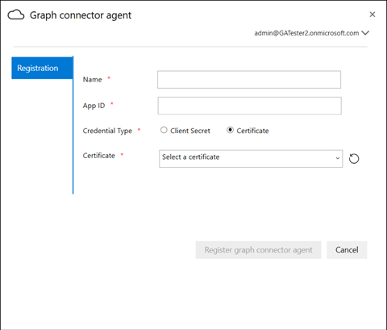

# Agente localOn-Prem Agent

## Agente de conector de GraphGraph connector agent

Los conectores de gráficos locales requieren la instalación del software del *agente de conector de Graph* .On-prem Graph connectors require you to install *Graph connector agent* software. Permite una transferencia de datos rápida y segura entre los datos locales y los servicios en la nube.It allows quick and secure data transfer between on-premises data and cloud services. Este artículo le guiará por los pasos necesarios para instalar y configurar el software.This article guides you through the steps of installing and configuring the software. Una vez configurada, estará disponible para crear conexiones a los orígenes de datos locales desde el [centro de administración de Microsoft 365](https://admin.microsoft.com).Once configured, it will be available for creating connections to your on-prem data sources from the [Microsoft 365 admin center](https://admin.microsoft.com).

## InstalaciónInstallation

Descargue la versión más reciente del agente de conector de Graph con [este vínculo](https://download.microsoft.com/download/d/d/e/dde18236-9c67-437d-a864-894a0a888ef2/AgentPackage.msi) e instale el software mediante el Asistente para la instalación.Download the latest version of Graph connector agent using [this link](https://download.microsoft.com/download/d/d/e/dde18236-9c67-437d-a864-894a0a888ef2/AgentPackage.msi) and install the software using the installation wizard. Con la configuración recomendada del equipo que se describe a continuación, el software puede controlar fácilmente hasta tres conexiones.With the recommended configuration of the machine described below, the software can seamlessly handle up to three connections. Cualquier conexión posterior podría degradar el rendimiento.Any connections beyond that might degrade the performance.

Configuración recomendada:Recommended configuration:

* Windows 10, Windows Server 2012 R2 y versiones posterioresWindows 10, Windows Server 2012 R2 and above
* 8 núcleos, 3 GHz8 cores, 3GHz
* 16 GB de RAM, 1 GB de espacio en disco16GB RAM, 1GB Disk Space
* Acceso de red a origen de datos e Internet mediante 443Network access to data source and internet through 443

## Creación de la aplicación para el agenteCreating App for the agent  

La instancia del agente debe alimentarse con algunos parámetros críticos antes de crear conexiones.The agent instance needs to be fed few critical parameters before you create connections. Estos parámetros incluyen los detalles de autenticación necesarios para usar las API de recopilación de gráficos.These parameters include authentication details required for using Graph ingestion APIs.  

Pasos para crear aplicaciones para el agente.Steps for creating App for the agent.

1. Vaya a [Azure portal](https://portal.azure.com) e inicie sesión con credenciales de administrador para el inquilino.Go to the [Azure portal](https://portal.azure.com) and sign in with admin credentials for the tenant.
2. Navegue a **Azure Active Directory**  ->  **registros de aplicaciones** de Azure Active Directory desde el panel de navegación y seleccione **nuevo registro**.Navigate to **Azure Active Directory** -> **App registrations** from the navigation pane and select **New registration**.
3. Especifique un nombre para la aplicación y seleccione **registrar**.Provide a name for the app and select **Register**.
4. Anote el identificador de la aplicación (cliente).Make a note of the Application (client) ID.
5. Abra **permisos de API** en el panel de navegación y seleccione **Agregar un permiso**.Open **API permissions** from the navigation pane and select **Add a permission**.
6. Seleccione **Microsoft Graph** y, a continuación, permisos de la **aplicación**.Select **Microsoft Graph** and then **Application permissions**.
7. Busque "ExternalItem. ReadWrite. All" y "Directory. Read. All" desde los permisos y seleccione **Agregar permisos**.Search for "ExternalItem.ReadWrite.All" and "Directory.Read.All" from the permissions and select **Add permissions**.
8. Seleccione **conceder consentimiento de administrador para [TenantName]** y confirme seleccionando **sí**.Select **Grant admin consent for [TenantName]** and confirm by selecting **Yes**.
9. Compruebe que los permisos se encuentran en el estado concedido.Check that the permissions are in the granted state.
     

## Configuración del agente de conector de GraphConfiguring Graph connector agent

Una vez que haya creado la aplicación para el agente, debe configurar el agente con los detalles de autenticación adecuados.Once you have created the App for the agent, you must configure the agent with appropriate authentication details.

Los detalles de autenticación se pueden proporcionar en una de las siguientes formas.Authentication details can be provided in one of the following forms.

### Configuración del secreto de cliente para la autenticaciónConfiguring the client secret for authentication

1. Vaya a [Azure portal](https://portal.azure.com) e inicie sesión con credenciales de administrador para el inquilino.Go to the [Azure portal](https://portal.azure.com) and sign in with admin credentials for the tenant.
2. Abra el **registro de aplicaciones** en el panel de navegación y vaya a la aplicación correspondiente.Open **App Registration** from the navigation pane and go to the appropriate App. En **administrar**, seleccione **certificados y secretos**.Under **Manage**, select **Certificates and secrets**.
3. Seleccione **nuevo secreto de cliente** y seleccione un período de expiración para el secreto.Select **New Client secret** and select an expiry period for the secret. Copie el secreto generado y guárdelo porque no se volverá a mostrar.Copy the generated secret and save it because it will not be shown again.
4. Use este secreto de cliente junto con el identificador de aplicación para configurar el agente.Use this Client secret along with the Application ID to configure the agent. No use espacios en blanco en el campo **nombre** del agente.Do not use any blank spaces in the **Name** field of the agent. Se aceptan los caracteres alfanuméricos alfanuméricos.Alpha numeric characters are accepted.

## Uso del certificado de huella digital para la autenticaciónUsing thumbprint certificate for authentication

Si ya ha configurado los detalles de autenticación mediante [la configuración del secreto de cliente para la autenticación](#configuring-the-client-secret-for-authentication) , puede ir directamente a la introducción a la [instalación](configure-connector.md).If you have already configured the authentication details by following [Configuring the client secret for authentication](#configuring-the-client-secret-for-authentication) , then you can jump directly to [Setup overview](configure-connector.md).

1. Abra el **registro de aplicaciones** y seleccione **certificados y secretos** en el panel de navegación.Open **App registration** and select **Certificates and secrets** from the navigation pane. Copie la huella digital del certificado.Copy the certificate thumbprint.

2. Use el secreto de cliente o la huella digital para registrar el agente de conector de Graph.Use either the client secret or thumbprint to register the Graph connector agent.

