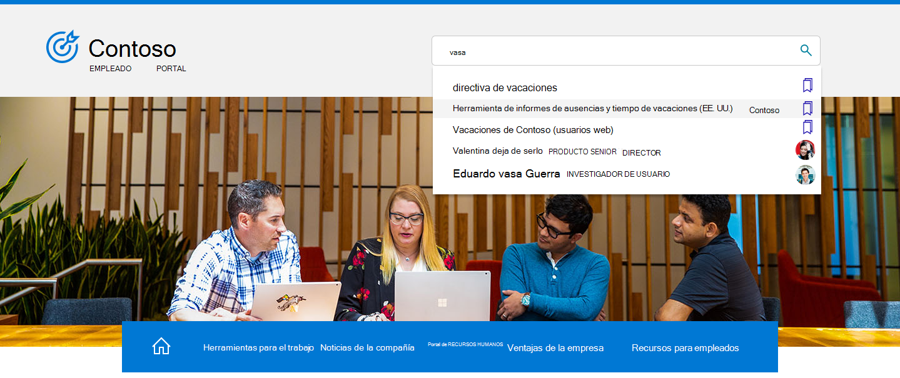

# Información general sobre Búsqueda de Microsoft en Bing

Búsqueda de Microsoft en Bing reúne las capacidades de Búsqueda de Microsoft y Bing búsqueda web. Proporciona una experiencia de búsqueda familiar que ayuda a los usuarios a encontrar resultados relevantes de su organización y la web. Para ayudar a mantener los usuarios y los datos privados y seguros, los usuarios deben iniciar sesión en su cuenta de trabajo o escuela en Bing para poder encontrar resultados internos.

## Qué ven los usuarios

Cuando las personas de su organización usan Búsqueda de Microsoft en Bing, hay dos lugares donde pueden ver resultados profesionales o educativos:

- PÁGINA TODOS los resultados: si hay un resultado de trabajo o escuela relevante, aparecerá en la parte superior de la página de resultados de búsqueda, seguido de los resultados de la web pública.
- Página de resultados WORK o SCHOOL: solo aparecen en esta página los resultados de su organización. Nunca incluye resultados web públicos.

:::image type="content" alt-text="Todas las páginas de resultados de trabajo para Contoso y la página de resultados de la escuela secundaria contoso." source="media/msb-overview/all-work-school-serps.gif" lightbox="media/msb-overview/all-work-school-serps.gif":::

Los usuarios pueden identificar fácilmente los resultados profesionales o educativos buscando el logotipo, el nombre o la imagen de perfil de su organización.

## Introducción a la Búsqueda de Microsoft en Bing

Búsqueda de Microsoft en Bing está habilitado de forma predeterminada para todos los usuarios de la organización. Si un usuario ya ha iniciado sesión en su cuenta profesional o educativa en otro servicio (como Outlook, Microsoft Teams o SharePoint), se iniciará sesión automáticamente en la misma cuenta cuando vaya Bing. Para obtener más información, vea [Seguridad y privacidad en Búsqueda de Microsoft en Bing](security-for-search.md).

Si no está familiarizado con Búsqueda de Microsoft en Bing, le recomendamos que revise la Búsqueda de Microsoft en la Guía de Bing [Admin Essentials](https://aka.ms/SearchAdminEssentials) para obtener información de configuración e implementación. Para ayudar a aumentar el conocimiento de los usuarios Búsqueda de Microsoft, nuestro [kit de adopción](https://aka.ms/SearchAdoptionKit) incluye recursos de aprendizaje y comunicación.

## Buscar experiencias para el trabajo y la escuela

Búsqueda de Microsoft en Bing proporciona experiencias de búsqueda adaptadas a las necesidades de los usuarios profesionales y educativos. En organizaciones con planes de servicio empresarial, los usuarios recibirán una experiencia de búsqueda diseñada para el trabajo, incluidos los gráficos organizativos y Power BI respuestas.

Los usuarios de organizaciones con planes de servicio educativo tendrán una experiencia diseñada para buscar en la escuela, incluidas las respuestas sobre clases y próximas asignaciones.

Si su organización tiene planes de servicio educativo y empresarial, puede seleccionar un Búsqueda de Microsoft en Bing experiencia para los usuarios, ya sea educativos o laborales. Para obtener más información, vea [Select a school or work search experience](/microsoftsearch/select-work-school-search-experience).

## Agregar Búsqueda de Microsoft en Bing a la intranet

Búsqueda de Microsoft está diseñado para facilitar el acceso a la información interna en cualquier lugar en el que los usuarios estén buscando. Si los usuarios de la organización usan el sitio de intranet para iniciar una búsqueda de trabajo o escuela, considere la posibilidad de agregar un cuadro de búsqueda incrustado al sitio.

Con un script simple, puede agregar un cuadro de búsqueda personalizado e incluso dirigirlo a una vertical personalizada. Para obtener más información, vea [Agregar un cuadro de búsqueda al sitio de intranet.](add-a-search-box-to-your-intranet-site.md)

## Establecer valores predeterminados para facilitar la búsqueda en el trabajo o en la escuela

Para ayudar a aumentar la adopción de Búsqueda de Microsoft en Bing, considere la posibilidad de convertirla en una parte perfecta del día del usuario estableciendo los valores predeterminados.

**Explorador predeterminado:** al crear Microsoft Edge explorador predeterminado, los usuarios pueden buscar en su organización y obtener sugerencias de búsqueda relevantes, directamente desde la barra de direcciones. La búsqueda desde la barra de direcciones es una información rápida y fácil de encontrar y no es necesario que vaya a Bing para iniciar una búsqueda. Para obtener más información, vea [Set Microsoft Edge as the default browser](/deployedge/edge-default-browser).

Motor de búsqueda **predeterminado:** si cambiar el explorador predeterminado no es una opción, puede habilitar la búsqueda de trabajo o escuela desde la barra de direcciones estableciendo Bing como motor de búsqueda predeterminado. Para obtener más información, [vea Make Bing the default search engine](set-default-search-engine.md). Si su organización tiene un plan de servicio Aplicaciones Microsoft 365 para empresas (anteriormente Office 365 ProPlus), puede establecer Bing como el motor de búsqueda predeterminado para Google Chrome implementando el Búsqueda de Microsoft en Bing extensión. Para obtener más información, [vea Búsqueda de Microsoft en Bing y Aplicaciones Microsoft 365 para empresas](/deployoffice/microsoft-search-bing).

**Página principal** predeterminada: establecer Bing como la página principal predeterminada de la organización no habilitará la búsqueda de trabajo o escuela desde la barra de direcciones, pero proporciona una forma fácil de acceder a bing.com. Para obtener más información, vea [Make Bing.com the default home page](set-default-homepage.md).

## Seguridad y privacidad

Búsqueda de Microsoft en Bing usa medidas de seguridad y privacidad mejoradas para ayudar a proteger los datos de su organización y sus usuarios. Para obtener más información, consulta Seguridad y privacidad para Búsqueda de Microsoft en [Bing](security-for-search.md) y How [Búsqueda de Microsoft in Bing helps keep your info secure](https://support.microsoft.com/office/how-microsoft-search-in-bing-helps-keep-your-info-secure-cbce46ae-bb1f-4d0e-86f1-5984f4589113).

## Vea también

- [Introducción a Búsqueda de Microsoft](overview-microsoft-search.md)
- [Planear el contenido](plan-your-content.md)
