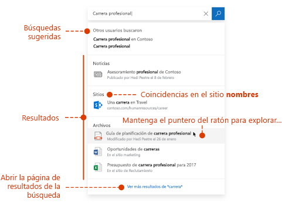
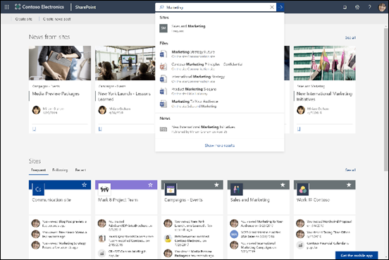

# Introducción a Búsqueda de Microsoft

Búsqueda de Microsoft es la característica de búsqueda unificada en las aplicaciones de productividad de Microsoft 365 y en el más amplio ecosistema de Microsoft. Con el tiempo, Búsqueda de Microsoft estará disponible en más aplicaciones de Microsoft 365.

Búsqueda de Microsoft ayuda a los usuarios a encontrar respuestas correctas, personas y contenido para completar sus tareas en la aplicación en la que están trabajando.

- Los usuarios obtienen resultados pertinentes en el **contexto** de la aplicación desde la que buscan. Por ejemplo, cuando buscan en Outlook, encuentran mensajes de correo electrónico, no sitios de SharePoint. Cuando buscan en SharePoint, encuentran sitios, páginas y archivos.
- Independientemente de la aplicación con la que trabajan, Búsqueda de Microsoft es **personal**.  Búsqueda de Microsoft usa la información de Microsoft Graph para mostrar resultados relevantes para cada usuario. Usuarios diferentes pueden ver resultados diferentes, aunque busquen las mismas palabras. Solo verán resultados a los que ya tienen acceso, Búsqueda de Microsoft no cambia los permisos.
- Los usuarios no necesitan recordar dónde se encuentra la información. Por ejemplo, un usuario está trabajando en Word y desea volver a usar la información de una presentación que un compañero ha compartido en su OneDrive. No es necesario cambiar a OneDrive y buscar esa presentación, simplemente pueden buscar desde Word.  
- En Bing, los usuarios pueden obtener resultados de la web pública y de su organización.

## Qué ven los usuarios

En Bing, los usuarios usan el mismo cuadro de búsqueda que para las búsquedas web. En las aplicaciones de Microsoft 365, los usuarios pueden encontrar el cuadro de Búsqueda de Microsoft en la barra de encabezado. Tiene el siguiente aspecto:

Cuando los usuarios hacen clic en el cuadro de búsqueda, la búsqueda sugiere resultados en función de su actividad anterior en Office 365 y basándose en el contenido que es tendencia en su organización. Los archivos en los que se ha trabajado recientemente, los comandos que se han usado recientemente, así como personas con las que colaboran son ejemplos de actividades que la búsqueda tiene en cuenta. Cuando los usuarios empiezan a escribir en el cuadro de búsqueda, los términos sugeridos se actualizan. Los usuarios pueden abrir los resultados de búsqueda directamente desde el cuadro de búsqueda. Un ejemplo de búsqueda en SharePoint es:

Si las sugerencias del cuadro de búsqueda no son lo que se está buscando, **Entrar** abre la lista completa de resultados. Pueden usar metadatos, como quién modificó por última vez el elemento y cuándo, o dónde encuentran los elementos, así como obtener una vista previa para determinar si es lo buscan.

## Ventajas de Búsqueda de Microsoft

**Búsquedas en Microsoft 365 desde cualquier cuadro de Búsqueda de Microsoft** : los usuarios pueden buscar desde cualquier cuadro de Búsqueda de Microsoft y volver rápidamente a lo estaban haciendo. Búsqueda de Microsoft reúne los resultados desde fuentes de datos en Office 365, como SharePoint, OneDrive para la Empresa y Exchange.

**Búsqueda fácil**: Búsqueda de Microsoft sugiere resultados en función de la actividad anterior del usuario en Office 365, directamente en el cuadro de búsqueda.

**Encontrar archivos compartidos**: Búsqueda de Microsoft usa una comprensión avanzada de consultas para simplificar la búsqueda de archivos compartidos. Los usuarios pueden encontrar fácilmente archivos en los que están colaborando.

**Mostrar contenido relevante**: Proporcione la información y las respuestas que los usuarios necesitan para completar las tareas, como directivas, beneficios, recursos, herramientas, etc. También puede dirigirse a grupos específicos, como los empleados nuevos o los trabajadores remotos.

**Búsqueda de Microsoft evoluciona**: el conjunto de tipos de contenido por el que los usuarios pueden buscar y la inteligencia del cuadro de búsqueda crecen con el tiempo.

**Administrar a través de todas las aplicaciones**: Búsqueda de Microsoft está **activada** de forma predeterminada y cualquier administración que realice se aplica a Búsqueda de Microsoft en todas las aplicaciones.

## Aplicaciones que cuentan actualmente con Búsqueda de Microsoft

 La Búsqueda de Microsoft está activada de forma predeterminada para todas las aplicaciones de Microsoft compatibles. Todo lo que necesita hacer el usuario es iniciar sesión con una cuenta profesional o educativa.

Las siguientes aplicaciones ofrecen actualmente Búsqueda de Microsoft:
- SharePoint Online
- OneDrive para la Empresa
- Outlook en la Web
- Aplicaciones de Office en Windows

Además, los usuarios disponen de Búsqueda de Microsoft en:

- Página principal de Bing
- Office.com
- Las páginas de inicio de Word, Excel y PowerPoint Online

Los usuarios también pueden iniciar una búsqueda en Bing desde la barra de direcciones perimetral, si usan Bing como motor de búsqueda predeterminado.

## Requisitos

Debe tener uno de los siguientes suscripciones de Office 365 o Microsoft 365:

- Office 365 Empresa Essentials o Empresa Premium
- Office 365 A1/A3/A5
- Office 365 Educación E1/E3
- Office 365 Empresa E1/E3/E3 desarrollador/E5
- Office 365 F1
- Microsoft 365 Empresa
- Microsoft 365 A3/A5
- Microsoft 365 F1/E3/E5

Los usuarios y los administradores de búsqueda deben tener asignada esta licencia. Solo los usuarios con cuentas activas pueden usar Búsqueda de Microsoft y deben haber **Iniciado sesión**, ya que Microsoft Search requiere Azure Active Directory

## Personalizar Búsqueda de Microsoft para su organización

Como administrador, puede facilitar a los usuarios obtener resultados adecuados específicos para la organización cuando buscan desde su página de inicio de SharePoint, Office.com o Bing. Para ello, debe definir las respuestas que Búsqueda de Microsoft mostrará en respuesta a determinadas palabras clave en las consultas. Hay varios tipos de respuestas entre las que puede elegir. 

**Mostrar contenido útil**: ayude a los usuarios a buscar herramientas y recursos importantes de la organización mediante marcadores. Al igual que puede crear un marcador en una página web pública, puede crear un marcador para cualquier página web interna que sus usuarios puedan buscar. También puede integrar una Power App en el marcador para que los usuarios puedan completar su tarea directamente desde el marcador.

**Ofrecer respuestas a preguntas comunes**: proporcione la mejor respuesta para las preguntas más frecuentes en su organización. Cuando los usuarios escriben una pregunta frecuente en el cuadro de búsqueda, Búsqueda de Microsoft muestra como resultado la respuesta en lugar de limitarse a proporcionar un vínculo a la página web.

**Mostrar ubicaciones útiles**: muestre resultados de mapa y la información de direcciones de oficinas, edificios y otras áreas de trabajo de su organización sobre un mapa. Los usuarios pueden usar los mapas para obtener instrucciones, consultar qué hay cerca y mucho más.

Puede ver las estadísticas de uso que muestran el modo en que los usuarios intervienen con las respuestas y si los usuarios encuentran lo que buscan. Basándose en esto, puede ajustar las respuestas o agregar nuevas.

Para obtener información sobre el uso de las palabras clave y las palabras clave reservadas, vea [Planear el contenido](make-content-easy-to-find.md).

## ¿Qué contenido se busca?

Búsqueda de Microsoft busca en el contenido que se almacena en SharePoint Online, OneDrive para la Empresa y Exchange, incluidas las personas de la lista global de direcciones y los grupos de Office 365. Búsqueda de Microsoft no realiza búsquedas en espacios empresariales ni muestra resultados del contenido que comparten las organizaciones. Si su organización ha configurado un entorno híbrido de SharePoint con la búsqueda híbrida en la nube, Búsqueda de Microsoft devuelve resultados de contenido de SharePoint local y de la web, incluido cualquier contenido externo que haya conectado a su entorno de SharePoint Server. [Más información sobre los entornos híbridos de búsqueda](https://docs.microsoft.com/sharepoint/hybrid/learn-about-cloud-hybrid-search-for-sharepoint).

Cuando los usuarios buscan desde la página de inicio de SharePoint o desde Office.com, Búsqueda de Microsoft busca en todo el contenido de su organización y presenta todos los resultados que encuentra. Esto se conoce como **ámbito de búsqueda global**.

Cuando los usuarios buscan desde Bing, obtienen los resultados más relevantes en todo el contenido de su organización incrustado en la lista de resultados de la **web**. Si necesitan ver **todos** los resultados de la organización, el ámbito global de búsqueda está a un solo clic de distancia.

## ¿Qué tipos de resultados pueden encontrar los usuarios?
Los usuarios encuentran los siguientes tipos de resultados al buscar desde:

**SharePoint**: archivos, carpetas, usuarios de su organización, organigramas, sitios, páginas de sitios, noticias, listas y elementos de lista. Si se han definido, respuestas a preguntas comunes, marcadores que llevan a información relevante, ubicaciones y herramientas. [Obtenga información sobre los tipos de archivo puede encontrar](https://docs.microsoft.com/es-ES/SharePoint/technical-reference/default-crawled-file-name-extensions-and-parsed-file-types).

**Páginas de inicio de Office.com y Word, Excel y PowerPoint Online**: aplicaciones, archivos, carpetas, personas, organigramas, sitios de SharePoint, páginas de sitios, listas y elementos de lista. Si se han definido, respuestas a preguntas comunes, marcadores que llevan a información relevante, ubicaciones y herramientas. Puede encontrar archivos del mismo tipo que en SharePoint.

**Bing**: contenido en la web pública, archivos, grupos de Office 365, personas, conversaciones de Yammer y Teams, organigramas, sitios de SharePoint. Si se han definido, respuestas a preguntas comunes, marcadores que llevan a información relevante, ubicaciones y herramientas.  Se pueden encontrar archivos de Word, Excel, PowerPoint, Visio, OneNote y PDF.

**Outlook**: correos electrónicos, datos adjuntos y personas de su organización.

**Aplicaciones de Office en Windows**: acciones en la aplicación, personas de su organización y de la web, archivos, explicaciones de palabras, coincidencias para la consulta en el archivo o en el contenido de ayuda, contenido en la web. Puede encontrar archivos de Word, Excel, PowerPoint, Visio y OneNote.

**OneDrive**: encontrará ¡archivos del mismo tipo que en SharePoint.

## ¿Cómo funciona Búsqueda de Microsoft?

Cuando un usuario realiza una búsqueda, Búsqueda de Microsoft procesa la consulta y analiza el objetivo de búsqueda en frases más grandes mediante Inteligencia Artificial (IA) para obtener información sobre las frases superfluas comunes que los usuarios añaden a sus consultas, pero que no afectan a su intención de búsqueda. Por ejemplo, cuando un usuario busca "más información sobre cómo cambiar la contraseña", se extraen las palabras menos importantes de la consulta y se activa la búsqueda basándose en las más relevantes, como "cambiar contraseña".  

La Búsqueda de Microsoft no crea un índice nuevo, busca los índices existentes de SharePoint Online, OneDrive para la Empresa y el contenido de Exchange.

Los resultados de búsqueda para los que el usuario tiene **permisos** se muestran en la página de resultados de la búsqueda. Búsqueda de Microsoft utiliza algoritmos de clasificación inteligente para ordenar los resultados según su relevancia.

## Búsqueda de Microsoft en SharePoint Online

Búsqueda de Microsoft en SharePoint es la experiencia moderna de búsqueda en SharePoint Online. SharePoint Online también ofrece una experiencia de búsqueda clásica. Ambas experiencias están activadas de forma predeterminada y ambas buscan el mismo contenido. Como administrador de búsqueda, no puede activar o desactivar ninguna de estas experiencias de búsqueda. La experiencia que obtendrán los usuarios depende de desde dónde hacen la búsqueda:

- Los usuarios acceden al cuadro de Búsqueda de Microsoft en la página de inicio de SharePoint, sitios de concentrador, sitios de comunicación y sitios de grupo modernos.
- Los usuarios acceden al cuadro de búsqueda clásica en sitios de publicación, sitios de grupo clásicos y el centro de búsqueda.

La experiencia de búsqueda clásica se puede personalizar. Un ejemplo es agregar refinadores personalizados a la página de resultados de búsqueda, otro ejemplo es mostrar un determinado tipo de resultado de otra manera. No se puede personalizar la experiencia de Búsqueda de Microsoft en SharePoint de esa manera. Algunas de las personalizaciones creadas para la búsqueda clásica pueden afectar a la Búsqueda de Microsoft en SharePoint. Si su organización va a usar las dos experiencias de búsqueda en SharePoint, [obtenga información sobre las diferencias y cómo evitar que afecte a la experiencia de Búsqueda de Microsoft en SharePoint](https://docs.microsoft.com/es-ES/sharepoint/differences-classic-modern-search).

## Búsqueda de Microsoft en Bing

Como las búsquedas relacionadas con el trabajo pueden ser confidenciales, Búsqueda de Microsoft utiliza un conjunto de medidas de confianza sobre cómo la parte de resultados web públicos de Bing maneja estas búsquedas.

Las solicitudes de Búsqueda de Microsoft se realizan a través de HTTPS. Esta protección garantiza que la conexión esté cifrada de principio a fin para mejorar la seguridad. Adicionalmente, todos los registros que pertenecen al tráfico de Búsqueda de Microsoft son anonimizados y se almacenan por separado del tráfico público no asociado y ajeno al tráfico de Búsqueda de Microsoft.

Independientemente de si una consulta de usuario contiene uno o varios resultados relacionados con el trabajo en la respuesta devuelta, se toman las medidas siguientes:

**Registro**: Todos los registros de búsqueda correspondientes al tráfico de Microsoft Search se anonimizan. Se conservan durante 18 meses. Las consultas almacenadas en estos registros del sistema solo se usarán para modelar y probar características públicas como sugerencias automáticas u otras funciones relativas a búsquedas para resultados cuando se cumplan una serie de restricciones y umbrales de frecuencia, a fin de proporcionarnos la seguridad de que estas consultas son comunes y no específicas para una organización concreta. La consulta debe aparecer un número de veces significativo en datos correlativos que no procedan de usuarios de Microsoft Search y no debe activar únicamente resultados de búsqueda corporativos. Las consultas que no cumplan estos requisitos se almacenarán separadas del tráfico público no relativo a Microsoft Search. El acceso restringido se administra a través de diferentes mecanismos seguros, incluyendo grupos de seguridad y otras capas dentro del sistema de ingeniería.

**Historial de búsqueda**: cuando haya iniciado sesión con una cuenta profesional o educativa, el historial de búsqueda de un usuario no estará disponible en otros equipos o dispositivos.

**Publicidad**: las consultas de búsqueda empresariales nunca se comparten o se sugieren a anunciantes.
Los anuncios nunca están dirigidos a un usuario en función de su identidad de trabajo u organización.

## Vea también

[Configurar Búsqueda de Microsoft](setup-microsoft-search.md)

[Haga el contenido fácil de encontrar](make-content-easy-to-find.md)