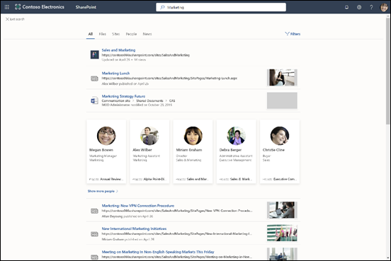

# Introducción a Búsqueda de Microsoft

Búsqueda de Microsoft es la característica de búsqueda unificada en las aplicaciones de productividad de Microsoft 365 y en el más amplio ecosistema de Microsoft. Con el tiempo, Búsqueda de Microsoft estará disponible en más aplicaciones de Microsoft 365.

Búsqueda de Microsoft ayuda a los usuarios a encontrar respuestas correctas, personas y contenido para completar sus tareas en la aplicación en la que están trabajando. Con Búsqueda de Microsoft: 
- Los usuarios obtienen resultados pertinentes en el **contexto** de la aplicación desde la que buscan. Por ejemplo, cuando buscan en Outlook, encuentran mensajes de correo electrónico, no sitios de SharePoint. Cuando buscan en SharePoint, encuentran sitios, páginas y archivos, no mensajes.
- Independientemente de la aplicación con la que trabajan, Búsqueda de Microsoft es **personal**.  Búsqueda de Microsoft usa la información de Microsoft Graph para mostrar resultados relevantes para cada usuario. Usuarios diferentes pueden ver resultados diferentes, aunque busquen las mismas palabras. Solo verán resultados a los que ya tienen acceso, Búsqueda de Microsoft no cambia los permisos.   
- Los usuarios no necesitan recordar dónde se encuentra la información. Por ejemplo, un usuario está trabajando en Word y desea volver a usar la información de una presentación que un compañero ha compartido en su OneDrive. No es necesario cambiar a OneDrive y buscar esa presentación, simplemente pueden buscar desde Word.  
- En Bing, los usuarios pueden recibir resultados de la web pública y del interior de su organización. 

Los usuarios encuentran el cuadro de Búsqueda de Microsoft en la barra de encabezado:

Cuando los usuarios hacen clic en el cuadro de búsqueda, la búsqueda sugiere resultados en función de su actividad anterior en Office 365 y basándose en el contenido que es tendencia en su organización. Los archivos en los que se ha trabajado recientemente, los comandos que se han usado recientemente, así como personas con las que colaboran son ejemplos de actividades que la búsqueda tiene en cuenta. Cuando los usuarios empiezan a escribir en el cuadro de búsqueda, los términos sugeridos se actualizan. Los usuarios pueden abrir los resultados de búsqueda directamente desde el cuadro de búsqueda.

Si las sugerencias del cuadro de búsqueda no son lo que se está buscando, al hacer clic en Entrar se abre la lista completa de resultados. Pueden usar metadatos, como quién modificó por última vez el elemento y cuándo, o dónde encuentran los elementos, así como obtener una vista previa para determinar si es lo buscan.

## Ventajas 
**Búsquedas en Microsoft 365 desde cualquier cuadro de Búsqueda de Microsoft** : los usuarios pueden buscar desde cualquier cuadro de Búsqueda de Microsoft y volver rápidamente a lo estaban haciendo. Búsqueda de Microsoft reúne los resultados desde fuentes de datos en Office 365, como SharePoint, OneDrive para la Empresa y Exchange, así como desde la web pública.

**Búsqueda fácil**: Búsqueda de Microsoft sugiere resultados en función de la actividad anterior del usuario en Office 365, directamente en el cuadro de búsqueda.

**Encontrar archivos compartidos**: Búsqueda de Microsoft usa una comprensión avanzada de consultas para simplificar la búsqueda de archivos compartidos. Los usuarios pueden encontrar fácilmente archivos en los que están colaborando.

**Mostrar contenido relevante**: Proporcione la información y las respuestas que los usuarios necesitan para completar las tareas, como directivas, beneficios, recursos, herramientas, etc. También puede dirigirse a grupos específicos, como los empleados nuevos o los trabajadores remotos.

**Búsqueda de Microsoft evoluciona**: el conjunto de tipos de contenido por el que los usuarios pueden buscar y la inteligencia del cuadro de búsqueda crecen con el tiempo.

**Administrar a través de todas las aplicaciones**: Búsqueda de Microsoft está activada de forma predeterminada y cualquier administración que realice se aplica a Búsqueda de Microsoft en todas las aplicaciones.

## ¿Qué aplicaciones cuentan actualmente con Búsqueda de Microsoft? 
Con el tiempo, Búsqueda de Microsoft estará disponible en más aplicaciones de Microsoft 365.
Las siguientes aplicaciones de Office 365 ofrecen actualmente Búsqueda de Microsoft:
- SharePoint Online 
- OneDrive para la Empresa
- Outlook en la Web
- Aplicaciones de Office en Windows

Además, los usuarios disponen de Búsqueda de Microsoft en:
- Bing 
- Windows
- Office.com
- Las páginas de inicio de Word, Excel y PowerPoint Online

Los usuarios también pueden iniciar una búsqueda en Bing desde la barra de direcciones de Edge.

## Requisitos 
Su organización debe tener un inquilino de Office 365 con una de las siguientes suscripciones:
- Office 365 Empresa Essentials o Empresa Premium
- Office 365 A1/A3/A5
- Office 365 Educación E1/E3
- Office 365 Empresa E1/E3/E3 desarrollador/E5 
- Office 365 F1 
- Microsoft 365 Empresa 
- Microsoft 365 A3/A5 
- Microsoft 365 F1/E3/E5 

Solo los usuarios con cuentas activas pueden usar Búsqueda de Microsoft y deben haber **iniciado sesión**.

## ¿Qué pueden encontrar los usuarios con Búsqueda de Microsoft? 
Búsqueda de Microsoft busca en el contenido que se almacena en Outlook, OneDrive y SharePoint Online, incluidas las personas de la lista global de direcciones y los grupos de Office 365. Si usa búsqueda híbrida en la nube para configurar un entorno híbrido de SharePoint, los usuarios de Búsqueda de Microsoft pueden obtener resultados de contenido de SharePoint local, incluido cualquier contenido externo que haya conectado a su entorno de SharePoint Server. [Más información sobre los entornos híbridos de búsqueda](https://docs.microsoft.com/es-ES/sharepoint/hybrid/learn-about-cloud-hybrid-search-for-sharepoint).

Cuando los usuarios buscan desde la [página de inicio de SharePoint](https://microsoft.sharepoint.com/_layouts/15/sharepoint.aspx) o desde office.com, Búsqueda de Microsoft busca en su organización y presenta todos los resultados de la organización que encuentra. Esto se conoce como ámbito de búsqueda global.

Cuando los usuarios buscan desde Bing, Búsqueda de Microsoft busca tanto en la web pública y como en la de su organización. Reciben una amplia variedad de los resultados más relevantes de su organización insertados en la lista de resultados. Si necesitan ver todos los resultados de la organización, el ámbito universal de búsqueda está a un solo clic de distancia.

Cuando los usuarios buscan desde una aplicación, reciben resultados relacionados con el contexto en el que están trabajando. Por ejemplo, si buscan en Outlook encontrarán mensajes de correo electrónico, si buscan en SharePoint encontrarán noticias y contenido en listas, así como acciones o palabras de la presentación en la que están trabajando si hacen la búsqueda desde PowerPoint..

Aquí le presentamos información general del tipo de resultados que los usuarios obtienen en cada aplicación:

**Outlook**: correos electrónicos, datos adjuntos y personas de su organización.

**Aplicaciones de Office en Windows**: acciones en la aplicación, personas de su organización y de la web pública, archivos, explicaciones de palabras, coincidencias para la consulta en el archivo o en el contenido de ayuda, contenido en la web pública. Puede encontrar archivos de Word, Excel, PowerPoint, Visio y OneNote.

**OneDrive**: encontrará ¡archivos del mismo tipo que en SharePoint.

**SharePoint**: archivos, carpetas, usuarios de su organización, organigramas, sitios, páginas de sitios, noticias, listas y elementos de lista. Si se han definido, respuestas a preguntas comunes, marcadores que llevan a información relevante, ubicaciones de mapa y herramientas. Obtenga información sobre los tipos de archivo puede encontrar.

**Bing**: contenido en la web pública, archivos, grupos de Office 365, personas, conversaciones de Yammer y Teams, organigramas, sitios de SharePoint. Si se han definido, respuestas a preguntas comunes, marcadores que llevan a información relevante, ubicaciones de mapa y herramientas.  Se pueden encontrar archivos de Word, Excel, PowerPoint, OneNote y PDF.

**Windows**: archivos y personas.

**Páginas de inicio de Office.com y Word, Excel y PowerPoint Online**: aplicaciones, archivos, carpetas, personas, organigramas, sitios de SharePoint, páginas de sitios, listas y elementos de lista. Si se han definido, respuestas a preguntas comunes, marcadores que llevan a información relevante, ubicaciones de mapa y herramientas. Los mismos tipos de archivo que se pueden encontrar en SharePoint.

## Personalizar Búsqueda de Microsoft para su organización

Como administrador, puede facilitar a los usuarios obtener resultados adecuados específicos para la organización cuando buscan desde su página de inicio de SharePoint, office.com o Bing.

**Mostrar contenido útil**: ayude a los usuarios a buscar herramientas y recursos importantes de la organización mediante marcadores. Al igual que puede crear un marcador en una página web pública, puede crear un marcador para cualquier página web interna que sus usuarios puedan buscar. También puede integrar una Power App en el marcador para que los usuarios puedan completar su tarea directamente desde el marcador.

**Ofrecer respuestas a preguntas comunes**: proporcione la mejor respuesta para las preguntas que se le formulan con mayor frecuencia. Cuando los usuarios escriben una pregunta frecuente en el cuadro de búsqueda, Búsqueda de Microsoft muestra como resultado la respuesta en lugar de limitarse a proporcionar un vínculo a la página web.

**Mostrar ubicaciones útiles**: muestre resultados de mapa y la información de direcciones de oficinas, edificios y otras áreas de trabajo de su organización sobre un mapa. Los usuarios pueden usar los mapas para obtener instrucciones, consultar qué hay cerca y mucho más.

Usted administra Búsqueda de Microsoft desde el Centro de Administración de Búsqueda de Microsoft para todas las aplicaciones que incorporan el cuadro de Búsqueda de Microsoft. 

## ¿Cómo funciona Búsqueda de Microsoft?
Búsqueda de Microsoft busca automáticamente el contenido en SharePoint Online, OneDrive para la Empresa y Exchange. Si ha configurado un entorno híbrido de SharePoint Server y SharePoint Online, mediante una búsqueda híbrida en la nube, Búsqueda de Microsoft también puede encontrar contenido local de SharePoint, incluido el contenido de los conectores locales.

Cuando un usuario realiza una búsqueda, Búsqueda de Microsoft procesa la consulta y analiza el objetivo de búsqueda en frases más grandes mediante Inteligencia Artificial (IA) para obtener información sobre las frases superfluas comunes que los usuarios añaden a sus consultas, pero que no afectan a su intención de búsqueda. Por ejemplo, cuando un usuario busca "más información sobre cómo cambiar la contraseña", se extraen las palabras menos importantes de la consulta y se activa la búsqueda basándose en las más relevantes, como "cambiar contraseña".  

Los resultados de búsqueda para los que el usuario tiene permisos se muestran en la página de resultados de la búsqueda. Búsqueda de Microsoft utiliza algoritmos de clasificación inteligente para ordenar los resultados según su relevancia.

## Búsqueda de Microsoft en SharePoint Online 
Búsqueda de Microsoft es la moderna experiencia de búsqueda en SharePoint Online. SharePoint Online también ofrece una experiencia de búsqueda clásica. Como administrador de búsqueda no puede activar o desactivar las búsquedas modernas o clásicas. Ambas se encuentran de forma predeterminada. La experiencia que obtendrán los usuarios depende de desde dónde hacen la búsqueda:

- Los usuarios acceden al cuadro de Búsqueda de Microsoft en la página principal de SharePoint, sitios de concentrador, sitios de comunicación y sitios de grupo modernos.
- Los usuarios acceden al cuadro de búsqueda clásica en sitios de publicación, sitios de grupo clásicos y el centro de búsqueda.

Ambas experiencias de búsqueda encuentran resultados en contenido en SharePoint y OneDrive para la Empresa, y encuentran personas en Office 365. 

Si sigue utilizando la búsqueda clásica en SharePoint, [obtenga información sobre cómo evitar que afecte a la experiencia de Búsqueda de Microsoft en SharePoint](https://docs.microsoft.com/es-ES/sharepoint/differences-classic-modern-search).  

## Búsqueda de Microsoft en Bing 
Cuando los usuarios buscan en Bing, reciben resultados de la web y resultados de dentro de su organización, si han iniciado sesión en Office 365.
Como las búsquedas relacionadas con el trabajo pueden ser confidenciales, Microsoft Search ha implementado un conjunto de medidas de confianza sobre cómo se manejan por parte del elemento de resultados web públicos de Bing.

Independientemente de si una consulta de usuario contiene uno o varios resultados de trabajo en la respuesta devuelta, se toman las siguientes medidas: 

**Registro**: todos los registros que pertenecen al tráfico de Búsqueda de Microsoft son anonimizados y se almacenan por separado del tráfico público no asociado y ajeno al tráfico de Búsqueda de Microsoft. Se conservan durante 18 meses y solo se permite el acceso con fines de depuración. Las consultas de estos registros no se usan para mejorar características públicas como las sugerencias automáticas o las búsquedas relacionadas para la web pública. El acceso restringido se administra a través de diferentes mecanismos seguros, incluyendo grupos de seguridad y otras capas dentro del sistema de ingeniería.

**Historial de búsqueda**: cuando haya iniciado sesión con una cuenta profesional o educativa, el historial de búsqueda de un usuario no estará disponible en otros equipos o dispositivos.

**Publicidad**: las consultas de búsqueda empresariales nunca se comparten o se sugieren a anunciantes.
Los registros de anuncios de búsquedas que pertenezcan a Microsoft Search se almacenan por separado del tráfico público.
Los anuncios nunca están dirigidos a un usuario en función de su identidad de trabajo u organización.

## Vea también
[Configurar Búsqueda de Microsoft](setup-microsoft-search.md)

[Haga el contenido fácil de encontrar](make-content-easy-to-find.md)

