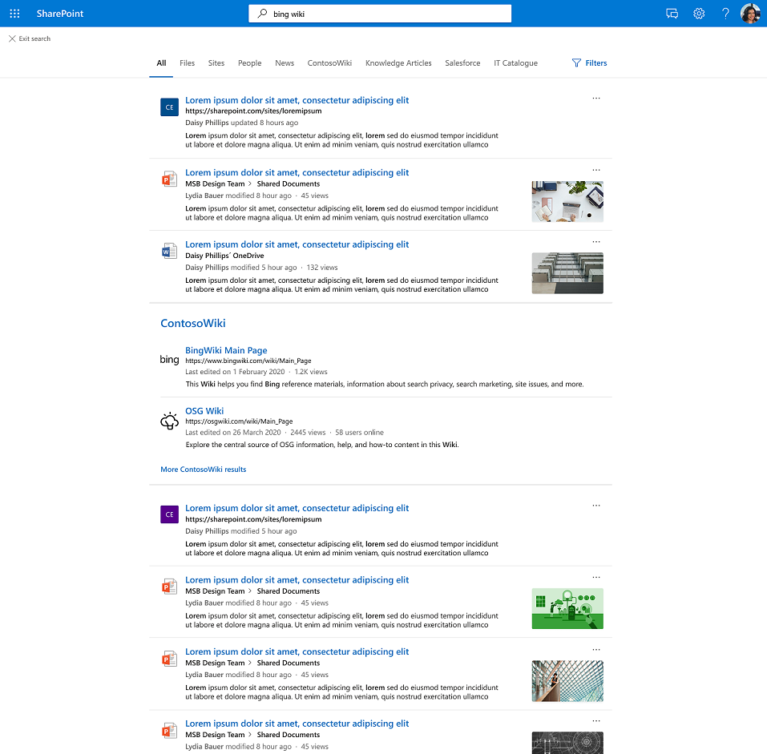

# Graph de resultados de conectores

## Información general sobre el clúster de Graph de resultados de conectores de conexión  

Con los clústeres de resultados de los conectores de Graph, las empresas  pueden buscar contenido de orígenes de datos de terceros en su vista predeterminada, la pestaña Todos, en SharePoint, Office.com y Búsqueda de Microsoft en Bing.

Los clústeres de resultados ayudan a los usuarios a descubrir todo el contenido de terceros en un solo lugar. Los resultados que se muestran en un clúster de resultados se agrupan en función de la configuración vertical de búsqueda.

## Cómo se seleccionan y muestran los resultados del conector

Los resultados del conector proporcionados en el clúster de resultados se derivan de verticales de búsqueda individuales con contenido de conector. Cada vertical de búsqueda proporciona un conjunto de resultados relevantes que se convierte en un clúster de resultados candidato. Los resultados relevantes se eligen en función de la propiedad "title" y la propiedad "content" de cada elemento. La propiedad content se marca como *isContent=true* en el esquema.

Para garantizar la detección de contenido de las verticales de búsqueda, se recomienda proporcionar títulos significativos para los elementos. Esto afecta positivamente al arbitraje de los candidatos del clúster de resultados y a la probabilidad de que el contenido se muestre en un clúster de resultados. Por ejemplo, evite el uso de los IDs como valores de la propiedad "title" a menos que los usuarios usen los IDs para buscar contenido.

La frecuencia con la que se muestra un clúster de resultados varía según factores como el número de verticales de búsqueda que configure y el tipo de contenido. Al interactuar o ignorar un clúster de resultados, los usuarios proporcionarán implícitamente sugerencias que ajustarán su desencadenamiento con el tiempo.

La experiencia de resultados de búsqueda de los elementos de conector que se muestran en el clúster de [resultados](./customize-search-page.md#create-your-own-result-type) usa tipos de resultados definidos por usted. Si no se configura ningún tipo de resultado, [se usa un diseño generado por](./customize-search-page.md#default-search-result-layout) el sistema.

Se recomienda usar la propiedad "title" como título del resultado de la búsqueda y la propiedad "content" como descripción de la búsqueda. Esto proporcionará la mejor experiencia para los usuarios mediante la activación precisa del clúster de resultados y los resultados más relevantes en el clúster.

Los clústeres de resultados se muestran en el medio de la página en la vertical Todo. Por ejemplo, a continuación se muestra un clúster de resultados de una vertical de 'MediaWiki'.

## Configuración predeterminada de clústeres de resultados
  
La experiencia del clúster de resultados está activada de forma predeterminada.  

Si desea deshabilitarla, siga estos pasos para desactivar la experiencia en el nivel de la organización:

1. En el [Centro de administración de Microsoft 365](https://admin.microsoft.com), vaya a [**Verticales**](https://admin.microsoft.com/Adminportal/Home#/MicrosoftSearch/verticals).
1. Seleccione la **vertical Todo** y, a continuación, habilite **Ocultar resultados del conector**.

Siga estos pasos para desactivar la experiencia en el nivel SharePoint sitio:

1. Vaya a **Configuración** en el sitio SharePoint web
2. Vaya a **Información del sitio** Ver toda la configuración del > **sitio**.
3. Vaya a la sección Búsqueda de Microsoft y, a continuación, seleccione **Configurar Búsqueda de Microsoft para esta colección de sitios**.
4. En el panel de navegación, vaya **a Experiencia personalizada** y, a continuación, seleccione **Verticales**.
5. Seleccione la **vertical Todo** y, a continuación, habilite **Ocultar resultados del conector**.
