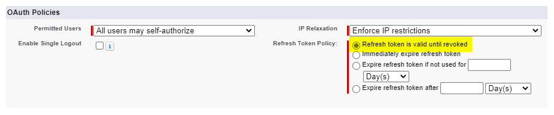
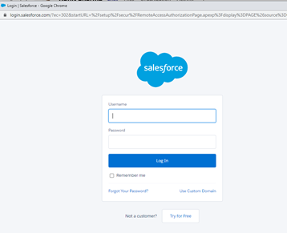
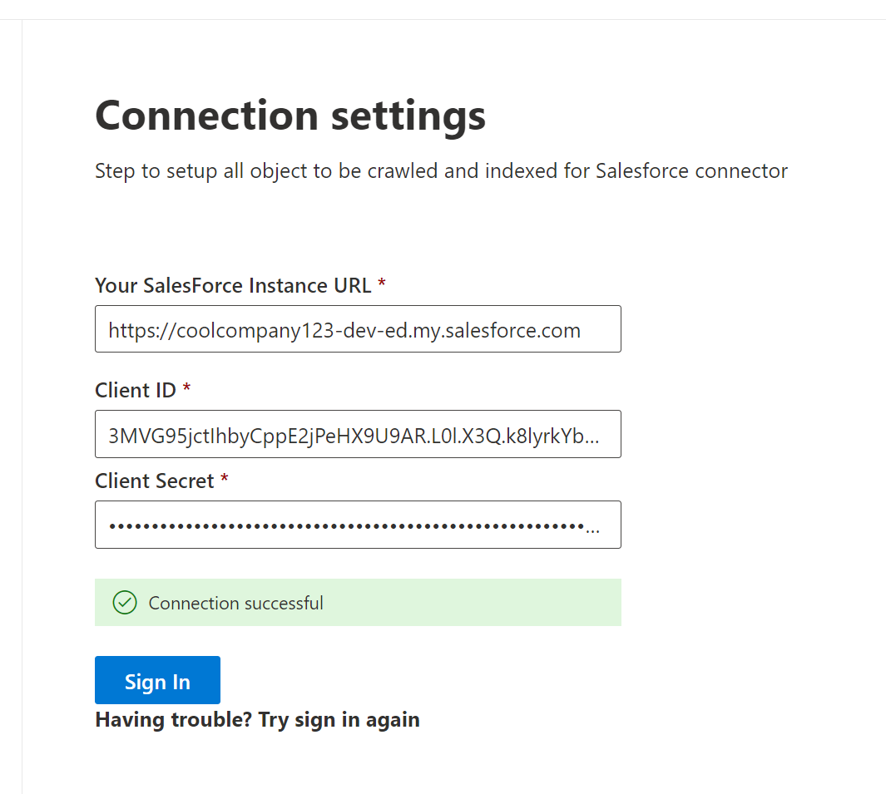
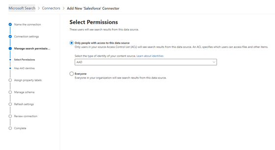

<!---Previous ms.author: rusamai --->

# Conector de Graph Salesforce

El conector de Graph salesforce permite a su organización indizar objetos Contacts, Opportunities, Leads, Cases y Accounts en su instancia de Salesforce. Después de configurar el conector y el contenido de índice de Salesforce, los usuarios finales pueden buscar esos elementos desde cualquier Búsqueda de Microsoft cliente.

> [!NOTE]
> Lea el [**artículo Setup for your Graph connector para**](configure-connector.md) comprender las instrucciones generales Graph de configuración de conectores.

Este artículo está para cualquier persona que configure, ejecute y monitore un conector de Graph Salesforce. Complementa el proceso de configuración general y muestra instrucciones que solo se aplican al conector de Graph Salesforce. En este artículo también se incluye información sobre [limitaciones](#limitations).

>[!IMPORTANT]
>El conector de Graph salesforce admite actualmente summer '19 o posterior.

## Antes de empezar

Para conectarse a la instancia de Salesforce, necesita la dirección URL de la instancia de Salesforce, el id. de cliente y el secreto de cliente para la autenticación de OAuth. Los siguientes pasos explican cómo usted o su administrador de Salesforce pueden obtener esta información de su cuenta de Salesforce:

- Inicie sesión en la instancia de Salesforce y vaya al programa de instalación

- Vaya a Aplicaciones -> App Manager.

- Selecciona **Nueva aplicación conectada**.

- Complete la sección API de la siguiente manera:

    - Active la casilla de verificación **Habilitar Oauth Configuración**.

    - Especifique la dirección URL de devolución de llamada como: [https://gcs.office.com/v1.0/admin/oauth/callback](https://gcs.office.com/v1.0/admin/oauth/callback)

    - Seleccione estos ámbitos OAuth necesarios.

        - Obtener acceso y administrar los datos (api)

        - Realizar solicitudes en su nombre en cualquier momento (refresh_token, offline_access)

    - Active la casilla Requerir **secreto para el flujo del servidor web.**

    - Guarda la aplicación.
    
      > [!div class="mx-imgBorder"]
      > 

- Copie la clave de consumidor y el secreto de consumidor. Esta información se usará como el identificador de cliente y el secreto de cliente cuando configure la conexión Configuración para el conector de Graph en el portal de administración de Microsoft 365 cliente.

  > [!div class="mx-imgBorder"]
  > 
  
- Antes de cerrar la instancia de Salesforce, siga estos pasos para asegurarse de que los tokens de actualización no expiren:
    - Ir a Aplicaciones -> App Manager
    - Busca la aplicación que creaste y selecciona la lista desplegable a la derecha. Seleccione **Administrar**
    - Seleccionar **directivas de edición**
    - Para la directiva de token de actualización, seleccione **Actualizar token es válido hasta que se revoque**

  > [!div class="mx-imgBorder"]
  > 

Ahora puede usar el [Centro de Administración de Microsoft 365 para](https://admin.microsoft.com/) completar el resto del proceso de configuración del Graph conector.

## Paso 1: Agregar un conector Graph en el Centro de administración de Microsoft 365

Siga las instrucciones [generales de configuración](./configure-connector.md).
<!---If the above phrase does not apply, delete it and insert specific details for your data source that are different from general setup instructions.-->

## Paso 2: Nombrar la conexión

Siga las instrucciones [generales de configuración](./configure-connector.md).
<!---If the above phrase does not apply, delete it and insert specific details for your data source that are different from general setup instructions.-->

## Paso 3: Configurar las opciones de conexión

Para la dirección URL de instancia, use https://[domain].my.salesforce.com donde domain sería el dominio de Salesforce para su organización.

Escriba el id. de cliente y el secreto de cliente que obtuvo de la instancia de Salesforce y seleccione Iniciar sesión.

La primera vez que haya intentado iniciar sesión con esta configuración, aparecerá una ventana emergente que le pedirá que inicie sesión en Salesforce con su nombre de usuario y contraseña de administrador. La captura de pantalla siguiente muestra el elemento emergente. Escriba sus credenciales y seleccione "Iniciar sesión".

  

  >[!NOTE]
  >Si la ventana emergente no aparece, puede que se bloquee en el explorador, por lo que debe permitir las ventanas emergentes y los redireccionamientos.

Compruebe que la conexión se ha realizado correctamente buscando un banner verde que diga "Conexión correcta" como se muestra en la captura de pantalla siguiente.

  > [!div class="mx-imgBorder"]
  > 

## Paso 4: Seleccionar propiedades

Seleccione los objetos de Salesforce que desea que el conector rastree e incluya en los resultados de búsqueda. Si Contact está seleccionado, Account también se seleccionará automáticamente.

>[!NOTE]
>Si un campo tiene establecida la seguridad de nivel de campo (FLS) para un perfil, el conector no ingeriá ese campo para los perfiles de esa organización de Salesforce. Como resultado, los usuarios no podrán buscar en los valores de esos campos ni aparecerán en los resultados.

## Paso 5: Administrar permisos de búsqueda

Deberá elegir qué usuarios verán los resultados de búsqueda de este origen de datos. Si solo permite que determinados Azure Active Directory (Azure AD) o usuarios que no son de Azure AD vean los resultados de la búsqueda, asegúrese de asignar las identidades.

### Paso 5.a: Seleccionar permisos

Puede elegir ingerir listas de control de acceso (ACL) desde la instancia de Salesforce o permitir que todos los usuarios de su organización vean los resultados de búsqueda de este origen de datos. Las ACL pueden incluir identidades Azure Active Directory (AAD) (usuarios federados de Azure AD a Salesforce), identidades que no son de Azure AD (usuarios nativos de Salesforce que tienen identidades correspondientes en Azure AD) o ambas.

>[!NOTE]
>Si usa un proveedor de identidades de terceros como Ping ID o secureAuth, debe seleccionar "non-AAD" como tipo de identidad.

> [!div class="mx-imgBorder"]
> 

Si optó por ingerir una ACL de la instancia de Salesforce y seleccionó "non-AAD" para el tipo de identidad, consulte [Map your non-Azure AD Identities](map-non-aad.md) para obtener instrucciones sobre cómo asignar las identidades.

### Paso 5.b: Asignar identidades de AAD

Si optó por ingerir una ACL de la instancia de Salesforce y seleccionó "AAD" para el tipo de identidad, consulte [Map your Azure AD Identities](map-aad.md) para obtener instrucciones sobre cómo asignar las identidades. Para obtener información sobre cómo configurar SSO de Azure AD para Salesforce, consulte este [tutorial](/azure/active-directory/saas-apps/salesforce-tutorial).

### Aplicar asignación de usuario para sincronizar las identidades de Salesforce con identidades de Azure AD

En este vídeo puede ver el proceso para autenticarse en la instancia de Salesforce, sincronizar las identidades que no son de Azure Active Directory con las identidades de Azure Active Directory y aplicar los recortes de seguridad adecuados a los elementos de Salesforce.

> [!VIDEO https://www.youtube-nocookie.com/embed/SZYiFxZMKcM]

## Paso 6: Asignar etiquetas de propiedades

Puede asignar una propiedad de origen a cada etiqueta eligiendo en un menú de opciones. Aunque este paso no es obligatorio, tener algunas etiquetas de propiedades mejorará la relevancia de la búsqueda y garantizará mejores resultados de búsqueda para los usuarios finales. De forma predeterminada, algunas de las etiquetas como "Title", "URL", "CreatedBy" y "LastModifiedBy" ya tienen asignadas propiedades de origen.

## Paso 7: Administrar esquema

Puede seleccionar qué propiedades de origen deben indizarse para que se muestren en los resultados de la búsqueda. El asistente para la conexión selecciona de forma predeterminada un esquema de búsqueda basado en un conjunto de propiedades de origen. Puede modificarlo seleccionando las casillas de cada propiedad y atributo de la página del esquema de búsqueda. Los atributos de esquema de búsqueda incluyen Search, Query, Retrieve y Refine.
Refinar permite definir las propiedades que se pueden usar más adelante como refinadores o filtros personalizados en la experiencia de búsqueda.  

> [!div class="mx-imgBorder"]
> 

## Paso 8: Establecer la programación de actualización

El conector de Salesforce solo admite programaciones de actualización para rastreos completos actualmente.

>[!IMPORTANT]
>Un rastreo completo busca objetos eliminados y usuarios que se sincronizaron previamente con el índice Búsqueda de Microsoft usuario.

La programación recomendada es de una semana para un rastreo completo.

## Paso 9: Revisar conexión

Siga las instrucciones [generales de configuración](./configure-connector.md).

>[!TIP]
>**Tipo de resultado predeterminado**
>* El conector de Salesforce registra automáticamente un [tipo de resultado](./customize-search-page.md#step-2-create-result-types) una vez que se publica el conector. El tipo de resultado usa un diseño de resultados generado [dinámicamente](./customize-results-layout.md) en función de los campos seleccionados en el paso 3.
>* Para administrar el tipo de resultado, vaya a [**Tipos de resultados**](https://admin.microsoft.com/Adminportal/Home#/MicrosoftSearch/resulttypes) en el [Centro de administración de Microsoft 365](https://admin.microsoft.com). El tipo de resultado predeterminado se denominará `ConnectionId` "Predeterminado". Por ejemplo, si el identificador de conexión es , el diseño `Salesforce` de resultados se denominará: "SalesforceDefault"
>* Además, puede elegir crear su propio tipo de resultado si es necesario.
<!---If the above phrase does not apply, delete it and insert specific details for your data source that are different from general setup instructions.-->

<!---## Troubleshooting-->
<!---Insert troubleshooting recommendations for this data source-->

## Limitaciones

- El Graph no admite actualmente el uso compartido y el uso compartido basado en el territorio basado en Apex mediante grupos personales de Salesforce.
- Hay un error conocido en la API de Salesforce que usa el conector de Graph, donde los valores predeterminados de toda la organización privada para clientes potenciales no se respetan actualmente.  
- Si un campo tiene establecida la seguridad de nivel de campo (FLS) para un perfil, el conector de Graph no ingeriá ese campo para los perfiles de esa organización de Salesforce. Como resultado, los usuarios no podrán buscar en los valores de esos campos ni aparecerán en los resultados.  
- En la pantalla Administrar esquema, estos nombres de propiedades estándar comunes se enumeran una vez, las opciones son **Query**, **Search,** **Retrieve** y **Refine** y se aplican a todos o ninguno.
    - Name
    - Url
    - Descripción
    - Fax
    - Phone
    - MobilePhone
    - Correo electrónico
    - Tipo
    - Título
    - AccountId
    - AccountName
    - AccountUrl
    - AccountOwner
    - AccountOwnerUrl
    - Owner
    - OwnerUrl
    - CreatedBy
    - CreatedByUrl
    - LastModifiedBy
    - LastModifiedByUrl
    - LastModifiedDate
    - ObjectName
