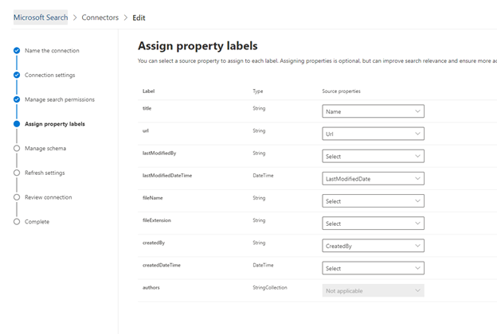

# Conector de Salesforce

Con el conector gráfico de Salesforce, su organización puede indizar los objetos Contacts, oportunidades, clientes potenciales y cuentas en su instancia de Salesforce. Después de configurar el conector y el contenido del índice desde Salesforce, los usuarios finales pueden buscar dichos elementos desde cualquier cliente de Microsoft Search

Este artículo está destinado a los administradores de [Microsoft 365](https://www.microsoft.com/microsoft-365) o a cualquiera que configure, ejecute y supervise un conector de Salesforce. Se explica cómo configurar las capacidades del conector y el conector, las limitaciones y las técnicas de solución de problemas.

>[!IMPORTANT]
>El conector gráfico de Salesforce actualmente es compatible con las versiones de verano "20, primavera" 20, invierno "20 y verano de" 19 ".

## Configuración de conexión

Para conectarse a su instancia de Salesforce, necesita la dirección URL de la instancia de Salesforce, el identificador de cliente y el secreto de cliente para la autenticación OAuth. Los siguientes pasos explican cómo usted o su administrador de Salesforce pueden obtener esta información de su cuenta de Salesforce:

- Inicie sesión en su instancia de Salesforce y vaya a configuración

- Vaya a apps-> App Manager.

- Seleccione **nueva aplicación conectada**.

- Complete la sección API de la siguiente manera:

    - Marque la casilla de verificación **Habilitar configuración de OAuth**.

    - Especifique la dirección URL de devolución de llamada como: [https://gcs.office.com/v1.0/admin/oauth/callback](https://gcs.office.com/v1.0/admin/oauth/callback)

    - Seleccione estos ámbitos de OAuth necesarios. 

        - Obtener acceso y administrar los datos (API) 

        - Realizar solicitudes en su nombre en cualquier momento (refresh_token, offline_access) 

    - Marque la casilla **requerir secreto para el flujo del servidor Web**.

    - Guarde la aplicación.
    
      

- Copie la clave de consumidor y el secreto de consumidor. Se usarán como el identificador de cliente y el secreto de cliente al configurar las opciones de conexión para el conector de Graph en el portal de administración de Microsoft 365.

  
- Antes de cerrar la instancia de Salesforce, siga estos pasos para asegurarse de que los tokens de actualización no expiren: 
    - Vaya a apps-> App Manager
    - Busque la aplicación que acaba de crear y seleccione la lista desplegable de la derecha. Seleccione **administrar**
    - Seleccionar **editar directivas**
    - Para la Directiva de token de actualización, seleccione el **token de actualización es válido hasta que se revoca**

  

Ahora puede usar el [centro de administración de M365](https://admin.microsoft.com/) para completar el resto del proceso de instalación del conector de Graph.  

Configure las opciones de conexión para su conector para gráficos de la siguiente manera:

- Para la dirección URL de instancia, use https://[dominio]. My. salesforce. com donde dominio sería el dominio de Salesforce de su organización. 
- Escriba el identificador de cliente y el secreto de cliente que obtuvo de la instancia de Salesforce y seleccione iniciar sesión.
- Si esta es la primera vez que intenta iniciar sesión con esta configuración, recibirá una ventana emergente que le pedirá que inicie sesión en Salesforce con el nombre de usuario y la contraseña de administrador. La captura de pantalla siguiente muestra el elemento emergente. Escriba sus credenciales y seleccione iniciar sesión.

  

  >[!NOTE]
  >Si no aparece la ventana emergente, es posible que se bloquee en el explorador, por lo que debe permitir los elementos emergentes y las redirecciones.

  >[!NOTE]
  >Si su organización usa el inicio de sesión único (SSO), puede seleccionar **usar dominio personalizado** en la esquina inferior derecha de la interfaz de inicio de sesión. Escriba el dominio y, después, seleccione **continuar**. Irá a la página de inicio de sesión específico de la organización, donde tendrá una opción para iniciar sesión con SSO.

- Compruebe que la conexión se ha realizado correctamente buscando un banner verde que diga "conexión correcta", tal y como se muestra en la captura de pantalla siguiente.

  

## Administrar permisos de búsqueda
Tendrá que elegir qué usuarios verán los resultados de la búsqueda de este origen de datos. Si solo permite que determinados usuarios de Azure Active Directory (AAD) o no AAD vean los resultados de la búsqueda, tendrá que asignar las identidades.

### Seleccionar permisos
Puede optar por recopilar listas de control de acceso (ACL) de su instancia de Salesforce o permitir que todos los usuarios de la organización vean los resultados de la búsqueda de este origen de datos. Las ACL pueden incluir identidades de Azure Active Directory (AAD), identidades que no son de AAD o ambas.

### Asignar identidades que no son AAD 
Si opta por ingesta de una ACL de su instancia de Salesforce y ha seleccionado "no-AAD" para el tipo de identidad, consulte [asignar las identidades que no son de Azure ad ](map-non-aad.md) para obtener instrucciones sobre cómo asignar las identidades.

### Asignar identidades de AAD
Si optó por la incorporación de una ACL desde su instancia de Salesforce y seleccionó "AAD" para el tipo de identidad, consulte [asignar las identidades de Azure ad](map-aad.md) para obtener instrucciones sobre cómo asignar las identidades.

## Asignar etiquetas de propiedad 
Puede asignar una propiedad de origen a cada etiqueta eligiendo en un menú de opciones. Aunque este paso no es obligatorio, tener algunas etiquetas de propiedades mejorará la relevancia de la búsqueda y garantizará resultados de búsqueda más precisos para los usuarios finales. De forma predeterminada, algunas de las etiquetas como "title", "URL" y "LastModifiedBy" ya tienen asignadas propiedades de origen.

## Administrar esquema
Puede seleccionar qué propiedades de origen deben indizarse para que se puedan mostrar en los resultados de la búsqueda. El Asistente para la conexión selecciona de forma predeterminada un esquema de búsqueda en función de un conjunto de propiedades de origen. Puede modificarla activando las casillas para cada propiedad y atributo en la página esquema de búsqueda. Los atributos de esquema de búsqueda incluyen búsqueda, consulta, recuperar y refinar. Refinar permite definir las propiedades que se pueden usar más adelante como refinadores personalizados o filtros en la experiencia de búsqueda.  

## Establecer la programación de actualización

El conector de Salesforce solo admite programaciones de actualización para rastreos completos actualmente.

>[!IMPORTANT]
>Un rastreo completo busca objetos eliminados y usuarios que se han sincronizado anteriormente en el índice de Microsoft Search.

La programación recomendada es una semana para un rastreo completo.

## Limitaciones

- En este momento, el conector de Graph no admite el uso compartido y uso compartido basado en territorio de Apex con grupos personales de Salesforce.
- Hay un error conocido en la API de Salesforce que usa el conector de Graph en el que actualmente no se respetan los valores predeterminados de la organización privada para los clientes potenciales.  
- Si un campo tiene un nivel de seguridad de nivel de campo (FLS) establecido para un perfil, el conector de Graph no inscribirá ese campo para los perfiles de esa organización de Salesforce. Por lo tanto, los usuarios no podrán buscar en los valores de esos campos, ni se mostrarán en los resultados.  
- Cualquier configuración de FLS se respetará durante las sincronizaciones completas del conector.
- En la pantalla Administrar esquema, estos nombres de propiedades estándar comunes se muestran una vez y se realiza la selección para que se puedan consultar, realizar búsquedas y recuperarse en todos o en ninguno.
    - Nombre
    - Url 
    - Descripción
    - Fax
    - Phone
    - MobilePhone
    - Correo electrónico
    - Tipo
    - El título
    - AccountId
    - AccountName
    - AccountUrl
    - AccountOwner
    - AccountOwnerUrl
    - Owner
    - OwnerUrl
    - CreatedBy 
    - CreatedByUrl 
    - LastModifiedBy 
    - LastModifiedByUrl 
    - LastModifiedDate
    - ObjectName 
