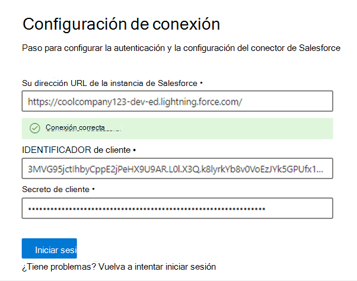

<!---Previous ms.author: rusamai --->

# Conector de Salesforce Graph (versión preliminar)

El conector de Salesforce Graph permite a su organización indizar los objetos Contactos, Oportunidades, Clientes potenciales y Cuentas en su instancia de Salesforce. Después de configurar el conector y el contenido de índice de Salesforce, los usuarios finales pueden buscar esos elementos desde cualquier cliente de Microsoft Search.

> [!NOTE]
> Lea el [**artículo Setup for your Graph connector para**](configure-connector.md) comprender las instrucciones generales de configuración de los conectores de Graph.

Este artículo está dirigido a cualquier persona que configure, ejecute y monitore un conector de Salesforce Graph. Complementa el proceso de configuración general y muestra instrucciones que solo se aplican al conector de Salesforce Graph. En este artículo también se incluye información sobre [limitaciones](#limitations).

>[!IMPORTANT]
>Actualmente, el conector de Salesforce Graph admite Summer '19 o posterior.

## Antes de empezar

Para conectarse a la instancia de Salesforce, necesita la dirección URL de la instancia de Salesforce, el id. de cliente y el secreto de cliente para la autenticación de OAuth. Los siguientes pasos explican cómo usted o su administrador de Salesforce pueden obtener esta información de su cuenta de Salesforce:

- Inicie sesión en la instancia de Salesforce y vaya al programa de instalación

- Vaya a Aplicaciones -> App Manager.

- Selecciona **Nueva aplicación conectada**.

- Complete la sección API de la siguiente manera:

    - Active la casilla habilitar **la configuración de Oauth**.

    - Especifique la dirección URL de devolución de llamada como: [https://gcs.office.com/v1.0/admin/oauth/callback](https://gcs.office.com/v1.0/admin/oauth/callback)

    - Seleccione estos ámbitos OAuth necesarios.

        - Obtener acceso y administrar los datos (api)

        - Realizar solicitudes en su nombre en cualquier momento (refresh_token, offline_access)

    - Active la casilla Requerir **secreto para el flujo del servidor web.**

    - Guarda la aplicación.
    
      > [!div class="mx-imgBorder"]
      > 

- Copie la clave de consumidor y el secreto de consumidor. Esta información se usará como id. de cliente y secreto de cliente cuando configure las opciones de conexión de Graph Connector en el portal de administración de Microsoft 365.

  > [!div class="mx-imgBorder"]
  > 
  
- Antes de cerrar la instancia de Salesforce, siga estos pasos para asegurarse de que los tokens de actualización no expiren:
    - Ir a Aplicaciones -> App Manager
    - Busca la aplicación que creaste y selecciona la lista desplegable a la derecha. Seleccione **Administrar**
    - Seleccionar **directivas de edición**
    - Para la directiva de token de actualización, seleccione **Actualizar token es válido hasta que se revoque**

  > [!div class="mx-imgBorder"]
  > 

Ahora puedes usar el Centro de administración [de M365](https://admin.microsoft.com/) para completar el resto del proceso de configuración del conector de Graph.

## Paso 1: Agregar un conector de Graph en el Centro de administración de Microsoft 365

Siga las instrucciones [generales de configuración](./configure-connector.md).
<!---If the above phrase does not apply, delete it and insert specific details for your data source that are different from general setup instructions.-->

## Paso 2: Nombrar la conexión

Siga las instrucciones [generales de configuración](./configure-connector.md).
<!---If the above phrase does not apply, delete it and insert specific details for your data source that are different from general setup instructions.-->

## Paso 3: Configurar las opciones de conexión

Para la dirección URL de instancia, use https://[domain].my.salesforce.com donde domain sería el dominio de Salesforce para su organización.

Escriba el id. de cliente y el secreto de cliente que obtuvo de la instancia de Salesforce y seleccione Iniciar sesión.

La primera vez que haya intentado iniciar sesión con esta configuración, aparecerá una ventana emergente que le pedirá que inicie sesión en Salesforce con su nombre de usuario y contraseña de administrador. La captura de pantalla siguiente muestra el elemento emergente. Escriba sus credenciales y seleccione "Iniciar sesión".

  

  >[!NOTE]
  >Si la ventana emergente no aparece, puede que se bloquee en el explorador, por lo que debe permitir las ventanas emergentes y los redireccionamientos.

Compruebe que la conexión se ha realizado correctamente buscando un banner verde que diga "Conexión correcta" como se muestra en la captura de pantalla siguiente.

  > [!div class="mx-imgBorder"]
  > 

## Paso 4: Administrar permisos de búsqueda

Deberá elegir qué usuarios verán los resultados de búsqueda de este origen de datos. Si solo permite que determinados usuarios de Azure Active Directory (Azure AD) o usuarios que no son de Azure AD vean los resultados de la búsqueda, asegúrese de asignar las identidades.

## Paso 4a: Seleccionar permisos

Puede elegir ingerir listas de control de acceso (ACL) desde la instancia de Salesforce o permitir que todos los usuarios de su organización vean los resultados de búsqueda de este origen de datos. Las ACL pueden incluir identidades de Azure Active Directory (AAD) (usuarios federados de Azure AD a Salesforce), identidades que no son de Azure AD (usuarios nativos de Salesforce que tienen identidades correspondientes en Azure AD) o ambas.

>[!NOTE]
>Si usa un proveedor de identidades de terceros como Ping ID o secureAuth, debe seleccionar "non-AAD" como tipo de identidad.

> [!div class="mx-imgBorder"]
> 

Si optó por ingerir una ACL de la instancia de Salesforce y seleccionó "non-AAD" para el tipo de identidad, consulte [Map your non-Azure AD Identities](map-non-aad.md) para obtener instrucciones sobre cómo asignar las identidades.

## Paso 4b: Asignar identidades de AAD

Si optó por ingerir una ACL de la instancia de Salesforce y seleccionó "AAD" para el tipo de identidad, consulte [Map your Azure AD Identities](map-aad.md) para obtener instrucciones sobre cómo asignar las identidades. Para obtener información sobre cómo configurar SSO de Azure AD para Salesforce, consulte este [tutorial](/azure/active-directory/saas-apps/salesforce-tutorial).

## Paso 5: Asignar etiquetas de propiedades

Puede asignar una propiedad de origen a cada etiqueta eligiendo en un menú de opciones. Aunque este paso no es obligatorio, tener algunas etiquetas de propiedades mejorará la relevancia de la búsqueda y garantizará mejores resultados de búsqueda para los usuarios finales. De forma predeterminada, algunas de las etiquetas como "Title", "URL", "CreatedBy" y "LastModifiedBy" ya tienen asignadas propiedades de origen.

## Paso 6: Administrar esquema

Puede seleccionar qué propiedades de origen deben indizarse para que se muestren en los resultados de la búsqueda. El asistente para la conexión selecciona de forma predeterminada un esquema de búsqueda basado en un conjunto de propiedades de origen. Puede modificarlo seleccionando las casillas de cada propiedad y atributo de la página del esquema de búsqueda. Los atributos de esquema de búsqueda incluyen Search, Query, Retrieve y Refine.
Refinar permite definir las propiedades que se pueden usar más adelante como refinadores o filtros personalizados en la experiencia de búsqueda.  

> [!div class="mx-imgBorder"]
> 

## Paso 7: Establecer la programación de actualización

El conector de Salesforce solo admite programaciones de actualización para rastreos completos actualmente.

>[!IMPORTANT]
>Un rastreo completo busca objetos eliminados y usuarios que se sincronizaron previamente con el índice de Microsoft Search.

La programación recomendada es de una semana para un rastreo completo.

## Paso 8: Revisar la conexión

Siga las instrucciones [generales de configuración](./configure-connector.md).
<!---If the above phrase does not apply, delete it and insert specific details for your data source that are different from general setup instructions.-->

<!---## Troubleshooting-->
<!---Insert troubleshooting recommendations for this data source-->

## Limitaciones

- Actualmente, el conector de Graph no admite el uso compartido y el uso compartido basados en territorios basados en Apex mediante grupos personales de Salesforce.
- Hay un error conocido en la API de Salesforce que usa el conector de Graph, donde los valores predeterminados de toda la organización privada para los clientes potenciales no se respetan actualmente.  
- Si un campo tiene establecida la seguridad de nivel de campo (FLS) para un perfil, el conector de Graph no ingeriá ese campo para los perfiles de esa organización de Salesforce. Como resultado, los usuarios no podrán buscar en los valores de esos campos ni aparecerán en los resultados.  
- En la pantalla Administrar esquema, estos nombres de propiedades estándar comunes se enumeran una vez, las opciones son **Query**, **Search,** **Retrieve** y **Refine** y se aplican a todos o ninguno.
    - Nombre
    - Url
    - Descripción
    - Fax
    - Phone
    - MobilePhone
    - Correo electrónico
    - Tipo
    - Título
    - AccountId
    - AccountName
    - AccountUrl
    - AccountOwner
    - AccountOwnerUrl
    - Owner
    - OwnerUrl
    - CreatedBy
    - CreatedByUrl
    - LastModifiedBy
    - LastModifiedByUrl
    - LastModifiedDate
    - ObjectName