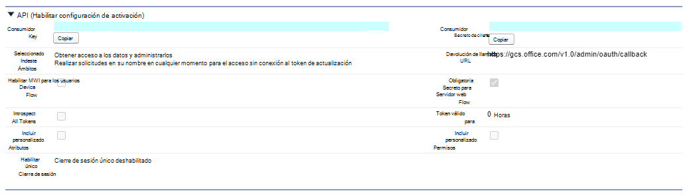

# Conector de Salesforce (versión preliminar)Salesforce connector (preview)

Con el conector gráfico de Salesforce, su organización puede indizar los objetos Contacts, oportunidades, clientes potenciales y cuentas en su instancia de Salesforce.With the Salesforce Graph connector, your organization can index Contacts, Opportunities, Leads and Accounts objects in your Salesforce instance. Después de configurar el conector y el contenido del índice desde Salesforce, los usuarios finales pueden buscar dichos elementos desde cualquier cliente de Microsoft Search.After you configure the connector and index content from Salesforce, end users can search for those items from any Microsoft Search client.

Este artículo está destinado a los administradores de [Microsoft 365](https://www.microsoft.com/microsoft-365) o a cualquiera que configure, ejecute y supervise un conector de Salesforce.This article is for [Microsoft 365](https://www.microsoft.com/microsoft-365) administrators or anyone who configures, runs, and monitors a Salesforce connector. Se explica cómo configurar las capacidades del conector y el conector, las limitaciones y las técnicas de solución de problemas.It explains how to configure your connector and connector capabilities, limitations, and troubleshooting techniques.

>[!IMPORTANT]
>El conector gráfico de Salesforce admite actualmente el verano de 19 o posterior.The Salesforce Graph connector currently supports Summer '19 or later.

## Configuración de conexiónConnection settings

Para conectarse a su instancia de Salesforce, necesita la dirección URL de la instancia de Salesforce, el identificador de cliente y el secreto de cliente para la autenticación OAuth.To connect to your Salesforce instance, you need your Salesforce instance URL, the Client ID, and Client Secret for OAuth authentication. Los siguientes pasos explican cómo usted o su administrador de Salesforce pueden obtener esta información de su cuenta de Salesforce:The following steps explain how you or your Salesforce administrator can get this information from your Salesforce account:

- Inicie sesión en su instancia de Salesforce y vaya a configuraciónLog in to your Salesforce instance and go to Setup

- Vaya a apps-> App Manager.Navigate to Apps -> App Manager.

- Seleccione **nueva aplicación conectada**.Select **New connected app**.

- Complete la sección API de la siguiente manera:Complete the API section as follows:

    - Marque la casilla de verificación **Habilitar configuración de OAuth**.Select the checkbox for **Enable Oauth Settings**.

    - Especifique la dirección URL de devolución de llamada como: [https://gcs.office.com/v1.0/admin/oauth/callback](https://gcs.office.com/v1.0/admin/oauth/callback)Specify the Callback URL as: [https://gcs.office.com/v1.0/admin/oauth/callback](https://gcs.office.com/v1.0/admin/oauth/callback)

    - Seleccione estos ámbitos de OAuth necesarios.Select these required OAuth scopes. 

        - Obtener acceso y administrar los datos (API)Access and manage your data (api) 

        - Realizar solicitudes en su nombre en cualquier momento (refresh_token, offline_access)Perform requests on your behalf at any time (refresh_token, offline_access) 

    - Marque la casilla **requerir secreto para el flujo del servidor Web**.Select the checkbox for **Require secret for web server flow**.

    - Guarde la aplicación.Save the app.
    
      

- Copie la clave de consumidor y el secreto de consumidor.Copy the consumer key and the consumer secret. Se usarán como el identificador de cliente y el secreto de cliente al configurar las opciones de conexión para el conector de Graph en el portal de administración de Microsoft 365.These will be used as the Client ID and the Client Secret when you configure the Connection Settings for your Graph Connector in the Microsoft 365 admin portal.

  
- Antes de cerrar la instancia de Salesforce, siga estos pasos para asegurarse de que los tokens de actualización no expiren:Before closing your Salesforce instance, perform the following steps to ensure that refresh tokens do not expire:
    - Vaya a apps-> App ManagerGo to Apps -> App Manager
    - Busque la aplicación que acaba de crear y seleccione la lista desplegable de la derecha.Find the app you just created and select the drop down on the right. Seleccione **administrar**Select **Manage**
    - Seleccionar **editar directivas**Select **edit policies**
    - Para la Directiva de token de actualización, seleccione el **token de actualización es válido hasta que se revoca**For refresh token policy, select **Refresh token is valid until revoked**

  

Ahora puede usar el [centro de administración de M365](https://admin.microsoft.com/) para completar el resto del proceso de instalación del conector de Graph.You can now use the [M365 Admin Center](https://admin.microsoft.com/) to complete the rest of the setup process for your Graph connector.  

Configure las opciones de conexión para su conector para gráficos de la siguiente manera:Configure the Connection settings for your Graph connector as follows:

- Para la dirección URL de instancia, use https://[dominio]. My. salesforce. com donde dominio sería el dominio de Salesforce de su organización.For the Instance URL, use https://[domain].my.salesforce.com where domain would be the Salesforce domain for your organization. 
- Escriba el identificador de cliente y el secreto de cliente que obtuvo de la instancia de Salesforce y seleccione iniciar sesión.Enter the Client ID and Client Secret you obtained from your Salesforce instance and select Sign in.
- Si esta es la primera vez que intenta iniciar sesión con esta configuración, recibirá una ventana emergente que le pedirá que inicie sesión en Salesforce con el nombre de usuario y la contraseña de administrador.If this is the first time you have attempted to Sign in with these settings, you will get a pop up asking you to login to Salesforce with your admin username and password. La captura de pantalla siguiente muestra el elemento emergente.The screenshot below shows the popup. Escriba sus credenciales y seleccione iniciar sesión.Enter your credentials and select Log in.

  

  >[!NOTE]
  >Si no aparece la ventana emergente, es posible que se bloquee en el explorador, por lo que debe permitir los elementos emergentes y las redirecciones.If the pop up does not appear, it might be getting blocked in your browser, so you must allow pop-ups and redirects.

  >[!NOTE]
  >Si su organización usa el inicio de sesión único (SSO), puede seleccionar **usar dominio personalizado** en la esquina inferior derecha de la interfaz de inicio de sesión.If your organization uses single sign-on (SSO), you can select **Use Custom Domain** in the bottom, right-hand corner of the login interface. Escriba el dominio y, después, seleccione **continuar**.Enter the domain and then select **Continue**. Irá a la página de inicio de sesión específico de la organización, donde tendrá una opción para iniciar sesión con SSO.It will go to your organization specific login page where you will have an option to login with SSO.

- Compruebe que la conexión se ha realizado correctamente buscando un banner verde que diga "conexión correcta", tal y como se muestra en la captura de pantalla siguiente.Check that the connection was successful by searching for a green banner that says "Connection successful" as show in the screenshot below.

  

## Administrar permisos de búsquedaManage search permissions
Tendrá que elegir qué usuarios verán los resultados de la búsqueda de este origen de datos.You will need to choose which users will see search results from this data source. Si permite que solo algunos usuarios de Azure Active Directory (Azure AD) o distintos de Azure vean los resultados de la búsqueda, tendrá que asignar las identidades.If you allow only certain Azure Active Directory (Azure AD) or Non-Azure AD users to see the search results, you will then need to map the identities.

### Seleccionar permisosSelect Permissions
Puede optar por recopilar listas de control de acceso (ACL) de su instancia de Salesforce o permitir que todos los usuarios de la organización vean los resultados de la búsqueda de este origen de datos.You can choose to ingest Access Control Lists (ACLs) from your Salesforce instance, or you can allow everyone in your organization to see search results from this data source. Las ACL pueden incluir identidades de Azure Active Directory (AAD) (usuarios federados de Azure AD a Salesforce), identidades que no son de Azure AD (usuarios nativos de Salesforce que tienen identidades correspondientes en Azure AD) o ambos.ACLs can include Azure Active Directory (AAD) identities (users who are federated from Azure AD to Salesforce), non-Azure AD identities (native Salesforce users who have corresponding identities in Azure AD), or both.

### Asignar identidades que no son AADMap non-AAD identities 
Si opta por ingesta de una ACL de su instancia de Salesforce y ha seleccionado "no-AAD" para el tipo de identidad, consulte [asignar las identidades que no son de Azure ad](map-non-aad.md) para obtener instrucciones sobre cómo asignar las identidades.If you chose to ingest an ACL from your Salesforce instance and selected "non-AAD" for the identity type see [Map your non-Azure AD Identities](map-non-aad.md) for instructions on mapping the identities.

### Asignar identidades de AADMap AAD identities
Si optó por la incorporación de una ACL desde su instancia de Salesforce y seleccionó "AAD" para el tipo de identidad, consulte [asignar las identidades de Azure ad](map-aad.md) para obtener instrucciones sobre cómo asignar las identidades.If you chose to ingest an ACL from your Salesforce instance and selected "AAD" for the identity type see [Map your Azure AD Identities](map-aad.md) for instructions on mapping the identities. Para obtener información sobre cómo configurar el SSO de Azure AD para Salesforce, vea este [tutorial](https://docs.microsoft.com/en-us/azure/active-directory/saas-apps/salesforce-tutorial).To learn how to set up Azure AD SSO for Salesforce, see this [tutorial](https://docs.microsoft.com/en-us/azure/active-directory/saas-apps/salesforce-tutorial).

## Asignar etiquetas de propiedadAssign property labels 
Puede asignar una propiedad de origen a cada etiqueta eligiendo en un menú de opciones.You can assign a source property to each label by choosing from a menu of options. Aunque este paso no es obligatorio, tener algunas etiquetas de propiedades mejorará la relevancia de la búsqueda y garantizará resultados de búsqueda más precisos para los usuarios finales.While this step is not mandatory, having some property labels will improve the search relevance and ensure more accurate search results for end users. De forma predeterminada, algunas de las etiquetas como "title", "URL", "CreatedBy" y "LastModifiedBy" ya tienen asignadas propiedades de origen.By default, some of the Labels like "Title," "URL," "CreatedBy," and  "LastModifiedBy" have already been assigned source properties.

## Administrar esquemaManage Schema
Puede seleccionar qué propiedades de origen deben indizarse para que se puedan mostrar en los resultados de la búsqueda.You can select what source properties should be indexed so that they can show up in search results. El Asistente para la conexión selecciona de forma predeterminada un esquema de búsqueda en función de un conjunto de propiedades de origen.The connection wizard by default selects a search schema based on a set of source properties. Puede modificarla activando las casillas para cada propiedad y atributo en la página esquema de búsqueda.You can modify it by selecting the check boxes for each property and attribute in the search schema page. Los atributos de esquema de búsqueda incluyen búsqueda, consulta, recuperar y refinar.Search schema attributes include Search, Query, Retrieve and Refine. Refinar permite definir las propiedades que se pueden usar más adelante como refinadores personalizados o filtros en la experiencia de búsqueda.Refine allows you to define the properties which can be later used as custom refiners or filters in the search experience.  

## Establecer la programación de actualizaciónSet the refresh schedule

El conector de Salesforce solo admite programaciones de actualización para rastreos completos actualmente.The Salesforce connector only supports refresh schedules for full crawls currently.

>[!IMPORTANT]
>Un rastreo completo busca objetos eliminados y usuarios que se han sincronizado anteriormente en el índice de Microsoft Search.A full crawl finds deleted objects and users that were previously synced to the Microsoft Search index.

La programación recomendada es una semana para un rastreo completo.The recommended schedule is one week for a full crawl.

## LimitacionesLimitations

- En este momento, el conector de Graph no admite el uso compartido y uso compartido basado en territorio de Apex con grupos personales de Salesforce.The Graph connector does not currently support Apex based , territory-based sharing and sharing using personal groups from Salesforce.
- Hay un error conocido en la API de Salesforce que usa el conector de Graph en el que actualmente no se respetan los valores predeterminados de la organización privada para los clientes potenciales.There is a known bug in the Salesforce API that the Graph connector uses where the private org wide defaults for leads is not honored currently.  
- Si un campo tiene un nivel de seguridad de nivel de campo (FLS) establecido para un perfil, el conector de Graph no inscribirá ese campo para los perfiles de esa organización de Salesforce. Por lo tanto, los usuarios no podrán buscar en los valores de esos campos, ni se mostrarán en los resultados.If a field has field level security (FLS) set for a profile, the Graph connector will not ingest that field for any profiles in that Salesforce org. Users will thus not be able to search on values for those fields, nor will it  show up in the results.  
- En la pantalla Administrar esquema, estos nombres de propiedades estándar comunes se muestran una vez y se realiza la selección para que se puedan consultar, realizar búsquedas y recuperarse en todos o en ninguno.In the Manage Schema screen these common standard property names are listed once and the selection done to make them queryable, searchable and retrievable apply to all or none.
    - NombreName
    - UrlUrl 
    - DescriptionDescription
    - FaxFax
    - PhonePhone
    - MobilePhoneMobilePhone
    - Correo electrónicoEmail
    - TipoType
    - El títuloTitle
    - AccountIdAccountId
    - AccountNameAccountName
    - AccountUrlAccountUrl
    - AccountOwnerAccountOwner
    - AccountOwnerUrlAccountOwnerUrl
    - OwnerOwner
    - OwnerUrlOwnerUrl
    - CreatedByCreatedBy 
    - CreatedByUrlCreatedByUrl 
    - LastModifiedByLastModifiedBy 
    - LastModifiedByUrlLastModifiedByUrl 
    - LastModifiedDateLastModifiedDate
    - ObjectNameObjectName 
