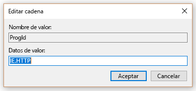

# Establecer explorador predeterminadoSet default browser

> [!IMPORTANT]
> Este artículo se aplica al portal de administración de Microsoft Search (Búsqueda de Microsoft) en BingThis article applies to the Microsoft Search in Bing admin portal. Estamos moviendo el portal al Centro de administración de Microsoft 365 y después se eliminará.We’re moving the portal to the Microsoft 365 admin center, and then it will be removed. Se recomienda utilizar el Centro de administración de Microsoft 365 para empezar.We recommend that you use the Microsoft 365 admin center to get started. [Introducción a Microsoft Search (Búsqueda de Microsoft)](overview-microsoft-search.md).Overview of Microsoft Search
    
La configuración de la página principal, motor de búsqueda y explorador predeterminados ayudará a los usuarios a descubrir las funciones de Microsoft Search, fomentar su uso y proporcionar una experiencia más fluida.Configuring the default browser, default search engine, and default homepage will help your users discover Microsoft Search capabilities, encourage more usage, and provide a smoother experience.
  
Para establecer el explorador predeterminado para su organización, siga los pasos siguientes.To set the default browser for your organization, follow the steps below.
  
## Windows 8 y versiones posterioresWindows 8 and above

Para configurar Internet Explorer o Microsoft Edge como explorador predeterminado, siga estos pasos:To set Internet Explorer or Microsoft Edge as the default browser, follow these steps:
  
### Cree el archivo de asociaciones predeterminadasCreate default associations file

1. Abra una consola de administración de PowerShell.Open an administrative PowerShell console.
    
2.  `New-Item -Path "\\$env:USERDOMAIN\SYSVOL\$env:USERDNSDOMAIN" -Type Directory -Name "Settings"`
    
3.  `$SettingsPath="\\$env:USERDOMAIN\SYSVOL\$env:USERDNSDOMAIN\Settings"`
    
4.  `Start-Process Dism.exe -PassThru "/Online /Export-DefaultAppAssociations:$SettingsPath\AppAssoc.xml"`
    
Estos pasos intentan crear el archivo de asociaciones predeterminadas en la carpeta SYSVOL del controlador del dominio.These steps try and create the default associations file in the SYSVOL folder of the domain controller.
  
### Agregue o edite el archivo de asociaciones predeterminadasAdd or edit the default associations file

1. `Notepad "$SettingsPath\AppAssoc.xml"`
    
2. Edite las siguientes entradas (.htm, .html, http, https) y quite otras entradas si no son necesarias.Edit the following entries (.htm, .html, http, https), and remove other entries if they're not needed.
    
  - **Microsoft Edge****Microsoft Edge**
    
     `<Association Identifier=".htm" ProgId="AppX4hxtad77fbk3jkkeerkrm0ze94wjf3s9" ApplicationName="Microsoft Edge" />`
  
     `<Association Identifier=".html" ProgId="AppX4hxtad77fbk3jkkeerkrm0ze94wjf3s9" ApplicationName="Microsoft Edge" />`
  
     `<Association Identifier="http" ProgId="AppXq0fevzme2pys62n3e0fbqa7peapykr8v" ApplicationName="Microsoft Edge" />`
    
  - **Internet Explorer****Internet Explorer**
    
     `<Association Identifier=".htm" ProgId="htmlfile" ApplicationName="Internet Explorer" />`
  
     `<Association Identifier=".html" ProgId="htmlfile" ApplicationName="Internet Explorer" />`
  
     `<Association Identifier="http" ProgId="IE.HTTP" ApplicationName="Internet Explorer" />`
  
     `<Association Identifier="https" ProgId="IE.HTTPS" ApplicationName="Internet Explorer" />`
    
3. Abra la Consola de administración de directivas de grupo (gpmc.msc) y cambie a editar una directiva existente o crear una nueva.Open Group Policy Management Console (gpmc.msc) and switch to editing any existing policy or creating a new one.
    
1. Vaya a **Configuración del equipo\Plantillas administrativas\Componentes de Windows\Explorador de archivos**.Navigate to **Computer Configuration\Administrative Templates\Windows Components\File Explorer**
    
2. Haga doble clic en **Establecer un archivo de configuración de asociaciones predeterminadas**, establézcalo en **Habilitado** y especifique la ruta de acceso a AppAssoc.xml (por ejemplo: %USERDOMAIN%\SYSVOL\%USERDNSDOMAIN%\Settings\AppAssoc.xml)Double-click **Set a default associations configuration file**, set it to **Enabled**, and enter the path to AppAssoc.xml (for example %USERDOMAIN%\SYSVOL\%USERDNSDOMAIN%\Settings\AppAssoc.xml)
    
4. Aplique el GPO resultante vinculándolo al dominio correspondiente.Enforce the resultant GPO by linking it to the appropriate domain.
    
Los usuarios podrán cambiar el explorador después de establecer esta directiva.Users will be able to change the browser after this policy is set.
  
## Windows 7Windows 7

1. Configure el equipo local que se usará para establecer el GPOConfigure the local machine that will be used to set the GPO.
    
1. Abra **Panel de control\Programas\Programas predeterminados\Establecer programas predeterminados** y establezca Internet Explorer como predeterminado.Open **Control Panel\Programs\Default Programs\Set Default Programs** and set Internet Explorer as the default. 
    
2. Abra la Consola de administración de directivas de grupo (gpmc.msc) y cambie a editar una directiva existente o crear una nueva.Open Group Policy Management Console (gpmc.msc) and switch to editing any existing policy or creating a new one.
    
1. Vaya a **\<Equipo/Configuración\> de usuario\Directivas\Preferencias\Configuración de Windows**.Navigate to **\<Computer/User\> Configuration\Policies\Preferences\Windows Settings**.
    
2. Haga clic derecho en **Registro\Nuevo** y seleccione **Asistente de registro**.Right-click on **Registry\New** and select **Registry Wizard**.
    
3. En la ventana del Explorador de registro, seleccione **Equipo local** y haga clic en **Siguiente**.From the Registry Browser window, select **Local Computer** and click **Next**.
    
4. Vaya a **HKEY_CURRENT_USER\Software\Microsoft\Windows\Shell\Associations\UrlAssociations\https** y seleccione el valor ProgId. Asegúrese de que el valor tiene un aspecto similar al siguiente:Navigate to **HKEY_CURRENT_USER\Software\Microsoft\Windows\Shell\Associations\UrlAssociations\https** and select the ProgId value. Make sure the value looks like the one below: 
    
    
  
5. Vaya a **HKEY_CURRENT_USER\Software\Microsoft\Windows\Shell\Associations\UrlAssociations\https** y seleccione el valor ProgId. Asegúrese de que el valor tiene un aspecto similar al siguiente:Navigate to **HKEY_CURRENT_USER\Software\Microsoft\Windows\Shell\Associations\UrlAssociations\https** and select the ProgId value. Make sure that the value looks like the one below: 
    
    
  
3. Aplique el GPO resultante vinculándolo al dominio correspondiente.Enforce the resultant GPO by linking it to the appropriate domain.
    
Los usuarios podrán cambiar el explorador después de establecer esta directiva.Users will be able to change the browser after this policy is set.