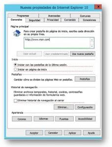

# Establecer página de inicio predeterminadaSet default homepage

Configurar el explorador predeterminado, el motor de búsqueda predeterminado y la página principal predeterminada le ayudará a los usuarios a descubrir las capacidades de Microsoft Search, fomentar el uso más y proporcionar una experiencia más suave.Configuring the default browser, default search engine, and default homepage will help your users discover Microsoft Search  capabilities, encourage more usage, and provide a smoother experience.
  
Para establecer la página principal predeterminada para su organización, siga los pasos siguientes.To set the default homepage for your organization, follow the steps below.
  
## Internet ExplorerInternet Explorer

### Internet Explorer 5.0 o posteriorInternet Explorer 5.0 or later

1. Abra la consola de administración de directiva de grupo (gpmc.msc) y cambie a editar cualquier directiva existente o crear uno nuevo.Open the Group Policy Management Console (gpmc.msc) and switch to editing any existing policy or creating a new one.
    
2. Vaya a **configuración de Windows\Mantenimiento de Internet del Panel de Configuration\Preferences\Control de usuario**.Navigate to **User Configuration\Preferences\Control Panel Settings\Internet Settings**.
    
3. Haga clic en **Configuración de Internet** y seleccione **Internet Explorer 10**.Right-click on **Internet Settings** and select **Internet Explorer 10**.
    
    > [!NOTE]
    > Es necesario seleccionar la opción de Internet Explorer 10 para aplicar la configuración de Internet Explorer 11 como la misma configuración se aplica a Internet Explorer 11.You need to select the option of Internet Explorer 10 to apply the settings for Internet Explorer 11 as the same settings apply to Internet Explorer 11. 
  
4. Configuración que está subrayados en rojo no está configurados en el equipo de destino, mientras que la configuración de subrayado en verde se configura en el equipo de destino. Para cambiar el formato de subrayado, use las teclas de función siguientes:Settings which are underlined in red are not configured at the target machine, while settings underlined in green are configured at the target machine. To change the underlining, use the following function keys:
    
    F5 - habilitar todas las opciones en la ficha actualF5 - Enable all settings on the current tab
    
    F6 - habilitar el valor seleccionado actualmenteF6 - Enable the currently selected setting
    
    F7 - deshabilitar el valor seleccionado actualmenteF7 - Disable the currently selected setting
    
    F8 - deshabilitar todas las opciones en la ficha actualF8 - Disable all settings on the current tab
    
5. Presione la tecla **F8** para deshabilitar a todas las opciones antes de configurar nada. La pantalla debe tener este aspecto:Press **F8** to disable all settings before configuring anything. The screen should look like this: 
    
    
  
6. En la configuración de la página principal, presione **F6** y escriba`https://www.bing.com/business?form=BFBSPR`Press **F6** on the Home page setting and enter `https://www.bing.com/business?form=BFBSPR`
    
7. Aplicar el GPO resultante mediante la vinculación al dominio apropiado.Enforce the resultant GPO by linking it to the appropriate domain.
    
> [!NOTE]
> Los usuarios todavía pueden cambiar la página principal de una vez establecida esta directiva.Users can still change the homepage after this policy is set. 
  
## Microsoft EdgeMicrosoft Edge

### 10 de Windows, versión 1511 o posteriorWindows 10, Version 1511 or later

1. Abra la consola de administración de directiva de grupo (gpmc.msc) y cambie a editar cualquier directiva existente o crear uno nuevo.Open the Group Policy Management Console (gpmc.msc) and switch to editing any existing policy or creating a new one.
    
2. Navegue al **borde de Windows\Microsoft administrativas\Componentes administrativas**Navigate to **Administrative Templates\Windows Components\Microsoft Edge**
    
1. Haga doble clic en **las páginas de configuración de inicio**, establecida en **habilitado**y escriba`https://www.bing.com/business`Double-click **Configure Start pages**, set it to **Enabled**, and enter `https://www.bing.com/business`
    
3. Aplicar el GPO resultante mediante la vinculación al dominio apropiado.Enforce the resultant GPO by linking it to the appropriate domain.
    
> [!CAUTION]
> Los usuarios no podrán cambiar el proveedor de búsqueda después de establece esta directiva.Users won't be able to change the search provider after this policy is set. 
  
## Google ChromeGoogle Chrome

### Windows XP SP2 o posteriorWindows XP SP2 or later

El artículo de soporte técnico de Windows en administración de archivos ADMX y los archivos ADMX más recientes para las diferentes versiones de Windows puede encontrarse [en soporte técnico de Microsoft](https://support.microsoft.com/en-us/help/3087759/how-to-create-and-manage-the-central-store-for-group-policy-administra).The Windows Support article on managing ADMX files and the latest ADMX files for different versions of Windows can be found [on Microsoft Support](https://support.microsoft.com/en-us/help/3087759/how-to-create-and-manage-the-central-store-for-group-policy-administra).

También necesitará el archivo de directiva de Google más reciente, que puede encontrar en la [Ayuda de Google Chrome Enterprise](https://support.google.com/chrome/a/answer/187202).You'll also need the latest Google policy file, which you can find on [Google Chrome Enterprise Help](https://support.google.com/chrome/a/answer/187202).
  
Si la configuración que se describen en esta sección no se encuentra dentro de GPMC, descargar el ADMX adecuado y copiarlos en el [almacén central](https://docs.microsoft.com/en-us/previous-versions/windows/it-pro/windows-vista/cc748955%28v%3dws.10%29). Almacén central en el controlador de es una carpeta con la convención de nomenclatura siguiente:If the settings described in this section can't be found inside of GPMC, download the appropriate ADMX and copy them to the [central store](https://docs.microsoft.com/en-us/previous-versions/windows/it-pro/windows-vista/cc748955%28v%3dws.10%29). Central store on the controller is a folder with the following naming convention:
  
 **%SystemRoot%\Sysvol\\<domain\>\policies\PolicyDefinitions****%systemroot%\sysvol\\<domain\>\policies\PolicyDefinitions**
  
Cada dominio de los identificadores de controlador deberían obtener una carpeta independiente. El siguiente comando se puede usar para copiar el archivo ADMX desde el símbolo del sistema:Each domain your controller handles should get a separate folder. The following command can be used to copy the ADMX file from the command prompt:
  
 `Copy <path_to_ADMX.ADMX> %systemroot%\sysvol\<domain>\policies\PolicyDefinitions`
  
1. Abra la consola de administración de directiva de grupo (gpmc.msc) y cambie a editar cualquier directiva existente o crear uno nuevo.Open the Group Policy Management Console (gpmc.msc) and switch to editing any existing policy or creating a new one.
    
2. Asegúrese de que las carpetas siguientes aparecen en la sección **Plantillas administrativas** de ambos *Configuración del usuario o equipo*: Google Chrome y Google Chrome - Default Settings (los usuarios pueden invalidar).Make sure the following folders appear in the **Administrative Templates** section of both *User/Computer Configuration*: Google Chrome and Google Chrome - Default Settings (users can override).
    
   - La configuración de la primera sección se fija y el administrador local no podrá cambiarla.The settings of the first section are fixed and the local administrator won't be able to change them.
    
   - La configuración de la sección de directivas de este última se puede cambiar por los usuarios de su configuración del explorador. Debe decidir si los usuarios pueden invalidar la configuración predeterminada. En los siguientes pasos, cambiar en la opción en la carpeta que corresponde a sus necesidades y la directiva de la organización. Los pasos siguientes usan Google Chrome - configuración predeterminada como el valor predeterminado.The settings of the latter section of policies can be changed by users in their browser settings. You should decide if users can override your default setting. In the following steps, change in the setting in the folder that corresponds to your organization policy and needs. The steps below use the Google Chrome - Default Settings as the default.
    
3. Vaya a \*\* &lt;configuración de usuario o equipo&gt;\Administrative Templates\Google cromo - página de Settings\Home predeterminada\*\*.Navigate to **&lt;Computer/User Configuration&gt;\Administrative Templates\Google Chrome - Default Settings\Home Page**.
    
4. Haga doble clic en **Usar la nueva ficha página como página principal**y establecerla en **habilitado**.Double-click **Use New Tab Page as homepage**, and set it to **Enabled**.
    
5. Vaya a \*\* &lt;configuración de usuario o equipo&gt;\Administrative Templates\Google cromo - página de ficha predeterminada Settings\New\*\*.Navigate to **&lt;Computer/User Configuration&gt;\Administrative Templates\Google Chrome - Default Settings\New Tab Page**.
    
6. Haga doble clic en **Configurar la nueva dirección URL de página de ficha**, establecida en **habilitado**y escriba`https://www.bing.com/business?form=BFBSPR`Double-click **Configure the New Tab Page URL**, set it to **Enabled**, and enter `https://www.bing.com/business?form=BFBSPR`
    
7. Aplicar el GPO resultante mediante la vinculación al dominio apropiado.Enforce the resultant GPO by linking it to the appropriate domain.
    
Los usuarios podrán cambiar la página principal, una vez establecida esta directiva.Users will be able to change the home page after this policy is set.