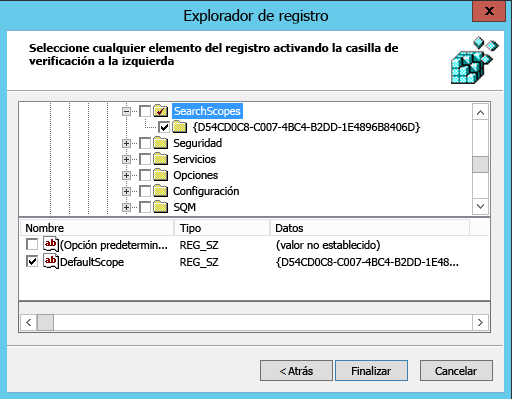

# Establezca Bing como el motor de búsqueda predeterminado
  
Este artículo explica cómo puede hacer de Bing el motor de búsqueda predeterminado para Microsoft Edge, Google Chrome e Internet Explorer. 
  
## Microsoft Edge en Windows 10, versión 1703 o posterior

Aunque usted va a configurar Bing como motor de búsqueda predeterminado, Microsoft Edge permite a los usuarios cambiar su configuración para usar un motor de búsqueda diferente.
  
Para los archivos ADMX más recientes para diferentes versiones de Windows, vea [Cómo crear y administrar el almacén central de plantillas administrativas de directiva de grupo en Windows](https://support.microsoft.com/help/3087759/how-to-create-and-manage-the-central-store-for-group-policy-administra).
  
Si no se encuentra la configuración descrita en esta sección dentro de GPMC, descargue el ADMX adecuado y cópielos en el almacén central. Para obtener más información, [vea Editing Domain-Based GPOs Using ADMX Files](/previous-versions/windows/it-pro/windows-vista/cc748955%28v%3dws.10%29). El almacén central en el controlador es una carpeta con la siguiente convención de nomenclatura: **%systemroot%\sysvol \\<dominio \> \policies\PolicyDefinitions**
  
Todos los dominios que maneja el controlador deben obtener una carpeta diferente. El comando siguiente puede usarse para copiar el archivo ADMX desde el símbolo del sistema:
  
 `Copy <path_to_ADMX.ADMX> %systemroot%\sysvol\<domain>\policies\PolicyDefinitions`
  
1. Abra la Consola de administración de directivas de grupo (gpmc.msc) y cambie a editar una directiva existente o crear una nueva.
2. Vaya a **&lt;Equipo/Configuración de usuario&gt;\Plantillas administrativas\Componentes de Windows\Microsoft Edge**.
3. Haga doble clic en **Establecer motor de búsqueda predeterminado**, establézcalo como **Habilitado** y escriba `https://www.bing.com/sa/osd/bfb.xml`
4. Aplique el GPO resultante vinculándolo al dominio correspondiente.

## Google Chrome en Windows 10, versión 1507 o posterior

Los usuarios no podrán cambiar el motor de búsqueda predeterminado después de establecer esta directiva.
  
Chrome viene con su propio conjunto de opciones de configuración de directiva [de](https://support.google.com/chrome/a/answer/187202)grupo que se pueden descargar en forma de archivo ADMX de Google Chrome Enterprise Ayuda .
  
Copie el archivo de plantilla en un almacén central para archivos ADMX en el controlador de dominio. Para obtener más información, [vea Editing Domain-Based GPOs Using ADMX Files](/previous-versions/windows/it-pro/windows-vista/cc748955%28v%3dws.10%29). El almacén central en el controlador es una carpeta con la siguiente convención de nomenclatura: **%systemroot%\sysvol \\<dominio \> \policies\PolicyDefinitions**
  
Todos los dominios que maneja el controlador deben obtener una carpeta diferente. El comando siguiente puede usarse para copiar el archivo ADMX desde el símbolo del sistema:
  
 `Copy <path_to_Chrome.ADMX> %systemroot%\sysvol\<domain>\policies\PolicyDefinitions`
  
1. Abra la Consola de administración de directivas de grupo (gpmc.msc) y cambie a editar una directiva existente o crear una nueva.
2. Asegúrese de que las carpetas siguientes aparecen en la sección de Plantillas administrativas en Usuario/Configuración de equipo: Google Chrome y Google Chrome: configuración predeterminada.

    - La configuración de la primera sección es fija y los administradores locales no pueden cambiarla en el explorador.
    - Los usuarios pueden cambiar la configuración de la segunda sección de directivas en la configuración del explorador.

3. Vaya a **\<Computer/User\> Configuración\Plantillas administrativas\Google Chrome\Proveedor de búsqueda predeterminado**
4. Haga doble clic en **Habilitar el motor de búsqueda predeterminado** y establézcalo como **Habilitado**.
5. Haga doble clic en el **icono de Motor de búsqueda predeterminado**, establézcalo como **Habilitado** y escriba `https://www.bing.com/sa/simg/bb.ico`.
6. Haga doble clic en el **URL instantánea del motor de búsqueda predeterminado** y escriba `https://www.bing.com/business/search?q={searchTerms}&amp;form=BFBSPR`.
7. Haga doble clic en el **nombre del motor de búsqueda predeterminado**, establézcalo como Habilitado y escriba "Microsoft Search en Bing".
8. Haga doble clic en el **URL de búsqueda del motor de búsqueda predeterminado**, establézcalo como **Habilitado** y escriba `https://www.bing.com/business/search?q={searchTerms}&amp;form=BFBSPR`.
9. Aplique el GPO resultante vinculándolo al dominio correspondiente.

## Internet Explorer 11 o posterior

Los usuarios podrán cambiar el proveedor de búsqueda después de establecer esta directiva.
  
### PASO 1. Configure el equipo local que se usará para establecer el GPO

Pegue el texto siguiente en un archivo de registro (\*.reg).
  
Windows Registry Editor Version 5.00
  
<pre>[HKEY_CURRENT_USER\Software\Microsoft\Internet Explorer\SearchScopes]
"DefaultScope"="{D54CD0C8-C007-4BC4-B2DD-1E4896B8406D}"
[HKEY_CURRENT_USER\Software\Microsoft\Internet Explorer\SearchScopes\{D54CD0C8-C007-4BC4-B2DD-1E4896B8406D}]
"Codepage"=dword:0000fde9
"DisplayName"="Microsoft Search in Bing"
"OSDFileURL"="https://www.bing.com/sa/osd/bfb.xml"
"FaviconURL"="https://www.bing.com/sa/simg/bb.ico"
"URL"="https://www.bing.com/business/search?q={searchTerms}&amp;form=BFBSPR"</pre>
  
Haga doble clic en el archivo creado y siga los pasos para importar el archivo. Una importación correcta debe dar como resultado el cuadro de diálogo siguiente:
  

  
### PASO 2. Abra la Consola de administración de directivas de grupo (gpmc.msc) y cambie a editar una directiva existente o crear una nueva.

1. Vaya a **Configuración de usuario\Configuración\Directivas\Preferencias\Configuración de Windows**.
2. Haga clic derecho en **Registro\Nuevo** y seleccione **Asistente de registro**. En la ventana del Explorador de registro, seleccione **Equipo local** y haga clic en **Siguiente**.
3. Vaya a **HKEY_CURRENT_USER\SOFTWARE\Microsoft\Internet Explorer\SearchScopes**.
4. En esta clave, asegúrese de seleccionar DefaultScope.

    
5. Compruebe todas las subclaves que contienen el GUID de Microsoft Search en Bing y todos los valores de la clave excepto las rutas de acceso a los perfiles de usuario. Desplácese hacia abajo para seleccionar otros elementos.
6. Haga clic en Finalizar para terminar la configuración.

### Paso 3. Configurar las Preferencias de usuario para ayudar a eliminar la advertencia que posiblemente reciba el usuario cuando se aplique la búsqueda DefaultScope

Esta advertencia es intencionada y alerta a los usuarios de un programa que intentan modificar la configuración.
  
1. En el mismo GPO, haga clic derecho en **Registro\Nuevo** y seleccione **Asistente de registro**.
2. Vaya a **HKEY_CURRENT_USER\SOFTWARE\Microsoft\Internet Explorer\User Preferences**.
3. Seleccione la clave **User Preference**.
4. Haga clic en **Finalizar**.
5. Haga clic en el objeto recién creado. En el panel de la derecha, haga doble clic en el objeto User Preferences y cambie la **Acción** a **Eliminar y guardar**.
6. Aplique el GPO resultante vinculándolo al dominio correspondiente.