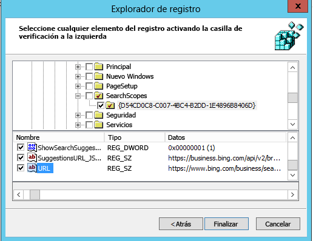

# Establecer motor de búsqueda predeterminadoSet default search engine

La configuración de la página principal, motor de búsqueda y explorador predeterminados ayudará a los usuarios a descubrir las funciones de Microsoft Search, fomentar su uso y proporcionar una experiencia más fluida.Configuring the default browser, default search engine, and default homepage will help your users discover Microsoft Search capabilities, encourage more usage, and provide a smoother experience.
  
Para establecer el motor de búsqueda predeterminado para su organización, siga los pasos siguientes.To set the default search engine for your organization, follow the steps below.
  
## Internet ExplorerInternet Explorer

### Internet Explorer 11Internet Explorer 11

Los usuarios podrán cambiar el proveedor de búsqueda después de establecer esta directiva.Users will be able to change the search provider after this policy is set.
  
#### 1. Configurar el equipo local que se usará para establecer el GPO1. Configure the local machine that will be used to set the GPO

Pegue el texto siguiente en un archivo de registro (\*.reg).Paste the following text into a reg(\*.reg) file.
  
Windows Registry Editor Version 5.00Windows Registry Editor Version 5.00
  
<pre>[HKEY_CURRENT_USER\Software\Microsoft\Internet Explorer\SearchScopes]
"DefaultScope"="{D54CD0C8-C007-4BC4-B2DD-1E4896B8406D}"
[HKEY_CURRENT_USER\Software\Microsoft\Internet Explorer\SearchScopes\{D54CD0C8-C007-4BC4-B2DD-1E4896B8406D}]
"Codepage"=dword:0000fde9
"DisplayName"="Microsoft Search in Bing"
"OSDFileURL"="https://www.bing.com/sa/osd/bfb.xml"
"FaviconURL"="https://www.bing.com/sa/simg/bb.ico"
"SuggestionsURL_JSON"="https://business.ing.com/api/v2/browser/suggest?q={searchTerms}&amp;form=BFBSPA"
"ShowSearchSuggestions"=dword:00000001
"URL"="https://www.bing.com/business/search?q={searchTerms}&amp;form=BFBSPR"</pre>
  
Haga doble clic en el archivo creado y siga los pasos para importar el archivo. Una importación correcta debe dar como resultado el cuadro de diálogo siguiente:Double-click the file created and follow the steps to import the file. A successful import should result in the following dialog:
  

  
#### 2. Abra la Consola de administración de directivas de grupo (gpmc.msc) y cambie a editar una directiva existente o crear una nueva2. Open the Group Policy Management Console (gpmc.msc) and switch to editing an existing policy or creating a new one

1. Vaya a **Configuración de usuario\Configuración\Directivas\Preferencias\Configuración de Windows**.Navigate to **User Configuration\Policies\Preferences\Windows Settings**.
    
2. Haga clic derecho en **Registro\Nuevo** y seleccione **Asistente de registro**. En la ventana del Explorador de registro, seleccione **Equipo local** y haga clic en **Siguiente**.Right-click on **Registry\New** and select **Registry Wizard**. From the Registry Browser window, select **Local Computer** and click **Next**.
    
3. Vaya a **HKEY_CURRENT_USER\SOFTWARE\Microsoft\Internet Explorer\SearchScopes**.Navigate to **HKEY_CURRENT_USER\SOFTWARE\Microsoft\Internet Explorer\SearchScopes**.
    
4. En esta clave, asegúrese de seleccionar DefaultScope.From this key, make sure to select DefaultScope.
    
    
  
5. Compruebe todas las subclaves que contienen el GUID de Microsoft Search en Bing y todos los valores de la clave excepto las rutas de acceso a los perfiles de usuario. Desplácese hacia abajo para seleccionar otros elementos.Check all sub keys containing the GUID for Microsoft Search in Bing and every value under the key except any path to user profiles. Scroll down to select other items.
    
    
  
6. Haga clic en Finalizar para terminar la configuración.Click Finish to complete this configuration.
    
#### 3. Configurar las Preferencias de usuario para ayudar a eliminar una advertencia que puede aparecer para el usuario cuando se aplica la búsqueda DefaultScope3. Set up User Preferences to help eliminate a warning the user may get when DefaultScope search is enforced

Esta advertencia es intencionada y alerta a los usuarios de un programa que intentan modificar la configuración.This warning is by design and alerts users of a program trying to modify their settings.
  
1. En el mismo GPO, haga clic derecho en **Registro\Nuevo** y seleccione **Asistente de registro**.Within the same GPO, right click on **Registry\New** and select **Registry Wizard**.
    
2. Vaya a **HKEY_CURRENT_USER\SOFTWARE\Microsoft\Internet Explorer\User Preferences**.Navigate to **HKEY_CURRENT_USER\SOFTWARE\Microsoft\Internet Explorer\User Preferences**.
    
3. Seleccione la clave **User Preference**.Select the **User Preference** key.
    
4. Haga clic en **Finalizar**.Click **Finish**.
    
5. Haga clic en el objeto recién creado. En el panel de la derecha, haga doble clic en el objeto User Preferences y cambie la **Acción** a **Eliminar y guardar**.Click on the newly created object. On the right-side pane double click on the User Preferences object, change the **Action** to **Delete and Save**.
    
Aplique el GPO resultante vinculándolo al dominio correspondiente.Enforce the resultant GPO by linking it to the appropriate domain.
  
## Microsoft EdgeMicrosoft Edge

### Windows 10, versión 1703 o posteriores.Windows 10, Version 1703 or later

Los usuarios podrán cambiar el proveedor de búsqueda después de establecer esta directiva.Users will be able to change the search provider after this policy is set.
  
Para los archivos ADMX más recientes para diferentes versiones de Windows, vea [Cómo crear y administrar el almacén central de plantillas administrativas de directiva de grupo en Windows](https://support.microsoft.com/es-ES/help/3087759/how-to-create-and-manage-the-central-store-for-group-policy-administra).For the latest ADMX files for various versions of Windows, see [How to create and manage the Central Store for Group Policy Administrative Templates in Windows](https://support.microsoft.com/es-ES/help/3087759/how-to-create-and-manage-the-central-store-for-group-policy-administra).
  
Si la configuración descrita en esta sección no se encuentra dentro de la GPMC, descargue los ADMX adecuados y cópielos en el almacén central. Para obtener más información, vea [Editar GPO basados en dominios mediante archivos ADMX](https://docs.microsoft.com/es-ES/previous-versions/windows/it-pro/windows-vista/cc748955%28v%3dws.10%29). El almacén central en el controlador es una carpeta con la convención de nomenclatura siguiente:If the setting described in this section cannot be found inside of GPMC, download the appropriate ADMX and copy them to the central store. For more information, see [Editing Domain-Based GPOs Using ADMX Files](https://docs.microsoft.com/es-ES/previous-versions/windows/it-pro/windows-vista/cc748955%28v%3dws.10%29). Central store on the controller is a folder with the following naming convention:
  
 **%systemroot%\sysvol\\<domain\>\policies\PolicyDefinitions****%systemroot%\sysvol\\<domain\>\policies\PolicyDefinitions**
  
Todos los dominios que maneja el controlador deben obtener una carpeta diferente. El comando siguiente puede usarse para copiar el archivo ADMX desde el símbolo del sistema:Each domain that your controller handles should get a separate folder. The following command can be used to copy the ADMX file from the command prompt:
  
 `Copy <path_to_ADMX.ADMX> %systemroot%\sysvol\<domain>\policies\PolicyDefinitions`
  
1. Abra la Consola de administración de directivas de grupo (gpmc.msc) y cambie a editar una directiva existente o crear una nueva.Open the Group Policy Management Console (gpmc.msc) and switch to editing an existing policy or creating a new one.
    
2. Vaya a **&lt;Equipo/Configuración de usuario&gt;\Plantillas administrativas\Componentes de Windows\Microsoft Edge**.Navigate to **&lt;Computer/User Configuration&gt;\Administrative Templates\Windows Components\Microsoft Edge**.
    
1. Haga doble clic en **Establecer motor de búsqueda predeterminado**, establézcalo como **Habilitado** y escriba `https://www.bing.com/sa/osd/bfb.xml`Double-click **Set default search engine**, set to **Enabled**, and enter `https://www.bing.com/sa/osd/bfb.xml`
    
3. Aplique el GPO resultante vinculándolo al dominio correspondiente.Enforce the resultant GPO by linking it to the appropriate domain.
    
## Google ChromeGoogle Chrome

### Windows XP SP2 o versiones posterioresWindows XP SP2 or later

Los usuarios no podrán cambiar el proveedor de búsqueda después de establecer esta directiva.Users won't be able to change the search provider after this policy is set.
  
Chrome incluye su propio conjunto de configuración de directiva de grupo, que puede descargarse en forma de archivo ADMX desde Chrome [Ayuda de Google Chrome Enterprise](https://support.google.com/chrome/a/answer/187202). Si se usan los sistemas operativos Windows Vista/Server 2008 o versiones posteriores para administrar los GPO del dominio, el archivo ADMX proporcionado en este paquete se encarga de la configuración de Chrome en Windows XP SP2 o versiones posteriores.Chrome comes with its own set of group policy settings which can be downloaded in the form of an ADMX file from [Google Chrome Enterprise Help](https://support.google.com/chrome/a/answer/187202). If operating systems Windows Vista/Server 2008 or later are used to manage GPO's for the domain, the ADMX file provided in this package takes care of Chrome settings on Windows XP SP2 or later.
  
Copie el archivo de plantilla en un almacén central para archivos ADMX en el controlador del dominio. Para obtener más información, vea [Editar GPO basados en dominios mediante archivos ADMX](https://docs.microsoft.com/es-ES/previous-versions/windows/it-pro/windows-vista/cc748955%28v%3dws.10%29). El almacén central en el controlador es una carpeta con la convención de nomenclatura siguiente:Copy the template file to a central store for ADMX files on the domain controller. For more information, see [Editing Domain-Based GPOs Using ADMX Files](https://docs.microsoft.com/es-ES/previous-versions/windows/it-pro/windows-vista/cc748955%28v%3dws.10%29). Central store on the controller is a folder with the following naming convention:
  
 **%systemroot%\sysvol\\<domain\>\policies\PolicyDefinitions****%systemroot%\sysvol\\<domain\>\policies\PolicyDefinitions**
  
Todos los dominios que maneja el controlador deben obtener una carpeta diferente. El comando siguiente puede usarse para copiar el archivo ADMX desde el símbolo del sistema:Each domain that your controller handles should get a separate folder. The following command can be used to copy the ADMX file from the command prompt:
  
 `Copy <path_to_Chrome.ADMX> %systemroot%\sysvol\<domain>\policies\PolicyDefinitions`
  
1. Abra la Consola de administración de directivas de grupo (gpmc.msc) y cambie a editar una directiva existente o crear una nueva.Open the Group Policy Management Console (gpmc.msc) and switch to editing any existing policy or creating a new one.
    
2. Asegúrese de que las carpetas siguientes aparecen en la sección de Plantillas administrativas en Usuario/Configuración de equipo: Google Chrome y Google Chrome: configuración predeterminada.Make sure the following folders appear in the Administrative Templates section of both User/Computer Configuration: Google Chrome and Google Chrome - Default Settings.
    
  - La configuración de la primera sección es fija y los administradores locales no pueden cambiarla en el explorador.The settings of the first section are fixed and local administrators won't be able to change them in the browser.
    
  - Los usuarios pueden cambiar la configuración de la segunda sección de directivas en la configuración del explorador.The settings of the latter section of policies can be changed by users in the browser settings.
    
3. Vaya a **\<Equipo/Configuración de usuario\>\Plantillas administrativas\Google Chrome\Motor de búsqueda predeterminado**.Navigate to **\<Computer/User\> Configuration\Administrative Templates\Google Chrome\Default search provider**
    
4. Haga doble clic en **Habilitar el motor de búsqueda predeterminado** y establézcalo como **Habilitado**.Double-click **Enable the default search provider**, and set it to **Enabled**.
    
5. Haga doble clic en el **icono de Motor de búsqueda predeterminado**, establézcalo como **Habilitado** y escriba `https://www.bing.com/sa/simg/bb.ico`.Double-click **Default search provider icon**, set it to **Enabled**, and enter `https://www.bing.com/sa/simg/bb.ico`
    
6. Haga doble clic en el **URL instantánea del motor de búsqueda predeterminado** y escriba `https://www.bing.com/business/search?q={searchTerms}&amp;form=BFBSPR`.Double-click **Default search provider instant URL**, and enter `https://www.bing.com/business/search?q={searchTerms}&amp;form=BFBSPR`
    
7. Haga doble clic en el **nombre del motor de búsqueda predeterminado**, establézcalo como Habilitado y escriba "Microsoft Search en Bing".Double-click **Default search provider name**, set it to Enabled, and enter 'Microsoft Search in Bing'
    
8. Haga doble clic en el **URL de búsqueda del motor de búsqueda predeterminado**, establézcalo como **Habilitado** y escriba `https://www.bing.com/business/search?q={searchTerms}&amp;form=BFBSPR`.Double-click **Default search provider search URL**, set it to **Enabled**, and enter `https://www.bing.com/business/search?q={searchTerms}&amp;form=BFBSPR`
    
9. Haga doble clic en el **URL de sugerencia del motor de búsqueda predeterminado**, establézcalo como **Habilitado** y escriba `https://business.bing.com/api/v2/browser/suggest?q={searchTerms}&amp;form=BFBSPA`.Double-click **Default search provider suggest URL**, set it to **Enabled**, and enter `https://business.bing.com/api/v2/browser/suggest?q={searchTerms}&amp;form=BFBSPA`
    
10. Aplique el GPO resultante vinculándolo al dominio correspondiente.Enforce the resultant GPO by linking it to the appropriate domain.
    
Al establecer el motor de búsqueda predeterminado se agregará la característica de sugerencias de búsqueda de Microsoft Search en la barra de direcciones del explorador. Actualmente solo admite marcadores. Los usuarios verán las sugerencias de los dos marcadores principales por encima de las sugerencias web públicas mientras escribe en la barra de direcciones.Setting the default search engine will add the Microsoft Search search suggestions feature in the browser address bar. Currently, this supports bookmarks only. Users will see the top two bookmark suggestions above public web suggestions as they type in the address bar.