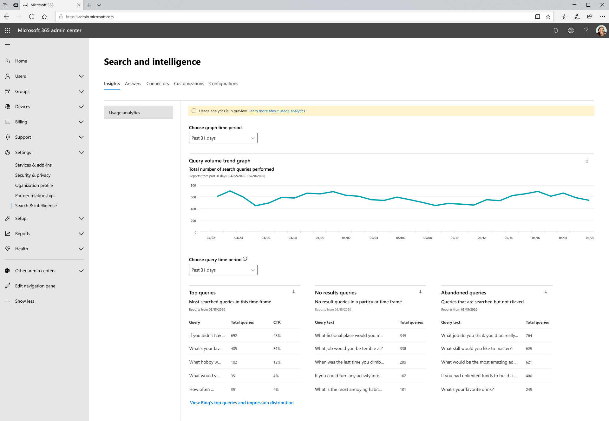

# Informes de uso de Microsoft Search

Los informes de uso de búsqueda le permiten comprender mejor cómo funciona la búsqueda en su organización. Los conocimientos generados a  partir de estos informes le ayudarán a facilitar la búsqueda y la realización de acciones que hagan de la búsqueda una experiencia más útil y agradable para los usuarios.

Los [informes de uso de Microsoft Search](https://admin.microsoft.com/Adminportal/Home?#/MicrosoftSearch/insights) incluyen gráficos y tablas generados a partir de búsquedas que se ejecutan desde inicio de SharePoint y cuadros Office.com búsqueda. Puede ver datos de los últimos 31 días, por día o mensualmente del año anterior. Estos informes se están implementando, por lo que llevará tiempo acumular los datos históricos.

Una versión anterior de esta página incluía datos de búsquedas ejecutadas para Microsoft Search en Bing en Bing.com. Esos datos se integrarán en estos informes pronto, pero por ahora, puede ver esos informes haciendo clic en el vínculo de la parte inferior de la página para ver las consultas principales y la distribución de impresiones de **Bing.**

> [!div class="mx-imgBorder"]
> 

## Información general sobre los informes de búsqueda

| Informe | Descripción |
|:-----|:-----|
|Volumen de consulta|Este informe muestra el número de consultas de búsqueda realizadas. Use este informe para identificar tendencias de volumen de consulta de búsqueda y para determinar períodos de actividad de búsqueda alta y baja.|
|Principales consultas|Este informe muestra las consultas de búsqueda más populares. Use este informe para comprender qué tipos de información buscan los usuarios.|
|Consultas abandonadas|Este informe muestra consultas de búsqueda populares que reciben un clic bajo. Utilice este informe para identificar las consultas de búsqueda que pueden crear la insatisfacción en los usuarios y para mejorar la capacidad de detección de contenido. A continuación, puede determinar si la acción correcta es crear una respuesta, como un marcador, o si ingerir contenido nuevo a través de un conector de Graph.|
|Sin consultas de resultados|Este informe muestra las consultas de búsqueda populares que no han devuelto ningún resultado. Utilice este informe para identificar las consultas de búsqueda que pueden crear la insatisfacción en los usuarios y para mejorar la capacidad de detección de contenido. A continuación, puede determinar si la acción correcta es crear una respuesta, como un marcador, o si ingerir contenido nuevo a través de un conector de Graph.|

## Visualización de informes

Al navegar a la página de informes de uso, todos los informes están disponibles para verlos. Puede usar el filtro de fecha para elegir un día o mes específicos que se va a ver.

La descarga de un informe le permitirá ver informes de un intervalo de tiempo más amplio. Haga clic en la flecha de descarga y seleccione **los últimos 31 días** o **los últimos 12 meses.** El informe se descarga como una hoja de cálculo de Excel. Si seleccionó los últimos 31 días, la hoja de cálculo tendrá una pestaña individual para cada día. La descarga de los últimos 12 meses tendrá una pestaña para cada mes.

Para ver las consultas principales e informes de distribución de impresiones de Bing, haga clic en el vínculo de la página.

## Preguntas frecuentes

**Cuando selecciono los últimos 31 días o los últimos 12 meses, ¿por qué tengo que elegir un día específico o un mes específico?**

La vista de calendario, hoy en día, en los informes de uso de búsqueda de Microsoft es un proceso de dos pasos. Primero seleccione el intervalo de fechas del menú desplegable (pasados 31 días o pasados 12 meses) y, a continuación, seleccione el día o mes de inicio.

Las tablas de consulta superiores, abandonadas y con errores muestran los resultados del día o del mes que elija.

**Cuándo voy a ver los datos agregados de los últimos 7 días, los últimos 30 días, etc. ¿Como los informes de consultas principales de Bing?**

Estamos considerando este tipo de agregación y simplificando el filtrado del intervalo de datos para versiones futuras de estos informes.

**¿Por qué no puedo ver un desglose de los informes de uso de diferentes aplicaciones (orígenes)?**

Actualmente, el filtrado por origen no está disponible. Los informes combinan búsquedas de SharePoint Home y Office.com. Nuestra próxima versión incluirá el filtrado de origen para que pueda ver métricas específicas de cada aplicación.

**¿Qué otro filtrado para informes de uso viene?**

Estamos trabajando en filtros adicionales que ayudarán a dar sentido al uso de la búsqueda en un nivel más detallado de su organización. Por ejemplo, podrá ver el volumen de consulta de un departamento o una zona geográfica específica.

**¿Por qué Microsoft Search en Bing informa en una página independiente?**

Modernizar la búsqueda en aplicaciones de Office 365 a Microsoft Search nos ha requerido unirse a sistemas anteriormente distintos, incluida la generación de informes. Esto lleva tiempo y sentimos que era más importante sacar estos informes ahora en lugar de esperar hasta que pudimos completar la integración de los datos de Bing. Una vez completada la integración, los datos de todos los puntos de conexión de búsqueda se incluirán en los mismos informes.